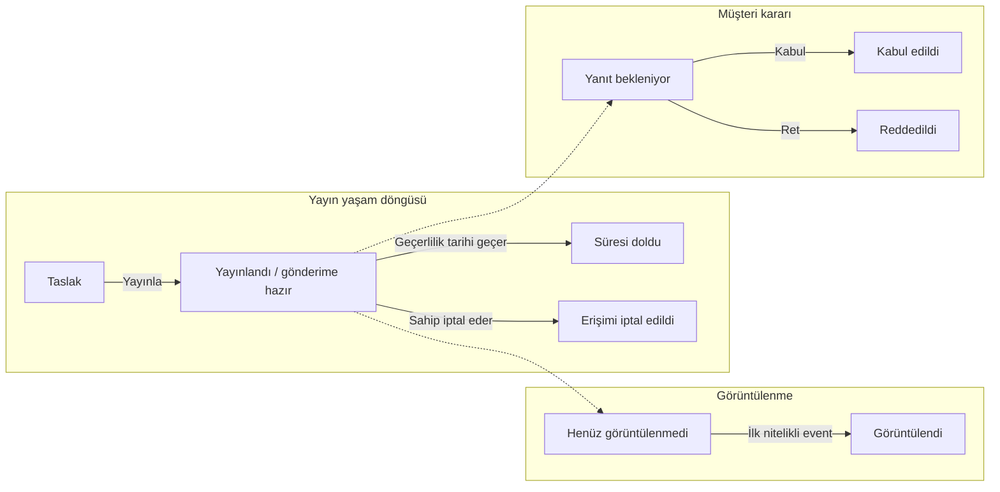
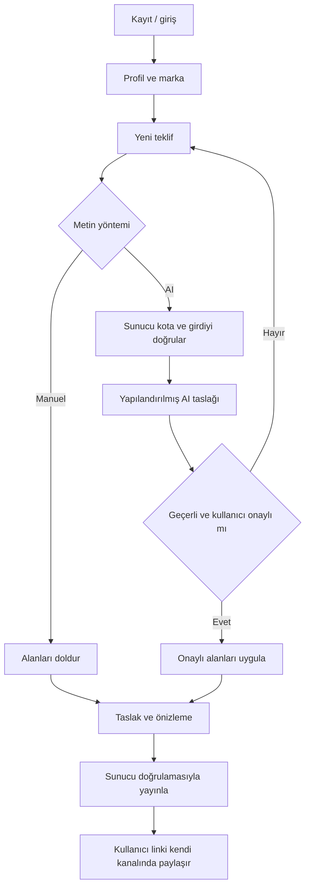
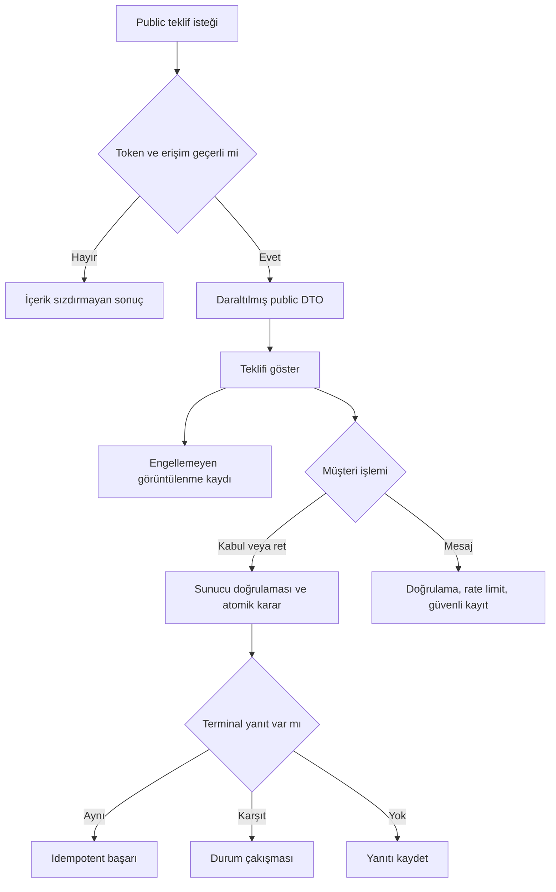

# Freelancer Teklif Oluşturma ve Takip Platformu — Geliştirme Planı

## 0. Belgenin Amacı

Bu belge, uygulama temelinden production yayınına kadar başka bir coding agent’ın bağımlılık sırasıyla uygulayabileceği, her adımı test edilebilir ana geliştirme yol haritasıdır. Uygulama kodu veya tam SQL şeması değildir.

MVP’nin temel ürün tezi:

> Yazılım geliştirici ve tasarımcı freelancerlar için AI destekli teklif oluşturucu ve teklif görüntülenme takip aracı.

Kapsam ilkeleri:

- MVP; CRM, proje yönetimi, finans uygulaması veya otomasyon platformuna dönüşmeyecektir.
- Faz 2–4 kapsamı, ilgili doğrulama kapıları geçilmeden MVP görevlerine alınmayacaktır.
- AI çıktıları düzenlenebilir taslaktır; kullanıcı onayı olmadan teklife uygulanmaz.
- AI kullanıcı adına kesin fiyat belirlemez.
- Görüntülenme verileri botlar ve bağlantı önizleme sistemleri nedeniyle yaklaşık kabul edilir.
- Public teklif sayfası doğrudan veya kontrolsüz veritabanı erişimi kullanmaz.
- AI, ödeme ve Supabase servis anahtarları frontend’e konmaz.
- Supabase RLS bütün iş tabloları için zorunludur.
- Kart bilgileri uygulamanın veritabanında veya loglarında saklanmaz.
- Belirsiz ürün kararları “Açık Karar”, zorunlu geçici teknik kabuller “Teknik Varsayım” olarak işaretlenir.
- KVKK ve hukuk maddeleri hukuki tavsiye veya uyum garantisi değildir; yayın öncesi profesyonel inceleme zorunlu çıkış kapısıdır.

## 1. Proje Özeti

Platform, freelance yazılım geliştiricilerin ve freelance UI/UX veya web tasarımcılarının yapılandırılmış ve AI destekli teklifler hazırlamasını, tahmin edilmesi zor bağlantılarla paylaşmasını, yaklaşık görüntülenme sinyallerini izlemesini ve duruma uygun takip mesajı üretmesini sağlar.

Çözülen temel problem şudur: Freelancer aynı kapsam, teslimat, süre, revizyon ve ödeme metinlerini tekrar yazar; teklif gönderildikten sonra müşterinin teklifi görüp görmediğini ve ne zaman takip edilmesi gerektiğini bilemez.

İlk sürüm CRM değildir. Basit müşteri kaydı yalnız teklif formunu hızlandırır; lead, pipeline, Kanban, görev, toplantı, takvim, proje ve finans yönetimi içermez.

Ana değer önerisi:

> Daha hızlı ve tutarlı teklif hazırla, bağlantı olarak paylaş, yaklaşık görüntülenme durumunu gör ve doğru zamanda kullanabileceğin takip mesajını üret.

Platform bağlantıyı veya takip mesajını otomatik göndermez. Public bağlantı üzerinden yanıt veren kişinin hukuki kimliğini doğruladığını ya da teklifin kesin olarak okunduğunu iddia etmez.

## 2. Hedef Kullanıcı ve Persona

İlk hedef yalnızca aşağıdaki iki personadır. Sosyal medya yöneticileri, genel danışmanlar, ajanslar ve diğer freelancer grupları MVP hedef kitlesine dahil değildir.

### 2.1 Freelance yazılım geliştirici

| Alan | Tanım |
|---|---|
| Mevcut teklif yöntemi | Word, Google Docs, Notion veya eski PDF’yi kopyalar; teknik kapsam, teslimatlar, süre, fiyat, revizyon ve ödeme koşullarını elle günceller. |
| Temel sorun | Teknik kapsamı müşteri diline çevirmek ve proje sınırlarını tutarlı yazmak zaman alır; teklifin açıldığını ve takip zamanını bilemez. |
| Ürünü kullanacağı durum | Yeni yazılım projesi teklifi, benzer teklifin çoğaltılması, yayın sonrası durum kontrolü veya takip mesajı hazırlama. |
| Ödeme yapmasını sağlayabilecek değer | Ölçülebilir zaman tasarrufu, daha açık kapsam, gerçek müşteriye gönderilen teklifte yaklaşık görüntülenme sinyali ve tekrar kullanım. |
| Kullanmama nedenleri | Düşük teklif hacmi, mevcut dokümanının yeterli olması, AI doğruluğu veya takip gizliliği kaygısı, fiyatın yüksek ya da görüntülenme bilgisinin değersiz bulunması. |

### 2.2 Freelance UI/UX veya web tasarımcısı

| Alan | Tanım |
|---|---|
| Mevcut teklif yöntemi | Word, Docs, Notion, sunum veya PDF kullanır; ekran, teslimat, revizyon, süre ve fiyat metinlerini eski işlerden kopyalar. |
| Temel sorun | Teslimatlar, hariç tutulan işler, revizyon sınırı ve marka görünümünü tutarlı hazırlamak zaman alır; müşteri ilgisini ölçemez. |
| Ürünü kullanacağı durum | UI/UX, web sitesi veya tasarım projesi teklifi, tekrar eden hizmetlerin kullanımı, yanıt bekleme ve kapsam/fiyat mesajı hazırlama. |
| Ödeme yapmasını sağlayabilecek değer | Profesyonel ve markalı görünüm, net proje sınırları, hızlı tekrar kullanım ve görüntülenmeye göre bilinçli takip. |
| Kullanmama nedenleri | Görsel özelleştirmeyi yetersiz bulma, kendi şablonunu tercih etme, düşük teklif hacmi, müşterinin PDF istemesi, takip veya ücret kaygısı. |

## 3. Problem Tanımı

| Problem | Mevcut davranış | Ürünün önerdiği çözüm |
|---|---|---|
| Teklif hazırlama süresinin uzun olması | Bölümler eski belgelerden kopyalanır veya yeniden yazılır. | Yapılandırılmış form, sabit temel sunum, teklif çoğaltma ve isteğe bağlı AI taslağı. |
| Teklifin görüntülenip görüntülenmediğinin bilinmemesi | E-posta eki veya PDF açılışı bilinmez; kullanıcı müşteriye sorar veya bekler. | Özel bağlantıda ilk, son ve toplam görüntülenme; kesin kişi veya okuma kanıtı değil, yaklaşık sinyal. |
| Takip mesajı zamanlaması | Kullanıcı sezgisel olarak erken veya geç takip eder. | Duruma göre düzenlenebilir ve kopyalanabilir AI mesajı; otomatik gönderim yok. |
| Profesyonel ve tutarlı teklif hazırlama | Alanlar, terminoloji ve koşullar değişir; kapsam sınırları unutulabilir. | Zorunlu alanlar, profil varsayılanları, doğrulama ve yayın önizlemesi. |
| Tekrar eden metinlerin yeniden yazılması | Teslimat, hariç tutma, revizyon ve ödeme metinleri tekrar yazılır. | Teklif çoğaltma ve AI taslakları; seçilebilir veya özel şablon sistemi MVP dışıdır. |

## 4. Ürün Konumlandırması

**Ana konumlandırma cümlesi:**

> Yazılım geliştirici ve tasarımcı freelancerlar için AI destekli teklif oluşturma ve görüntülenme takip aracı.

**Kısa ürün açıklaması:**

> Profesyonel teklif hazırla, bağlantı olarak gönder, müşterinin yaklaşık görüntülenme durumunu gör.

**Ürünün olduğu:**

- Düzenlenebilir teklif oluşturucu
- AI teklif metni ve takip mesajı taslağı
- Kayıt gerektirmeyen responsive müşteri sayfası
- Teklif bazlı görüntülenme ve yanıt takibi
- TRY, USD ve EUR destekli, Türkiye pazarını dikkate alan teklif aracı

**Ürünün olmadığı:**

- CRM, lead pipeline veya Kanban
- Proje, görev, toplantı veya takvim yönetimi
- Fatura, finans, gelir-gider veya saat takip sistemi
- Otomatik e-posta, WhatsApp veya otonom takip platformu
- Ajans, ekip veya müşteri veri ağı ürünü

**Doğrulanmamış farklılaşma hipotezi:** Yazılım ve tasarım freelancerlarına odaklanma; AI-native teklif akışı; görüntülenme takibi; Türkçe, TL ve yerel çalışma biçimleri; şeffaf KVKK yaklaşımı kombinasyonudur. Bu iddia yalnız gerçek müşteriye gönderim, tekrar kullanım ve gerçek ödeme ile doğrulanmış sayılacaktır.

## 5. MVP Kapsamı

### 5.1 Kimlik Doğrulama

- E-posta ve şifreyle kayıt
- Giriş ve güvenli çıkış
- Süreli bağlantıyla şifre sıfırlama
- Supabase Auth oturum yenileme ve sonlandırma
- Korumalı rotalarda sunucuda doğrulanmış oturum
- Profil ve teklif sahipliğinin hem sunucu hem RLS ile korunması
- Hatalı, süresi dolmuş veya tekrar kullanılmış reset bağlantılarının güvenli ele alınması
- Google ile girişin MVP dışında tutulması

**Açık Karar:** E-posta doğrulamasının zorunluluğu ve doğrulanmamış hesabın yetkileri Bölüm 34’te kesinleştirilecektir.

### 5.2 Kullanıcı Profili ve Marka Bilgileri

Alanlar:

- Ad
- Meslek
- Varsayılan para birimi: `TRY`, `USD`, `EUR`
- Logo
- İletişim bilgileri
- Marka veya şirket adı

Kurallar:

- Profil yalnız sahibi tarafından okunup güncellenir.
- Varsayılan para birimi yeni teklife başlangıç değeri sağlar; teklif bazında değiştirilebilir.
- Profil değişikliği yayınlanmış teklif içeriğini sessizce değiştirmez.
- Logo güvenli Storage akışından geçer.
- Auth e-postası kullanıcının açık onayı olmadan public iletişim e-postası yapılmaz.
- Müşteri telefonu, açık adresi, kimlik, vergi veya banka bilgisi zorunlu değildir.

### 5.3 Müşteri Kaydı

- Yalnız teklif oluşturmayı hızlandıran ad ve şirket temelli basit veri yapısıdır.
- Aynı müşteri birden fazla teklife bağlanabilir.
- Kayıt yalnız teklif sahibi tarafından görülür.
- Müşteri hesabı veya portalı yoktur.
- Pipeline, aşama, görev, toplantı, segmentasyon ve CRM raporu eklenmez.
- Bağımsız gelişmiş müşteri listesi Faz 2’dedir; MVP’de oluşturma ve seçme işlemi teklif formunun yardımcı parçasıdır.

### 5.4 Teklif Oluşturucu

Aşağıdaki alanların tamamı bulunacaktır:

- Müşteri adı
- Müşteri şirketi
- Proje adı
- Proje özeti
- Proje kapsamı
- Teslim edilecekler
- Hariç tutulan işler
- Proje süresi
- Başlangıç tarihi
- Hizmet kalemleri
- Fiyatlandırma
- Para birimi
- Ödeme planı
- Revizyon hakkı
- Teklif geçerlilik tarihi
- Vergi dahil veya hariç bilgisi
- Ek koşullar

Kurallar:

- Para birimi yalnız `TRY`, `USD`, `EUR` olabilir; arayüzde `TRY` “TL” olarak gösterilebilir.
- Hizmet kalemleri açıklama, miktar, birim fiyat ve sıra içerir.
- Fiyatlar floating point olarak tutulmaz; Postgres `numeric` değerleri API’de ondalık string olarak taşınır.
- Toplam istemcide önizlense de sunucuda yeniden hesaplanır.
- Vergi dahil/hariç yalnız bilgilendirici etikettir; vergi motoru veya resmi hesaplama yapılmaz.
- Tarih, tutar, para birimi ve zorunlu alanlar yayın öncesi sunucuda doğrulanır.
- Kullanıcı metinleri taslakta düzenlenebilir; yayın sonrası düzenleme Bölüm 5.5'teki plan ve karar durumu kurallarına bağlıdır.
- Kullanıcının girdiği metinlerin sınırları Bölüm 11.6'da tanımlıdır; uzun içerik sessizce kesilmez.
- Kaydetme hatasında form girdisi korunur.
- Önizleme ve public belgede “Fatura yerine geçmez.” uyarısı bulunur.

### 5.5 Teklif Taslak Durumu ve Düzenleme

- Taslak kaydetme
- Taslağı düzenleme
- Teklifi çoğaltma
- Önizleme
- Yayınlama
- Yayından kaldırma veya bağlantı erişimini iptal etme

Çoğaltılan teklif:

- Yeni kimlikle `Taslak` olur.
- İçerik, müşteri snapshot’ı ve hizmet kalemlerini kopyalar.
- Paylaşım anahtarı, görüntülenme, kabul/ret, mesajlar, yayın zamanları ve AI loglarını kopyalamaz.
- MVP kod tabanında bulunur ancak Pro entitlement’ı olarak sınırlandırılabilir.

Yayınlama:

- Yalnız teklif sahibi tarafından yapılır.
- Zorunlu alan, kota, plan ve durum doğrulamasından geçer.
- Tekrarlanan aynı yayın isteği mükerrer token veya kayıt üretmez.
- Erişim iptali eski bağlantıyı sunucuda geçersiz kılar.

Teklif versiyonlama MVP’de yoktur.

**Kesinleşen ürün kararı — 2026-09-23:**

- Free: Taslak düzenlenebilir; ilk yayından sonra içerik kilitlidir. Canlı düzenleme ve aynı teklifin yeniden yayınlanması yoktur. Bağlantıyı iptal etme hakkı korunur; içerik kilidi bağlantı iptali değildir.
- Pro: Yanıt bekleyen tekliflerde içerik kilidi, canlı düzenleme veya yeniden yayınlama seçilebilir. Kabul/ret verilmiş bir teklifin içeriği hiçbir planda değiştirilemez.
- İlk geçerli kabul/ret kararı değişmez; sahibi veya müşteri kararı sıfırlayamaz. Yeni koşullar için yeni teklif gerekir. Pro çoğaltabilir; Free yeni bir taslağı manuel oluşturabilir.

**Teknik tasarım — tablo ayrımı yapmadan uygulama:**

- Free ve Pro için aynı `proposals`, `proposal_sections` ve `proposal_items` tabloları kullanılır. Alt tablolara plan veya kilit kolonları kopyalanmaz.
- `proposals.publication_mode` alanı `locked|live` olur; güvenli başlangıç değeri `locked` seçilir. `live` yalnız güncel Pro yetkisiyle etkilidir; plan değişince satırdaki eski değer yetki kazandırmaz.
- Canlı düzenleme, yayında/süresi geçmemiş/yanıt bekleyen teklifte son kaydedilmiş içeriği aynı bağlantıda gösterir. Public sayfa son içerik güncellemesini belirtir. Bu, geçmiş sürüm arşivi veya elektronik imza değildir.
- Pro yeniden yayınlama, yanıt bekleyen aynı kayıt üzerinde içerik ve yayın kontrollerini tekrar çalıştırır; yeni paylaşım generation/selector ile eski bağlantı ve nonce'ları geçersiz kılar. İptal edilmiş veya süresi dolmuş kayıt bu işlemle tekrar yayına alınabilir. Normal link kopyalama bu işlemi yapmaz.
- Yeniden yayınlama eski görüntülenme/mesaj geçmişini silmez; mevcut agregalar teklif ömrü toplamıdır, yeni yayına aitmiş gibi etiketlenmez. Ayrı sürüm raporlaması MVP kapsamına eklenmez.
- Parent, sections ve items değişiklikleri aynı transaction'da parent satırını kilitler; sahiplik, güncel plan, yayın/karar durumu ve `lock_version` birlikte doğrulanır. İçerik değiştiğinde parent `lock_version` artırılır; salt görüntülenme sayacı bu içerik sürümünü değiştirmez.
- Müşteri yanıtı, gösterilmiş içerik sürümüne bağlı nonce ile alınır. Müşteri eski sekmede açık teklife yanıt verirken içerik değişmişse `409` ile yeniden görüntüleme istenir; görmediği koşullar kabul edilmiş sayılmaz.
- Kabul/ret de aynı parent kilidini kullanır: karar önce kaydolursa düzenleme reddedilir; düzenleme önce kaydolursa eski sürüme yanıt reddedilir.
- Tarayıcıya yayınlanmış parent veya alt tablolarda doğrudan write yetkisi verilmez. Kontrollü server işlemi ve DB koruması birlikte kullanılır; yalnız buton gizlemek yeterli değildir. Ayrıntı Bölüm 12'dedir.

### 5.6 AI Destekli Teklif Metni

AI yalnız aşağıdaki alanlarda taslak üretir:

- Proje özeti
- Kapsam
- Teslim edilecekler
- Hariç tutulan işler
- Tahmini süreç
- Revizyon koşulları
- Ödeme planı açıklaması

Zorunlu kurallar:

- AI teklif üretimi yalnız Pro planındadır. Free isteği sunucuda sağlayıcı çağrısı ve kota rezervasyonu yapılmadan reddedilir; manuel teklif akışı açıktır.
- Akış `Kullanıcı → Next.js sunucusu veya Edge Function → AI sağlayıcısı → doğrulama → düzenlenebilir taslak` şeklindedir.
- Tarayıcı AI sağlayıcısını doğrudan çağırmaz.
- AI anahtarı frontend’e, source map’e veya loga girmez.
- Çıktı otomatik kaydedilmez veya teklife uygulanmaz.
- Kullanıcı alan bazında inceleyebilir, düzenleyebilir ve açıkça uygulayabilir.
- Dolu kullanıcı metni açık onay olmadan ezilmez.
- AI kesin fiyat belirlemez.
- Yapılandırılmış çıktı şemasında kesin fiyat alanı bulunmaz.
- İstenmeden gelen fiyat ifadesi uygulanmadan filtrelenir veya “tahmini ve kullanıcı doğrulamalı” olarak işaretlenir.
- Prompt injection’a karşı sistem talimatı ve kullanıcı içeriği ayrılır.
- Girdi/çıktı karakter ve token sınırları sunucuda uygulanır.
- Kullanıcı ve plan bazlı kota, hız ve maliyet tavanı bulunur.
- Geçersiz çıktı Zod ile reddedilir ve sınırlı sayıda yeniden denenir.
- AI başarısız olduğunda kullanıcı manuel teklife devam edebilir.
- Gereksiz müşteri kişisel verisi modele veya loga gönderilmez.
- AI çıktısı hukuki, mali veya ticari tavsiye olarak sunulmaz.

### 5.7 Teklif Paylaşım Bağlantısı

- En az 128 bit güvenlik gücüne sahip, tahmin edilmesi zor capability token kullanılır.
- Token güvenli sunucu katmanında doğrulanır.
- Anonim kullanıcıya `proposals` tablosu için doğrudan `SELECT` verilmez.
- Sunucu yalnız public sayfada gerekli alanlardan oluşan allowlist DTO döndürür.
- Dahili kullanıcı, abonelik, AI, kota, log ve erişim kontrolü alanları gönderilmez.
- Sayfa mobil ve masaüstü uyumludur.
- Müşteri hesabı gerektirmez.
- Her istekte yayın, geçerlilik ve iptal durumu kontrol edilir.
- Geçersiz, süresi dolmuş veya iptal edilmiş bağlantı içerik sızdırmayan sonuç gösterir.
- Public sayfa `noindex`, `nofollow` ve `noarchive` kullanır.
- Token log, analitik ve hata mesajlarında maskelenir.
- `Referrer-Policy: no-referrer` uygulanır.

**Teknik Varsayım:** Tam token veritabanında açık saklanmayacaktır. Yeniden kopyalanabilir bağlantı için Bölüm 11’de tanımlanan selector + HMAC verifier yapısı, teklif veri modeli ve public resolver uygulanırken saldırı, anahtar rotasyonu ve yeniden kopyalama testleriyle doğrulanacaktır.

### 5.8 Müşteri Teklif Sayfası

Müşteri hesap oluşturmadan:

- Teklifi görüntüleyebilir.
- Kabul edebilir.
- Reddedebilir.
- Mesaj bırakabilir.

Kurallar:

- Tüm public mutation işlemleri token, geçerlilik, erişim durumu, Zod ve rate limit kontrolünden geçer.
- Kabul veya ret öncesi açık onay diyaloğu gösterilir.
- İlk geçerli terminal yanıt atomik olarak kazanır.
- Aynı yanıtın aynı idempotency anahtarıyla tekrarı aynı sonucu döndürür.
- Kabul sonrasında ret veya ret sonrasında kabul isteği güvenli `409 Conflict` döndürür.
- Eşzamanlı kabul/ret istekleri transaction ve unique constraint ile tek sonuca indirilir.
- Mesaj kararı değiştirmez.
- Mesaj düz metindir; uzunluk, spam ve XSS kontrolleri uygulanır.
- Link üzerinden verilen yanıt hukuki kimlik doğrulaması veya elektronik imza olarak sunulmaz.

**Kesinleşen karar:** İlk geçerli kabul/ret değişmez; yanıtlanan teklif içeriği de korunur (Bölüm 5.5).

**Açık Karar:** Müşteri adı/e-postası ve ek kimlik doğrulama Bölüm 34’tedir.

### 5.9 Görüntülenme Takibi

Gösterilecek bilgiler:

- İlk görüntülenme zamanı
- Son görüntülenme zamanı
- Toplam görüntülenme sayısı
- Pro kapsamı gerçekten çalışıyorsa gelişmiş olay geçmişi

Kurallar:

- Yalnız geçerli public sayfa başarıyla görüntülendikten sonra event kaydı denenir.
- Event hatası teklifin açılmasını engellemez.
- `HEAD`, geçersiz, süresi dolmuş veya iptal edilmiş istek sayılmaz.
- Bilinen bot ve bağlantı önizleme user-agent’ları işaretlenir veya sayaçtan çıkarılır.
- User-Agent kontrolünün kesin olmadığı belgelenir.
- Kısa sürede tekrarlanan kayıtlar proposal-scoped dedupe ve rate limit ile sınırlandırılır.
- Ham IP varsayılan olarak saklanmaz.
- IP işlenecekse minimizasyon, maskeleme veya dönen anahtarlı HMAC yaklaşımı kullanılır ve profesyonel KVKK incelemesi gerekir.
- Freelancer arayüzünde şu uyarı görünür:

> Görüntülenme verileri botlar, bağlantı önizlemeleri, gizlilik ayarları ve teknik engeller nedeniyle yaklaşık olabilir.

- Müşteri sayfasında takip bildirimi ve gizlilik/KVKK bağlantısı bulunur.
- Ayrı “benzersiz kişi” metriği, yöntem ve hukuki temel kesinleşmeden MVP’de gösterilmez.

### 5.10 Teklif Durumları

Durumlar tek bir enum’a sıkıştırılmaz. Dört eksen kullanılır:

- Yayın: `Taslak | Yayınlandı`
- Görüntülenme: `Henüz görüntülenmedi | Görüntülendi`
- Karar: `Bekliyor | Kabul edildi | Reddedildi`
- Erişim: `Aktif | Süresi doldu | Erişimi iptal edildi`



| Durum | Giriş koşulu | İzin verilen sonraki durumlar | UI gösterimi | Sunucu doğrulaması |
|---|---|---|---|---|
| Taslak | Yeni veya çoğaltılmış teklif | Düzenleme, yayınlama | Gri taslak rozeti | Sahiplik ve RLS; public erişim yok |
| Yayınlandı/gönderime hazır | Zorunlu alan, kota ve plan doğrulaması | Görüntülenme, kabul, ret, süre sonu, iptal | Yayınlandı ve link aksiyonları | `published_at`, token, plan ve idempotency |
| Henüz görüntülenmedi | Yayında ve sayılan event yok | Görüntülendi veya erişim/karar sonucu | “Kesin olarak görülmedi” iddiası olmadan | Aktif yayın ve `first_viewed_at` yokluğu |
| Görüntülendi | İlk nitelikli event | Kabul, ret, süre sonu, iptal | İlk/son/toplam ve yaklaşık uyarısı | Token, nonce, bot/dedupe ve atomik sayaç |
| Kabul edildi | Aktif ve süresi geçmemiş teklifte ilk kabul | Karar değişmez; erişim ayrıca iptal edilebilir | Kabul zamanı ve erişim rozeti | Row lock, conditional update, unique karar |
| Reddedildi | Aktif ve süresi geçmemiş teklifte ilk ret | Karar değişmez; erişim ayrıca iptal edilebilir | Ret zamanı ve erişim rozeti | Kabul ile aynı tutarlılık kuralı |
| Süresi doldu | Bekleyen yayının geçerlilik tarihi geçer | Public yanıt kapalı; yeni taslağa çoğaltılabilir | Süresi doldu | Her public read/mutation’da sunucu saati |
| Erişimi iptal edildi | Sahip bağlantıyı iptal eder | Eski link üzerinden yeni işlem yok | İptal rozeti; geçmiş korunur | Sahiplik, token rotasyonu ve iptal zamanı |

Teklif listesindeki gösterim önceliği:

`Erişimi iptal > Kabul/Ret > Süresi doldu > Görüntülendi > Yayınlandı ve görüntülenmedi > Taslak`

**Açık Karar:** “Gönderildi”nin manuel işaret, yayın alias’ı veya link kopyalama sonucu olup olmadığı Bölüm 34’te kesinleşecektir.

### 5.11 Teklif Listesi

Kolonlar:

- Teklif adı
- Müşteri
- Fiyat
- Para birimi
- Oluşturulma tarihi
- Son görüntülenme
- Durum
- İşlemler

Filtreler:

- Taslak
- Gönderildi/yayınlandı
- Görüntülendi
- Kabul edildi
- Reddedildi
- Süresi doldu

Plan:

- Server-side filtreleme ve kararlı sayfalama kullanılacaktır.
- Sayfa ve filtreler URL query parametrelerinde tutulacaktır.
- Farklı para birimleri tek toplam değere çevrilmeyecektir.
- Boş durumda yeni teklif CTA’sı gösterilecektir.
- Yüklenmede skeleton, hatada güvenli mesaj ve tekrar deneme bulunacaktır.
- Son görüntülenme yoksa “Henüz görüntülenmedi” gösterilecektir.
- Liste CRM pipeline’ına veya Kanban görünümüne dönüşmeyecektir.

### 5.12 AI Takip Mesajı

Senaryolar:

- Teklif görüntülenmedi.
- Teklif görüntülendi fakat yanıt gelmedi.
- Teklifin geçerlilik süresi dolmak üzere.
- Fiyat pazarlığı.
- Kapsam açıklaması.

Tonlar:

- Profesyonel
- Samimi
- Kısa
- Daha ikna edici

Kurallar:

- Kullanıcı senaryo ve tonu seçer.
- Sunucu yalnız gerekli teklif durumunu ve minimize bağlamı modele gönderir.
- Çıktı düzenlenebilir.
- Mesaj yalnız panoya kopyalanabilir.
- Otomatik e-posta, WhatsApp veya başka kanal gönderimi yoktur.
- Mesaj “teklifi kesin okudunuz” gibi kesin takip iddiası içermez.
- AI kullanıcı adına fiyat kararı vermez.
- Teklif taslağıyla aynı kota, doğrulama, maliyet, log ve fallback kuralları uygulanır.
- AI takip mesajı da yalnız Pro içindir; Free'de AI çağrısı veya AI deneme kotası yoktur.

### 5.13 Ücretsiz ve Pro Plan

| Özellik | Ücretsiz | Pro MVP | Kapsam notu |
|---|---|---|---|
| Aktif teklif | Eşzamanlı en fazla 3; aylık yayın kotası değildir | Sınır/adil kullanım tavanı henüz kararlaştırılmadı | Enforcement yalnız sunucuda |
| Sunum | Tek sabit temel şablon | Aynı temel şablon + çalışan marka hakları | Seçilebilir/özel şablon Faz 2 |
| Teklif bağlantısı | Var | Var | Her iki planda güvenli public erişim |
| Görüntülenme | İlk/son/toplam | Çalışıyorsa gelişmiş olay geçmişi | Kesin benzersiz kişi iddiası yok |
| AI | Yok; teklif üretimi ve takip mesajı kapalı | Var; kota miktarı/birimi ayrıca kesinleştirilecek | Free sağlayıcı çağrısı yapamaz; Pro için abuse/maliyet tavanı gerekir |
| Yayın sonrası içerik | Kilitli; düzenleme/yeniden yayınlama yok | Yanıt beklerken kilitleme, canlı düzenleme veya yeniden yayınlama | Kabul/ret sonrası her iki planda da içerik korunur |
| Çoğaltma | Yok veya kilitli | Var | Yetenek MVP’de geliştirilir, Pro entitlement’ıdır |
| Logo/marka | Profil alanı; public kullanım kararı açık | Özel logo/marka ve platform markasını kaldırma yalnız çalışıyorsa | Kişisel domain Faz 2 |
| PDF | Yok | Yok | Faz 2; MVP’de satılmaz |
| Özel şablon | Yok | Yok | Faz 2; MVP’de satılmaz |

Çelişki çözümü:

- Aktif teklif: `lifecycle_status = published`, `decision_status = pending`, iptal edilmemiş ve süresi dolmamış kayıt. Taslaklar, kabul/ret alanlar, iptal edilenler ve süresi dolanlar bu kotaya dahil değildir. `valid_until` boşsa mevcut modelde süre dolumu oluşmaz; otomatik geçerlilik süresi atanmaz.
- Kabul/ret, iptal veya süre sonu aktif kontenjanı boşaltır. Aylık sıfırlama yoktur. Kota yayınlama/yeniden etkinleştirme transaction'ında aynı kullanıcı için seri hale getirilir; paralel istekler 3 sınırını aşamaz.
- Pro'dan Free'ye düşüşte mevcut veriler silinmez; limit üstündeyken yeni aktivasyon engellenir, canlı düzenleme/yeniden yayınlama hakları kapanır. Mevcut bağlantıların kapanma/grace politikası Bölüm 34'te ayrıca kararlaştırılır.
- PDF ve özel şablonlar Faz 2’dir; MVP ödeme ekranında aktif özellik veya satın alınmış vaat olarak gösterilmez.
- Sahte kapı kullanılacaksa bunun ilgi testi olduğu açıkça yazılır ve ödeme alınmaz.
- Ücretli ön siparişte hazır olmayan kapsam, teslim tarihi ve iade koşulları açıkça belirtilir.
- Gerçek ödeme yalnız çalışan özellikler için alınır.
- “Sınırsız AI” yerine ölçülebilir yüksek kota ve teknik abuse/maliyet tavanı kullanılır.
- Çoğaltma MVP kodunda bulunur ancak Pro plan hakkı olarak sunulur.
- Profilde marka alanlarının bulunması, tüm white-label davranışlarının ücretsiz olduğu anlamına gelmez.

## 6. MVP Dışı Özellikler

| Özellik | MVP dışında olma nedeni | Değerlendirme sinyali | Faz |
|---|---|---|---|
| Seçilebilir/özel teklif şablonları | Temel akış için gereksiz ürün ve tasarım karmaşıklığı | Tekrar kullanım ve ödeme sonrası yönlendirmesiz talep | 2 |
| Özel alanlar | Genel form oluşturucu riskine yol açar | Aynı alan için tekrar eden ücretli kullanıcı talebi | 2 |
| Teklif versiyonlama | Veri modelini ve kabul bağlamını büyütür | Yayın sonrası düzenleme ihtiyacı ve ödeme doğrulaması | 2 |
| PDF dışa aktarma | Public bağlantı tezini doğrulamak için zorunlu değildir | PDF nedeniyle kaybedilen gerçek teklifler | 2 |
| E-posta bildirimleri | Temel teklif ve takip tezi için zorunlu değildir | Kritik olayların düzenli kaçırılması | 2 |
| Bağımsız müşteri listesi | MVP müşterisi yalnız teklif yardımcısıdır | Aynı müşteriye tekrar teklif oluşturma sıklığı | 2 |
| Teklif analitiği ve kabul oranı | Düşük hacimde yanıltıcıdır | Yeterli gerçek teklif hacmi | 2 |
| Kişisel domain/gelişmiş white-label | Domain ve tenant güvenliği ekler | Ödeme yapanların yönlendirmesiz talebi | 2 |
| CRM, lead pipeline ve Kanban | Ürünü CRM’e dönüştürür | Temel teklif akışı doğrulanıp kullanıcıların kendileri istemesi | 3 |
| Proje ve görev yönetimi | Teklif sonrası ayrı problemdir | Güçlü ve ücret destekli talep | 3 veya ayrı ürün |
| Sözleşme modülü | Hukuk ve imza kapsamı yaratır | Hukuk incelemesi ve ücretli talep | 3 |
| Takvim, toplantı, Google Calendar | Planlama ürününe dönüşür | Baskın kullanıcı talebi | 3 |
| Otomatik e-posta, Gmail, WhatsApp | OAuth, izin, teslimat ve KVKK kapsamı getirir | Kopyalama davranışı yetersiz kalırsa | 3 |
| Upwork veya Fiverr entegrasyonu | Harici platform bağımlılığı yaratır | Hedef kitlenin anlamlı bölümü talep ederse | 3 |
| Ödeme hatırlatma ve otomatik ödeme takibi | Finans ve otomasyon kapsamına girer | Kabul sonrası güçlü ücretli talep | 3 |
| Resmi fatura, e-fatura, e-arşiv | Hukuki ve mali kapsamı büyütür | Kritik kullanıcı talebi ve profesyonel inceleme | 3, ayrı modül |
| Gelir-gider, finans dashboard’u, saat takibi | Ürünü finans/operasyon aracına çevirir | Ayrı ürün stratejisi gerektirir | 3+ |
| AI toplantı özeti | Toplantı kaydı ve ek kişisel veri gerektirir | Güçlü PMF sonrası | 4 |
| AI satış asistanı ve otonom ajan | Kullanıcı adına eylem ve yüksek güven riski taşır | Güçlü PMF ve açık talep | 4 |
| Davranış analizi, başarı tahmini, persona fiyat önerileri | Profiling, veri ve yanıltma riski taşır | Yeterli izinli veri ve hukuki inceleme | 4 |
| Freelancer ağı ve müşteri veri ağı | Pazar yeri ve yüksek gizlilik riski oluşturur | Güçlü PMF, açık rıza ve ayrı strateji | 4 |
| Ajans ve ekip yönetimi | Rol, davet ve ortak sahiplik gerektirir | Bireysel PMF sonrası ücretli talep | 4 |
| Native mobil uygulama | Ayrı istemci ve dağıtım maliyeti getirir | Responsive web’in yetersizliği ölçülürse | 4 |

İlk 100 kullanıcıdaki referans hedefi manuel edinim yöntemidir; ürün içi referans sistemi değildir.

## 7. Faturalama Sınırı

- Teklif fatura değildir.
- Resmi fatura oluşturulmaz.
- E-fatura veya e-arşiv entegrasyonu yoktur.
- Hizmet kalemleri, toplam fiyat, ödeme planı ve vergi dahil/hariç bilgisi gösterilebilir.
- Her teklif önizlemesi ve public belgede “Fatura yerine geçmez.” uyarısı bulunur.
- Platform vergi, mali veya hukuki uygunluk garantisi vermez.
- Teklif ve vergi bilgilerinin doğruluğu kullanıcının sorumluluğundadır.
- Bu sınırlar kullanım koşullarında açıkça anlatılır.
- Kart verisi uygulamada tutulmaz.
- Resmi faturalama ancak doğrulanmış talep, ayrı kapsam ve profesyonel hukuk/mali incelemeyle Faz 3’te değerlendirilebilir.

## 8. Kullanıcı Akışları

### 8.1 Yeni kullanıcının kayıt olup ilk teklifini oluşturması

1. Kullanıcı e-posta ve şifreyle kayıt olur.
2. Auth doğrulaması ve oturum oluşturulur.
3. Ad, meslek ve varsayılan para birimiyle onboarding tamamlanır.
4. Dashboard boş durumunda “İlk teklifini oluştur” CTA’sı gösterilir.
5. Kullanıcı teklif formunu doldurup taslak kaydeder.
6. `first_proposal_created` bir kez üretilir.

### 8.2 AI kullanmadan manuel teklif

1. Kullanıcı tüm alanları elle doldurur.
2. İstemci doğrulaması hızlı geri bildirim verir.
3. Sunucu aynı iş kurallarını tekrar doğrular.
4. Taslak kaydedilir ve önizlenir.
5. AI kotası kullanılmaz.

### 8.3 AI ile teklif taslağı

1. Kullanıcı kısa proje açıklaması girer.
2. Sunucu auth, Pro yetkisi, sahiplik, kota, rate limit ve uzunluk kontrolü yapar; Free sağlayıcıya ulaşmaz.
3. AI yapılandırılmış taslak üretir.
4. Zod doğrulaması yapılır.
5. Kullanıcı alanları düzenler ve seçerek uygular.
6. Hata durumunda manuel akış devam eder.

### 8.4 Teklifin yayınlanması ve müşteriye gönderilmesi

1. Önizleme açılır.
2. Sunucu zorunlu alan, fiyat, geçerlilik, kota ve planı doğrular.
3. Teklif yayınlanır ve güvenli bağlantı oluşturulur.
4. Kullanıcı bağlantıyı kopyalar.
5. Kullanıcı bağlantıyı kendi iletişim kanalından gönderir.
6. Uygulama otomatik gönderim yapmaz.

### 8.5 Müşterinin teklifi görüntülemesi

1. Public route tokenı doğrular.
2. Yayın, iptal ve süre kontrol edilir.
3. Geçersiz durumda içerik sızdırmayan sonuç gösterilir.
4. Geçerli durumda minimum public DTO render edilir.
5. Şeffaf takip bildirimi gösterilir.
6. Görüntülenme eventi best-effort kaydedilir.

### 8.6 Müşterinin kabul etmesi

1. Müşteri kabul butonuna basar.
2. Onay diyaloğu gösterilir.
3. Token, nonce, durum, süre ve rate limit doğrulanır.
4. İlk terminal yanıt transaction içinde kaydedilir.
5. Tekrar aynı istek idempotent sonuç döndürür.

### 8.7 Müşterinin reddetmesi

Kabul akışının simetriğidir. Önceden kabul varsa çakışma döner.

### 8.8 Müşterinin mesaj bırakması

1. Mesaj düz metin olarak doğrulanır.
2. Token, durum, uzunluk, rate limit ve spam kontrolleri yapılır.
3. Mesaj saklanır.
4. Mesaj kabul veya ret kararını değiştirmez.

### 8.9 Freelancerın AI takip mesajı oluşturması

1. Kullanıcı teklif durumunu açar.
2. Senaryo ve tonu seçer.
3. Sunucu Pro yetkisini, sahipliği ve kotayı doğrular; Free sağlayıcıya ulaşmaz.
4. Mesaj taslağı üretilir.
5. Kullanıcı düzenler ve kopyalar.
6. Otomatik gönderim yapılmaz.

### 8.10 Teklifin süresinin dolması

- Her public read ve mutation sunucu saatine göre `valid_until` kontrolü yapar.
- Süresi dolmuş teklifte yeni kabul, ret veya mesaj kapatılır.
- Geçmiş korunur.
- Kullanıcı yeni taslak için teklifi çoğaltabilir.

### 8.11 Teklif bağlantısının iptal edilmesi

- Kullanıcı etkiyi açıklayan onay diyaloğunu kabul eder.
- Sahiplik ve mevcut erişim durumu doğrulanır.
- Bağlantı idempotent olarak iptal edilir.
- Eski token public veri veya mutation sağlamaz.
- Geçmiş görüntülenme ve yanıtlar korunur.

### 8.12 Teklifin çoğaltılması

- Sahiplik ve Pro entitlement’ı doğrulanır.
- Teklif, bölüm ve kalemler yeni taslağa kopyalanır.
- Token, view, yanıt ve AI logları kopyalanmaz.

### 8.13 Ücretsiz plan kotasının dolması

- Kota, tüketen işlem anında sunucuda hesaplanır.
- Dolmuş kotada taslak kaybolmaz.
- Kullanıcıya `aktif / 3` ve hangi durumların kontenjan açtığı gösterilir; aylık reset tarihi gösterilmez.
- Yalnız çalışan Pro özellikleriyle yükseltme sunulur.
- Sahte kapıda ödeme alınmaz.

### 8.14 Hesap ve verilerin silinmesi

- Etki ve silinecek veri kategorileri gösterilir.
- Yakın zamanda doğrulanmış oturum veya yeniden kimlik doğrulama istenir.
- Public linkler hemen iptal edilir.
- DB, Storage, Auth ve sağlayıcı işlemleri idempotent silme akışıyla yürütülür.
- Backup ve yasal saklama istisnaları kullanıcıya açıklanır.





## 9. Sayfalar ve Rotalar

**Teknik Varsayım:** Güncel kararlı Next.js App Router kullanılacaktır.

| Route | Ekran | Erişim ve uygulama sınırı |
|---|---|---|
| `/` | Landing page | Public ve indekslenebilir Server Component |
| `/pricing` | Fiyatlandırma | Public; deney varyantı sunucuda |
| `/auth/register` | Kayıt | Anonim; Client form + Auth action |
| `/auth/login` | Giriş | Anonim; Client form + güvenli sunucu oturumu |
| `/auth/forgot-password` | Şifre sıfırlama isteği | Anonim, rate-limited |
| `/auth/reset-password` | Yeni şifre | Geçerli reset oturumu/tokenı |
| `/onboarding` | Profil ve marka başlangıcı | Auth; Server veri + Client form |
| `/app` | Dashboard | Auth; Server Component |
| `/app/proposals` | Teklif listesi | Auth; server filtre ve sayfalama |
| `/app/proposals/new` | Yeni teklif | Auth; server shell + Client form |
| `/app/proposals/[proposalId]` | Detay ve görüntülenme geçmişi | Teklif sahibi |
| `/app/proposals/[proposalId]/edit` | Düzenleme | Teklif sahibi; yayın politikasıyla sınırlı |
| `/app/proposals/[proposalId]/preview` | Önizleme | Teklif sahibi; public token kullanılmaz |
| `/app/settings/profile` | Profil ve marka ayarları | Auth |
| `/app/settings/billing` | Plan ve abonelik yönetimi | Auth; hosted checkout |
| `/privacy` | Gizlilik politikası | Public |
| `/terms` | Kullanım koşulları | Public |
| `/kvkk` | KVKK aydınlatma metni | Public |
| `/cookies` | Çerez politikası | Public |
| `/p/[shareToken]` | Public teklif sayfası | Anonim; server token doğrulaması; noindex |

İşlem yüzeyleri:

- `/api/public/proposals/[shareToken]/views`
- `/api/public/proposals/[shareToken]/responses`
- `/api/public/proposals/[shareToken]/messages`
- `/api/ai/proposal`
- `/api/ai/follow-up`
- Sağlayıcı seçildikten sonra ödeme webhook route’u

Katman sınırları:

- Server Components: dashboard, liste, detay, önizleme ve public veri okuma.
- Client Components: form durumu, bölüm/kalem editörü, modal, kopyalama ve AI etkileşimi.
- Server Actions: authenticated ve dar kapsamlı kullanıcı mutation’ları.
- Route Handlers: anonim public mutation, webhook ve idempotency gerektiren HTTP işlemleri.
- Supabase Edge Functions veya eşdeğer server katmanı: AI ve gerektiğinde webhook işlemleri.
- Service role, AI ve ödeme secret’ları yalnız server tarafındadır.
- Auth korumasında cookie içindeki kullanıcı nesnesine kör güvenilmez; güncel Supabase SSR yaklaşımına göre doğrulanmış claims/user kullanılır. [Supabase SSR rehberi](https://supabase.com/docs/guides/auth/server-side/creating-a-client?queryGroups=framework&framework=nextjs)
- Public route tarayıcıdan doğrudan `proposals` sorgulamaz.
- Landing ve pricing indekslenebilir; auth, app, preview ve public teklif noindex’tir.
- Route-level loading, error ve not-found durumları bulunur.

## 10. Arayüz Bileşenleri

| Bileşen | Sorumluluk | Aldığı temel veri |
|---|---|---|
| `AppShell` | Korumalı uygulama düzeni | Kullanıcı özeti, plan adı |
| `AuthForm` | Kayıt, giriş ve reset | Form türü, güvenli hata kodu |
| `OnboardingForm` | İlk profil kurulumu | Profil taslağı, para birimleri |
| `ProfileBrandForm` | Profil ve marka düzenleme | Sahip profil DTO’su |
| `LogoUploader` | Logo seçme, doğrulama ve değiştirme | Mevcut logo, format/boyut kuralları |
| `ProposalForm` | Tüm teklif alanlarını koordine etme | Form değerleri, müşteri seçenekleri, profil varsayılanı |
| `ClientSelector` | Basit müşteri seçme/oluşturma | Sahibin minimum müşteri listesi |
| `ProposalSectionEditor` | Metin bölümlerini düzenleme | Bölüm türü, başlık, içerik, sıra |
| `ProposalItemsTable` | Hizmet kalemleri | Açıklama, miktar, fiyat, sıra |
| `MoneyInput` | Güvenli para girişi | Decimal string ve para birimi |
| `PricingSummary` | Toplam ve vergi etiketi | Sunucu kurallarıyla uyumlu kalemler |
| `PaymentPlanEditor` | Ödeme açıklaması | Metin ve uzunluk sınırı |
| `ProposalPreview` | Sahip önizlemesi | Tam owner preview DTO |
| `PublicProposalView` | Müşteri görünümü | Yalnız `PublicProposalDTO` |
| `InvoiceDisclaimer` | Fatura sınırı | Sabit yerelleştirilmiş metin |
| `TrackingTransparencyNotice` | Takip/KVKK bildirimi | Kısa metin ve politika linkleri |
| `ProposalStatusBadge` | Durum eksenlerini gösterme | Durum view-model’i |
| `ViewSummary` | İlk, son ve toplam görüntülenme | Aggregate view alanları |
| `ViewHistoryList` | Pro geçmişi | Sayfalanmış, minimize event DTO |
| `AIProposalPanel` | AI üretim akışı | Form bağlamı ve kota görünümü |
| `AIDraftFieldReview` | AI taslağını seçerek uygulama | Mevcut ve önerilen metin |
| `FollowUpMessageGenerator` | Takip mesajı üretme | Durum özeti, senaryo, ton |
| `PlanQuotaIndicator` | Kota gösterimi | Sunucu kaynaklı kullanım ve limit |
| `PublishPanel` | Eksik alan ve yayınlama | Doğrulama ve entitlement sonucu |
| `ShareLinkPanel` | Link kopyalama ve iptal | Public URL ve erişim durumu |
| `AcceptRejectActions` | Public karar | Action nonce ve mevcut karar |
| `CustomerMessageForm` | Public mesaj | Metin limiti ve erişim durumu |
| `ProposalTable` | Liste | Sayfalanmış row DTO |
| `ProposalFilters` | Durum filtreleri | İzinli filtre ve URL state |
| `PaginationControls` | Sayfalama | Cursor/sayfa ve toplam |
| `ConfirmationDialog` | Yayın, iptal, karar ve silme teyidi | Etki metni ve aksiyon |
| `DeleteAccountDialog` | Hesap silme | Veri özeti ve yeniden doğrulama gereği |
| `EmptyState` | Boş sonuç | Açıklama ve izinli CTA |
| `ErrorState` | Güvenli hata | Kullanıcı mesajı ve correlation ID |
| `LoadingState` | Yüklenme | Görünüm varyantı |

Ortak kurallar:

- Bileşenler ham DB satırı yerine DTO/view-model alır.
- Public bileşenlere dahili alan gönderilmez.
- Klavye kullanımı, görünür focus, kontrast ve screen-reader etiketleri sağlanır.
- Hata mesajı ilgili alanla ilişkilendirilir.
- Kritik hata yalnız toast ile gösterilmez.
- Yetki, sahiplik, plan, kota ve durum yalnız istemciye bırakılmaz.

## 11. Veritabanı Tasarımı

### 11.1 Ortak ilkeler

- İş tabloları exposed schema içindeyse RLS zorunludur.
- Data API erişimi RLS’den ayrı olarak minimum explicit `GRANT` ile yönetilir; otomatik açılmaya güvenilmez. [Supabase RLS rehberi](https://supabase.com/docs/guides/database/postgres/row-level-security)
- Zamanlar `timestamptz` ve UTC, takvim tarihleri `date` olur.
- Para alanları `numeric(14,2)`, miktar `numeric(12,3)` olur; API’de decimal string taşınır.
- **Yuvarlama kararı — 2026-09-23:** Her hizmet kalemi `quantity × unit_price` sonucundan 2 ondalığa, tam yarımda yukarı yuvarlanır; teklif toplamı yuvarlanmış kalemlerin toplamıdır. Hesap DB numeric veya eşdeğer exact decimal ile yapılır. Örnek: `1.500 × 0.01 = 0.015 → 0.02`; iki böyle kalem `0.04` eder. Alanın numeric aralığı aşılırsa güvenli doğrulama hatası verilir; fiyat sessizce kırpılmaz.
- `float`, `real` ve `double precision` kullanılmaz.
- Para birimi `TRY|USD|EUR` check constraint’iyle sınırlandırılır.
- İş nesnelerinde UUID, yüksek hacimli append-only olaylarda `bigint identity` kullanılır.
- Her FK indekslenir.
- Değişebilir tablolarda `created_at`, `updated_at` ve optimistic concurrency için `lock_version` bulunur.
- İstemci canonical durum, token, sayaç veya plan alanlarını yazamaz.
- Genel soft delete uygulanmaz. Link iptali silme değildir. Hesap silme doğrulanmış hard-delete/saga akışıdır.
- Teklif versiyonlama MVP’de yoktur.
- Yayın sonrası plan yetkileri ve içerik koruması Bölüm 5.5'teki kesinleşmiş kararlara uyar; aynı iş tabloları her iki plan için kullanılır.

### 11.2 Teklif durumu ve paylaşım anahtarı

**Teknik Varsayım — durum modeli:**

- `lifecycle_status`: `draft|published|revoked`
- `decision_status`: `pending|accepted|rejected`
- Görüntülenme: `first_viewed_at`, `last_viewed_at`, `counted_view_count`
- Süre sonu: `valid_until` üzerinden türetilir
- “Gönderildi” açık karar verilene kadar kalıcı DB durumu değildir.

**Teknik Varsayım — yeniden kopyalanabilir güvenli link:**

- URL `selector.verifier` biçimindedir.
- DB, kriptografik rastgele `share_selector`, `share_generation`, `share_key_version` ve verifier hash’i tutar.
- Tam verifier açık metin saklanmaz.
- Verifier sürümlü server secret ile HMAC-SHA-256 kullanılarak yeniden üretilebilir.
- Public istek selector ile satırı bulur ve verifier’ı constant-time doğrular.
- İptal veya rotasyon generation/selector değiştirir.
- Secret yalnız server/Edge secret store’dadır.
- Bu tasarım teklif veri modeli ve public resolver uygulanırken saldırı, key rotation ve yeniden kopyalama açısından doğrulanacaktır.

### 11.3 Tablolar

#### `profiles`

- **Amaç:** Kullanıcının profil, marka ve teklif iletişim bilgileri.
- **Kolonlar:** `id uuid PK/FK`, `full_name text nullable`, `profession text nullable`, `default_currency text nullable`, `brand_name text nullable`, `public_email text nullable`, `public_phone text nullable`, `website_url text nullable`, `logo_path text nullable`, `onboarding_completed_at timestamptz nullable`, zamanlar ve `lock_version`.
- **FK:** `id → auth.users(id) on delete cascade`.
- **Varsayılan:** Para birimi onboarding’de belirlenir.
- **Unique:** `id`; gerekirse `logo_path` için partial unique.
- **Check:** Para birimi ve metin uzunlukları.
- **İndeks:** PK yeterlidir.
- **Soft delete:** Yok.
- **Saklama:** Hesap süresince; hesap silmede cascade. Logo ayrıca Storage’dan kaldırılır.

#### `clients`

- **Amaç:** Teklif formunu kolaylaştıran minimum müşteri kaydı.
- **Kolonlar:** `id uuid PK`, `user_id uuid`, `name text not null`, `company_name text nullable`, zamanlar.
- **FK:** `user_id → auth.users on delete cascade`.
- **Unique:** Yapay ad/şirket unique constraint’i yoktur.
- **Check:** Boş olmayan ad ve metin uzunluğu.
- **İndeks:** `(user_id, updated_at desc, id)`, gerekirse `(user_id, lower(name))`.
- **Soft delete:** Yok.
- **Saklama:** Kullanıcı silene kadar; bağlı proposal snapshot’ı korunur.
- **CRM sınırı:** Pipeline, not, görev, lead veya aktivite alanı eklenmez.

#### `proposals`

- **Amaç:** Sahiplik, teklif yapısı, yaşam döngüsü ve view agregaları.
- **Kolonlar:** `id`, `user_id`, `client_id nullable`, `client_name`, `client_company nullable`, `project_name`, `start_date nullable`, `duration_text nullable`, `revision_limit nullable`, `currency`, `total_amount`, `tax_mode`, `lifecycle_status`, `publication_mode`, `decision_status`, `valid_until nullable`, `published_at`, `revoked_at`, `responded_at`, paylaşım alanları, `first_viewed_at`, `last_viewed_at`, `counted_view_count`, zamanlar ve `lock_version`.
- **FK:** `user_id → auth.users cascade`; `client_id → clients on delete set null`.
- **Varsayılan:** `draft`, `pending`, publication mode `locked`, toplam `0`, view count `0`, generation `0`. Profil para birimi kullanıcı seçimiyle gelir; otomatik TRY, revizyon sayısı, geçerlilik süresi veya vergi modu varsayılmaz.
- **Unique:** `share_selector`; verifier hash kullanılıyorsa partial unique.
- **Check:** Currency, tax, status, `publication_mode in ('locked', 'live')`, nonnegative tutar/sayaç/revizyon; metin sınırları Bölüm 11.6.
- **İndeks:** Kullanıcı+oluşturma, kullanıcı+durum, `client_id`, `valid_until`, `last_viewed_at`, selector/hash.
- **Soft delete:** Yok; draft silme hard delete, yayınlanmış kayıt için revoke tercih edilir.
- **Saklama:** Hesap ömrü ve onaylanacak retention politikası.

#### `proposal_sections`

- **Amaç:** Düzenlenebilir teklif metin bölümleri.
- **Kolonlar:** `id`, `proposal_id`, `section_key`, `title`, `content`, `sort_order`, `source`, zamanlar.
- **Section key:** `summary|scope|deliverables|exclusions|timeline|revision_terms|payment_plan|additional_terms`.
- **FK:** Proposal’a `on delete cascade`.
- **Varsayılan:** İçerik boş string, source `manual`.
- **Unique:** `(proposal_id, section_key)`.
- **Check:** Section/source allowlist, nonnegative sıra, içerik sınırı.
- **İndeks:** `(proposal_id, sort_order, id)`.
- **Soft delete:** Yok.
- **Saklama:** Proposal ile birlikte.
- **AI kuralı:** Kullanıcı “uygula” demeden AI sonucu bu tabloya yazılmaz.

#### `proposal_items`

- **Amaç:** Hizmet ve fiyat kalemleri.
- **Kolonlar:** `id`, `proposal_id`, `description`, `quantity numeric`, `unit_label nullable`, `unit_price numeric`, `line_total numeric`, `sort_order`, zamanlar.
- **FK:** Proposal’a cascade.
- **Unique:** `(proposal_id, sort_order)`.
- **Check:** Miktar `>0`, fiyat/toplam `>=0`, sıra `>=0`.
- **İndeks:** `(proposal_id, sort_order, id)`.
- **Soft delete:** Yok.
- **Saklama:** Proposal ile birlikte.
- **Toplam:** Sunucuda deterministik olarak hesaplanır.

#### `proposal_views`

- **Amaç:** Yaklaşık view eventleri; agregalar proposal üzerinde tutulur.
- **Kolonlar:** `id bigint identity`, `proposal_id`, `viewed_at`, `event_id`, `dedupe_hash nullable`, `dedupe_window_start nullable`, `user_agent_class nullable`, `is_suspected_bot`, `is_counted`.
- **FK:** Proposal’a cascade.
- **Varsayılan:** Bot ve counted `false`.
- **Unique:** `event_id`; dedupe kullanılırsa proposal+hash+window partial unique.
- **Check:** Allowlist UA sınıfı.
- **İndeks:** `(proposal_id, viewed_at desc, id desc)`, event/dedupe unique; ölçeklenirse BRIN.
- **Soft delete:** Yok.
- **Saklama:** Ham event kısa süre sonra purge; first/last/count proposal üzerinde kalır.
- **Veri minimizasyonu:** Ham IP ve tam User-Agent yoktur.

#### `proposal_responses`

- **Amaç:** Kabul, ret ve müşteri mesajları.
- **Kolonlar:** `id bigint identity`, `proposal_id`, `response_type`, `message nullable`, `idempotency_key`, `request_id`, `created_at`.
- **FK:** Proposal’a cascade.
- **Unique:** Idempotency key; proposal başına kabul/ret için partial unique.
- **Check:** `accepted|rejected|message`; karar türünde message boş, mesaj türünde uzunluk sınırı.
- **İndeks:** `(proposal_id, created_at desc, id desc)`.
- **Soft delete:** Yok.
- **Saklama:** Teklif yaşam döngüsüne bağlı; kesin süre hukuk incelemesiyle.
- **Tutarlılık:** İlk terminal karar kazanır ve değişmez; yanıtlanan teklif/section/item içeriği de korunur. Karar, görüntülenen içerik sürümüyle eşleşmelidir.

#### `ai_generations`

- **Amaç:** Kota, maliyet ve güvenli AI metadata kaydı.
- **Kolonlar:** `id`, `user_id`, `proposal_id nullable`, `kind`, `status`, `provider`, `model`, `prompt_version`, `request_id`, karakter/token sayaçları, `quota_units`, `estimated_cost_minor nullable`, `output_hash nullable`, `error_code nullable`, başlangıç/bitiş zamanları.
- **FK:** User’a cascade; proposal’a set null.
- **Unique:** `(user_id, request_id)`.
- **Check:** Tür/status allowlist ve nonnegative sayaçlar.
- **İndeks:** Kullanıcı+tarih, kullanıcı+tür+tarih, kullanıcı+status+tarih.
- **Soft delete:** Yok.
- **Saklama:** Metadata sınırlı süre; varsayılan olarak ham prompt/çıktı yoktur.

#### `subscriptions`

- **Amaç:** Ödeme sağlayıcısından normalize abonelik durumu.
- **Kolonlar:** `id`, `user_id`, `plan_code`, `billing_interval nullable`, `offer_code nullable`, normalize `status`, provider alanları, period tarihleri, `cancel_at_period_end`, iptal/bitiş zamanları.
- **FK:** User’a cascade.
- **Varsayılan:** Free plan.
- **Unique:** `user_id`; provider customer/subscription kimliklerinde partial unique.
- **Check:** Plan, dönem ve status allowlist.
- **İndeks:** Status+period end ve provider ID’leri.
- **Soft delete:** Yok.
- **Saklama:** Sağlayıcı ve hukuki retention kararıyla.
- **Yasak veri:** PAN, CVV veya kart son kullanma tarihi yoktur.

#### `activity_logs`

- **Amaç:** Güvenlik ve işlem audit’i; PII deposu değildir.
- **Kolonlar:** `id bigint identity`, `user_id nullable`, `actor_type`, `event_type`, `entity_type nullable`, `entity_id nullable`, `request_id`, allowlist `metadata jsonb`, `created_at`.
- **FK:** Silme davranışı retention kararına göre cascade veya anonimleştirme.
- **Check:** Metadata object/boyut ve event allowlist.
- **İndeks:** Kullanıcı+tarih, event+tarih, request ID.
- **Soft delete:** Yok; append-only.
- **Saklama:** Kısa, belgeli audit süresi.
- **Yasak veri:** Token, IP, prompt, teklif metni, müşteri mesajı ve ödeme payload’ı.

### 11.4 Gerekçeli ek tablolar

#### `usage_counters`

Eşzamanlı AI isteklerinde “önce say, sonra ekle” yarışını önlemek için gereklidir.
 
- PK: `(user_id, metric, period_start)`
- Alanlar: period start/end, used, reserved, updated_at
- Check: Değerler nonnegative
- Erişim: Kullanıcı kendi özetini read-only; yalnız güvenli sunucu işlemi yazabilir
- Akış: Reserve → başarıda finalize → terminal hatada release
- Free'nin 3 eşzamanlı aktif teklif sınırı aylık kullanım sayacı değildir. Aktif satırlar kullanıcı bazlı transaction kilidi altında güncel durum/süreyle hesaplanır; `usage_counters` içine aylık teklif tüketimi eklenmez.

#### `webhook_events`

Webhook idempotency ve at-least-once teslim için gereklidir.

- Alanlar: provider, provider event ID, event type, payload hash, status, attempts, received/processed zamanları, güvenli hata kodu
- Unique: `(provider, provider_event_id)`
- Tam payload varsayılan olarak tutulmaz
- Yalnız ödeme webhook worker’ı erişir.

Ayrı `rate_limits` tablosu peşinen eklenmez. Seçilen platform/managed store yetersiz kalırsa private schema’da TTL’li ve raw IP yerine dönen HMAC anahtarlı yapı eklenebilir.

### 11.5 Kritik transaction’lar

- Yayınlama: sahiplik, zorunlu alan, kota, toplam ve geçerlilik kontrolü; token üretimi ve lifecycle güncellemesi tek transaction.
- Pro canlı düzenleme/yeniden yayınlama: güncel entitlement, parent kilidi, child değişiklikleri ve sürüm kontrolü aynı transaction; Free ve yanıtlanmış içerik değişikliği reddedilir.
- View sayımı: dedupe insert başarılıysa aggregate atomik güncellenir.
- Kabul/ret: proposal row lock, durum kontrolü, response insert ve proposal decision güncellemesi tek transaction.
- Çoğaltma: proposal, sections ve items tek transaction; public ve geçmiş alanları sıfırlanır.
- Client silme: proposal snapshot’ı korunur.
- Retention günleri açıktır; yayın sonrası yetkiler ve ilk kararın değişmezliği Bölüm 5.5'te kesinleşmiştir.

### 11.6 Metin sınırları ve doğrulama sözleşmesi

**2026-09-23 teknik başlangıç sınırları:** Kullanıcının karakter kotası belirleme yetkisi doğrultusunda aşağıdaki üst sınırlar seçilmiştir. Free ve Pro için aynıdır; abonelik kullanım kotası değildir. Değiştirilirse UI, API, DB constraint'leri ve sınır testleri birlikte güncellenir.

| Alan | En fazla karakter | Not |
|---|---:|---|
| Profil adı `full_name` | 200 | Onboarding öncesinde nullable |
| Meslek `profession` | 120 | Serbest metin |
| Marka/şirket adı `brand_name`, `company_name`, `client_company` | 200 | Opsiyonel |
| Müşteri adı `clients.name`, teklif `client_name` | 200 | Müşteri kaydında boş/yalnız boşluk kabul edilmez |
| Proje adı `project_name` | 200 | Yayında zorunlu |
| İletişim/Auth form e-postası | 254 | Uzunluk, e-posta doğrulamasının yerine geçmez |
| Public telefon `public_phone` | 32 | Opsiyonel; yeni zorunlu kişisel veri oluşturmaz |
| Web sitesi `website_url` | 2.048 | Opsiyonel; ayrıca güvenli URL/protokol kontrolü |
| Logo Storage yolu `logo_path` | 512 | Sunucu tarafından üretilir; signed URL veya dosya içeriği değildir |
| Süre açıklaması `duration_text` | 200 | Ör. 4–6 hafta |
| Bölüm başlığı `proposal_sections.title` | 120 | Bölüm türü ayrı allowlist ile doğrulanır |
| Özet `summary` | 4.000 | Manuel metin ve AI uygulanmış sonuç |
| Kapsam `scope` | 12.000 | Manuel metin için yeterli alan |
| Teslimatlar `deliverables` | 8.000 | Düz metin |
| Hariç tutulanlar `exclusions` | 6.000 | Düz metin |
| Zaman planı `timeline` | 4.000 | Düz metin |
| Revizyon koşulları `revision_terms` | 4.000 | Sayısal `revision_limit` yerine geçmez |
| Ödeme planı `payment_plan` | 4.000 | Fiyat/vergi motoru değildir |
| Ek koşullar `additional_terms` | 8.000 | Düz metin |
| Hizmet kalemi açıklaması `proposal_items.description` | 2.000 | Dolu kalemde boş/yalnız boşluk kabul edilmez |
| Birim etiketi `unit_label` | 32 | Opsiyonel; saat/adet vb. |
| Müşteri mesajı `proposal_responses.message` | 4.000 | Mesaj türünde boş olamaz; kabul/ret türünde null |
| AI proje açıklaması | 8.000 | Mevcut Bölüm 14.4 sınırı |
| Birleşik AI girdisi | 20.000 | Dahil edilen bütün dinamik metin alanlarının toplamı |
| AI teklif çıktısı, alan başına | 4.000 | Manuel bölüm kotasını artırmaz; daha sıkı olan sınır uygulanır |
| AI teklif çıktısı, toplam | 16.000 | Yedi alanın toplamı |
| AI takip mesajı çıktısı / kopyalama editörü | 4.000 | Yalnız Pro; otomatik gönderim yok |
| Liste arama sorgusu | 200 | Kalıcı müşteri alanı değildir |

Sekiz bölümün ayrı üst sınırlarının toplamı 50.000 karakterdir. Boş bölüm içeriği taslakta korunabilir; hangi alanların yayın öncesi zorunlu olduğu ayrıca yayın doğrulamasında uygulanır.

Teknik metinler de sınırsız değildir:

- Provider adı 64; provider model kimliği 128; prompt sürümü 64; güvenli hata kodu 64 karakter.
- Provider customer/subscription/event kimlikleri en fazla 255 karakter; sağlayıcı seçildiğinde resmi sözleşmeyle doğrulanır. Taşan kimlik kesilmez veya farklı kayda eşlenmez, entegrasyon güvenli hata verir.
- String kullanılıyorsa `request_id` 64, `idempotency_key` 128 karakter; UUID alanlarda gerçek UUID tipi/doğrulaması kullanılır.
- Kontrollü plan/offer/event/entity/metric kodları en fazla 64, provider webhook event türü 128 karakter; enum/allowlist denetimi ayrıca zorunludur. UA sınıfı kontrollü kod en fazla 32 karakterdir; ham User-Agent alınmaz.
- Audit `metadata` yalnız allowlist object; uygulamada UTF-8 serileştirilmiş JSON en fazla 4 KiB, DB'de de eşdeğer boyut koruması. İçindeki serbest teknik string değerler en fazla 256 karakter; metin/prompt/token/PII ekleme izni değildir.
- Parola, hash, token ve imza alanlarına genel metin kotası veya otomatik trim uygulanmaz. Parolayı Supabase Auth doğrular; mevcut en az 8 karakter + harf/rakam politikası korunur. Hash/token format ve uzunluğu seçilen kriptografik algoritmayla doğrulanır, sessiz kısaltılmaz.

Doğrulama ve test sözleşmesi:

- İş metinleri NFC'ye, satır sonları LF'ye normalize edilip Unicode kod noktası olarak sayılır. UI/API sayacı JS `string.length` yerine aynı sayım sözleşmesini kullanır; DB `char_length` ve normalize saklama kontrolleriyle eşleşir. Birleşik emojinin birden fazla kod noktası olabileceği kabul edilir. [PostgreSQL metin işlevleri](https://www.postgresql.org/docs/17/functions-string.html)
- Limit aşımında alan bazlı hata verilir; otomatik kesme yapılmaz ve kullanıcı girdisi korunur. Zorunlu alanların yalnız whitespace olması reddedilir; opsiyonel alanlar null, taslak bölüm içeriği boş string olabilir.
- API/Zod ve PostgreSQL `CHECK` aynı limitleri uygular; yalnız HTML `maxlength` güvenlik kontrolü sayılmaz. Toplu bölüm kaydında ve AI merge sonrası nihai içerik yeniden doğrulanır.
- Metin tabanlı teklif mutasyonlarında 1 MiB, müşteri mesajında 32 KiB ham istek gövdesi başlangıç güvenlik tavanıdır; dosya yükleme limitleri ayrıdır. Bunlar karakter kotasının yerine geçmez; aşımlar 413 verir.
- Her alan için `N-1`, `N`, `N+1`, null/boşluk, Türkçe karakter, emoji ve CRLF/NFC testleri gerekir. Fazla uzun AI çıktısı/metadata ve yanlış enum ayrıca negatif test edilir.

**Henüz seçilmeyenler:** Abonelik fiyatı/tahsilat para birimi production'a yakın belirlenecek; teklif TRY/USD/EUR desteği korunur. Varsayılan revizyon sayısı, otomatik geçerlilik süresi ve vergi seçimi atanmaz. Fiyat yuvarlaması ise Bölüm 11.1'de kesinleştirilmiştir; karakter kotasından ayrı bir hesaplama kuralıdır.

## 12. Row Level Security Planı

### 12.1 Güvenlik sınırı

```text
Anonim tarayıcı
  -> Next.js Route Handler / Edge Function
  -> token, durum, rate limit ve expiry doğrulaması
  -> purpose-scoped server DB erişimi
  -> allowlist PublicProposalDTO
  -> tarayıcı
```

- `anon` rolüne iş tablolarında doğrudan erişim politikası verilmez.
- Public sayfa Supabase Data API’yi tarayıcıdan sorgulamaz.
- Auth kullanıcı işlemleri mümkün olduğunca kullanıcı JWT’si ve RLS altında yürür.
- Service role yalnız dar server-only modüllerde kullanılır.
- RLS kolon koruması değildir; kritik kolonlara direct write grant verilmez.
- Satır sahipliği ile kolon yetkileri ayrı kontrol edilir. [Supabase kolon yetkileri](https://supabase.com/docs/guides/database/postgres/column-level-security)
- `publication_mode`, lifecycle, decision, token ve sayaçlar kullanıcı tarafından doğrudan yazılamaz. Yayınlanmış section/item satırlarını doğrudan değiştirmek de yasaktır; aksi halde Free içerik kilidi alt tablolardan aşılabilir.
- Taslak alt tablo yazımları dahil bütün içerik mutasyonları parent satırını kilitleyip durum ve sürümü yeniden kontrol eder; publish/edit/response yarışı yalnız bir anlık RLS kontrolüne bırakılmaz. Yayın sonrası write yalnız Bölüm 5.5'teki kontrollü transaction yolundan geçer.
- Policy’lerde `TO authenticated`, `USING`, INSERT/UPDATE için `WITH CHECK` kullanılır.
- UPDATE için gerekli SELECT policy unutulmaz.
- `user_metadata` authorization kaynağı değildir.
- FK ve RLS predicate kolonları indekslenir.
- View gerekiyorsa `security_invoker=true` kullanılır.
- Public schema fonksiyonlarının varsayılan `EXECUTE` yetkisi geri alınır.
- `SECURITY DEFINER` yalnız zorunlu private-schema durumda, sabit `search_path`, açık auth kontrolü ve dar grant ile kullanılabilir.

### 12.2 RLS matrisi

| Tablo | Teklif sahibi | Başka auth kullanıcı | Kayıtsız müşteri | Service role | Ödeme webhook’u | AI Edge Function |
|---|---|---|---|---|---|---|
| `profiles` | Kendi satırını select/insert/update | Yok | Yok; yalnız public DTO | Hesap silme/bakım | Yok | JWT sahibi için gerekli minimum read |
| `clients` | Kendi satırlarında CRUD | Yok | Yok | Hesap silme/onarım | Yok | Açıkça seçilen minimum isim/şirket |
| `proposals` | Kendi kayıtlarını select; draft CRUD; kritik geçiş controlled action | Yok | Doğrudan yok | Token resolver ve transaction’lar | Yok | Seçili kendi proposal’ında minimum read |
| `proposal_sections` | Parent sahibi select; draft CRUD; yayın sonrası yalnız Pro/pending kontrollü action | Yok | Doğrudan yok | Token sonrası allowlist read; yetkili edit transaction | Yok | Minimum read; onaysız write yok |
| `proposal_items` | Parent sahibi select; draft CRUD; yayın sonrası yalnız Pro/pending kontrollü action | Yok | Doğrudan yok | Token sonrası allowlist read; yetkili edit transaction | Yok | Fiyat write yok |
| `proposal_views` | Parent sahibi select; plan entitlement’ı UI’yi sınırlar | Yok | Doğrudan yok | View insert ve aggregate | Yok | Yok |
| `proposal_responses` | Parent sahibi select; müşteri kararını değiştiremez | Yok | Doğrudan yok | Doğrulanmış public insert | Yok | Normalize durum read |
| `ai_generations` | Kendi metadata özetini select | Yok | Yok | Reserve/finalize | Yok | Yalnız kendi generation kaydı |
| `subscriptions` | Kendi normalize durumunu select | Yok | Yok | Dar abonelik kontrolü | İmzalı event sonrası ilgili kayıt write | Kendi entitlement read |
| `activity_logs` | Doğrudan erişim yok | Yok | Yok | Append-only | Kendi eventini append | Kendi eventini append |
| `usage_counters` | Kendi özetini select | Yok | Yok | Atomik quota işlemi | Yok | Kendi quota reserve/finalize |
| `webhook_events` | Yok | Yok | Yok | Operasyonel erişim | İmzalı event insert/update | Yok |
| `storage.objects` | Kendi kullanıcı klasöründe upload/read/delete | Yok | Doğrudan read/list yok | Cleanup/signed URL | Yok | Yok |

Service role teknik olarak RLS’yi bypass eder; yukarıdaki sınırlar purpose-scoped server wrapper ve integration testlerle korunur.

## 13. API ve Sunucu İşlemleri

### 13.1 Ortak sözleşme

- Girdiler server-side strict Zod şemasıyla parse edilir.
- Çıktı biçimi: `{ data, error: { code, message }, requestId }`.
- Public ve owner DTO’ları ayrıdır.
- Body içindeki `user_id`, plan, status veya sayaç yetki kaynağı değildir.
- Mutasyonlarda Origin, CSRF/SameSite ve body limitleri uygulanır.
- Auth rate anahtarı kullanıcı+işlem; public rate anahtarı selector+privacy-safe ağ sinyalidir.
- Idempotency key ve DB unique constraint birlikte kullanılır.
- Loglar içerik değil olay türü, sonuç, süre ve request ID taşır.

| İşlem | Yetkilendirme ve doğrulama | Çıktı ve hatalar | Rate limit | Idempotency ve log |
|---|---|---|---|---|
| Profil oluştur/güncelle | Auth, kendi profil alanları, Zod | `ProfileDTO`; 400/401/409/500 | Orta | Upsert/version; içeriksiz event |
| Logo yükleme | Auth, body/MIME/magic/decode/pixel kontrolü | Logo metadata; 413/415/422/storage error | Düşük | Request ID, immutable ad |
| Müşteri oluşturma | Auth/RLS, ad/şirket sınırı | `ClientDTO`; 400/401/409 | Orta | Client request UUID |
| Teklif oluşturma | Auth, sahiplik, bütün alan şemaları; aktif teklif kotası taslağı engellemez | Draft DTO; 400/401/403/409 | Orta | Tek transaction |
| Teklif güncelleme | Owner, editable alan allowlist, version; yayında Pro/live/pending | Güncel DTO; 403/404/409/state error | Orta | Parent+children transaction, `lock_version` |
| Teklif çoğaltma | Owner + Pro entitlement | Yeni draft ID; 403/404/409 | Düşük | Idempotency key |
| Teklif yayınlama | Owner, alan/toplam/kota/geçerlilik | Durum ve URL; 409/422/500 | Düşük | Tekrar istek aynı sonucu |
| Yayın modunu değiştirme | Owner, Pro, pending; locked/live allowlist | Mode ve version; 403/409 | Düşük | Parent lock ve sürüm kontrolü |
| Teklifi yeniden yayınlama | Owner, Pro, pending, alan/toplam/kota/geçerlilik | Yeni URL; 403/409/422 | Düşük | Atomik generation/selector değişimi; eski link/nonce iptali |
| Paylaşım anahtarı üretme/rotate | Owner, published state, açık rotate onayı | Aynı veya yeni URL | Düşük | Generation increment |
| Bağlantıyı iptal etme | Owner, state transition | Revoked state | Düşük | Tekrar revoke idempotent |
| Public teklif getirme | Token, yayın, revoke, expiry | `PublicProposalDTO`; uniform 404/410/429 | Public limit | GET idempotent, token maskeli |
| Görüntülenme kaydetme | Token, view nonce, bot/dedupe | 202/204; sayfa etkilenmez | Sıkı | Event ID ve dedupe unique |
| Teklifi kabul etme | Token, nonce, pending ve geçerli durum | Accepted; 409/410/429 | Çok sıkı | Row lock ve unique decision |
| Teklifi reddetme | Kabul ile aynı | Rejected; aynı hata ailesi | Çok sıkı | Aynı transaction kuralı |
| Müşteri mesajı | Token, nonce, düz metin, spam/length | Acknowledgement | Çok sıkı | Idempotency key |
| AI teklif metni | Auth, Pro, owner, kota, input cap | Kaydedilmemiş structured draft; Free 403 | Sıkı + kota | Yetki sonrası request reservation |
| AI takip mesajı | Auth, Pro, owner, durum ve ton | Kopyalanabilir taslak; Free 403 | Sıkı + kota | Yetki sonrası request reservation |
| Kota kontrol/reserve/finalize | Auth/internal AI, server planı | Entitlement ve kalan kullanım | Atomik | Composite counter |
| Abonelik durumu kontrolü | Auth, kendi subscription’ı | Normalize plan/status | Orta | Read idempotent |
| Ödeme webhook’u | Raw body imzası, replay ve event schema | Güvenli 2xx/4xx/5xx | Provider limit | Provider event ID unique |
| Hesap ve veri silme | Yakın zamanda doğrulanmış oturum | 202 ve silme durumu | Çok düşük | Retry-safe deletion saga |

Kritik davranışlar:

- Public invalid token ile mevcut olmayan kayıt ayrımı sızdırılmaz.
- View veya analitik hatası public sayfayı engellemez.
- Kabul/ret transaction’ı tamamen başarılı veya rollback olur.
- AI, Storage ve ödeme geçici hatalarında sınırlı retry ve idempotency kullanılır.
- Server Action kullanımı tek başına authorization değildir.

## 14. AI Mimarisi

```text
Client formu
-> authenticated server/Edge katmanı
-> entitlement ve atomik kota rezervasyonu
-> veri minimizasyonu ve prompt builder
-> AIProvider.generateStructured()
-> JSON parse, Zod ve iş kuralı doğrulaması
-> kaydedilmemiş taslak/diff
-> kullanıcı seçerek uygular
-> normal proposal update ve RLS
```

### 14.1 Sağlayıcı soyutlaması

`AIProvider` aşağıdaki sorumlulukları soyutlar:

- Yapılandırılmış çıktı üretme
- Timeout ve iptal
- Token kullanımını normalize etme
- Sağlayıcı hata kodlarını normalize etme
- Model alias’ı ve prompt sürümünü kaydetme

Sağlayıcı/model kesinleştirilmez; Bölüm 34’teki benchmark sonrası seçilir.

### 14.2 Promptlar ve yapılandırılmış çıktı

- Promptlar kodda sürümlenir.
- System talimatı ve kullanıcı verisi ayrı bloklardadır.
- Kullanıcı içeriği komut değil veri olarak işaretlenir.
- Modelin web, tool veya function erişimi yoktur.
- Çıktı allowlist’i yalnız yedi teklif alanını veya takip `message` alanını içerir.
- Fiyat, vergi, token, teklif durumu ve müşteri kararı schema dışındadır.
- Strict JSON ve `Zod.strict()` kullanılır.
- Unknown key, aşırı uzun alan veya geçersiz tip reddedilir.
- Raw HTML kapalıdır.
- Geçersiz şema için en fazla bir repair retry başlangıç varsayımıdır.
- Transport hataları için sınırlı backoff uygulanır.
- Sonsuz retry veya kontrolsüz ikinci sağlayıcı zinciri yoktur.

### 14.3 Kullanıcı metniyle birleştirme

- AI sonucu doğrudan DB’ye yazılmaz.
- UI mevcut ve önerilen metin diff’ini gösterir.
- Varsayılan merge yalnız boş alanları doldurur.
- Dolu alan açık seçim olmadan ezilmez.
- AI beklerken teklif değişmişse `lock_version` çakışması gösterilir.
- AI sonucu uygulama normal proposal update işleminden geçer.
- AI teklif durumu, public link veya müşteri yanıtını değiştiremez.

### 14.4 Limit, kota ve maliyet

**Teknik başlangıç varsayımları:**

- Tek proje açıklaması: en fazla 8.000 karakter
- Birleşik AI girdisi: en fazla 20.000 karakter
- Teklifte alan başına çıktı: en fazla 4.000 karakter
- Teklifte toplam çıktı: en fazla 16.000 karakter
- AI takip mesajı: en fazla 4.000 karakter
- Alan eşlemesi, Unicode sayımı ve uygulanmış metin sınırları: Bölüm 11.6

Bu değerler production AI uygulaması sırasında yürütülen maliyet ve kalite testlerinden sonra değiştirilebilir.

Kota:

1. Plan okunur; Free isteği sağlayıcı çağrısı ve rezervasyon öncesinde reddedilir. Pro için dönem ve kota okunur.
2. Transaction içinde kullanım rezerve edilir.
3. AI çağrısı yapılır.
4. Başarıda rezervasyon kullanıma çevrilir.
5. Sistem/provider terminal hatasında rezervasyon serbest bırakılır.
6. Crash kalan rezervasyonlar reconciliation ile temizlenir.

“Sınırsız” pazarlama ifadesi teknik abuse ve maliyet tavanını kaldırmaz.

### 14.5 Veri minimizasyonu ve loglama

Modele gönderilmeyecekler:

- Müşteri e-postası veya telefonu
- Public token
- IP veya view fingerprint
- Ödeme ve kart verisi
- Auth metadata
- Başka teklifler
- Gereksiz mesaj geçmişi

Loglanabilecek metadata:

- Generation/request ID
- Kullanıcı ve işlem türü
- Prompt sürümü
- Sağlayıcı/model alias’ı
- Karakter/token ve maliyet kovası
- Süre ve güvenli hata kodu

Ham prompt ve çıktı varsayılan olarak loglanmaz.

### 14.6 Fallback ve kabul kriterleri

- AI hatasında form çalışmaya devam eder.
- Kota dolduğunda manuel kullanım engellenmez.
- Provider timeout’ta güvenli mesaj gösterilir.
- Prompt injection çıktı alanlarını genişletemez.
- Fiyat alanı üretilemez veya değiştirilemez.
- Başka kullanıcının teklifi AI bağlamı yapılamaz.
- Paralel istekler kotayı aşamaz.
- Mevcut metin onaysız değişmez.

## 15. Görüntülenme Takibi Mimarisi

### 15.1 Görüntülenme tanımı

- Public HTML’nin sunucu tarafından fetch edilmesi tek başına görüntülenme sayılmaz.
- Sayfa başarıyla render edildikten, sekme görünür olduktan ve kısa bir eşik geçtikten sonra küçük client beacon gönderilir.
- JS kapalı veya hemen kapanan sayfa sayılmayabilir; bu nedenle veri yaklaşık olarak sunulur.
- Public resolver kısa ömürlü, proposal-bound `view_nonce` üretir.
- View endpoint token ve nonce’ı tekrar doğrular.
- Event yazımı public content response’unu bekletmez.

### 15.2 Bot ve önizleme sistemleri

- Bilinen crawler, headless ve link preview user-agent’ları `is_suspected_bot` olarak işaretlenir.
- Şüpheli bot eventleri varsayılan aggregate’a katılmaz.
- Tam User-Agent saklanmaz.
- User-Agent kolay taklit edildiği için kesin bot tespiti iddiası yoktur.

### 15.3 Dedupe ve yaklaşık benzersizlik

Seçenekler:

- Proposal-scoped kısa ömürlü rastgele ziyaret kimliği
- Minimize IP prefix + kaba UA değerinin günlük dönen HMAC’i
- Benzersiz kişi göstermeden yalnız dedupe edilmiş toplam

Varsayılan tercih:

- Ham IP saklanmaz.
- Ayrı “benzersiz kişi” metriği gösterilmez.
- Dedupe yöntemi privacy ve hukuk incelemesiyle seçilir.
- Hash değerleri anonim veri garantisi olarak değil pseudonymous veri olarak ele alınır.
- Refresh fırtınası unique constraint ve `ON CONFLICT DO NOTHING` ile bastırılır.
- Rate limitte reddedilen her istek event tablosuna yazılmaz.

### 15.4 Agregalar

- İlk sayılan event `first_viewed_at` değerini bir kez oluşturur.
- Her yeni sayılan event `last_viewed_at` değerini günceller.
- `counted_view_count` atomik artırılır.
- Ham eventlerin purge edilmesi agregaları sıfırlamaz.
- Reconciliation yalnız tutarsızlıkları denetler.

### 15.5 Performans ve şeffaflık

- Public read path event insert’ini beklemez.
- Beacon kısa timeout ile best-effort çalışır.
- Hacim görülmeden queue veya partition eklenmez.
- Freelancer ve müşteri uyarıları görünürdür.
- Gizli tracking pixel kullanılmaz.
- Token, URL, referrer veya analitiğe yazılmaz.
- Event sahteciliği teklifin kabul/ret durumunu değiştiremez.

## 16. Abonelik ve Ödeme Planı

### 16.1 Entitlement modeli

Entitlement’lar yalnız server-side normalize abonelik ve sürümlü plan konfigürasyonundan hesaplanır:

- `canCreateProposal`
- `canPublishProposal`
- `proposalLimit`
- `canUseAI`
- `aiQuota`
- `canEditPublishedProposal`
- `canRepublishProposal`
- `viewHistoryWindow`
- `canUseBranding`
- `canDuplicate`
- `canRemovePlatformBrand`

İstemci plan claim’i veya gizlenmiş buton yetki kaynağı değildir.

Free için aktif teklif limiti 3 ve AI kotası 0'dır; yayın sonrası edit/republish yetkisi yoktur. Pro aktif teklif sınırı ve AI kullanım miktarı ayrıca kararlaştırılır; belirsiz değer sessizce sınırsız kabul edilmez. Plan hakkı tek başına yeterli değildir: yanıtlanmış içerik hiçbir planda değiştirilemez; canlı düzenlemede `publication_mode` ve erişim durumu da kontrol edilir.

### 16.2 Fiyat testi

- Abonelik ücreti ve tahsilat para birimi MVP production'a yakın seçilecektir (2026-09-23 kararı). Önceki 149/249 TL örnekleri bağlayıcı fiyat/varsayılan/seed değildir.
- Bu erteleme, freelancerın tekliflerinde desteklenen TRY/USD/EUR para birimlerini veya kurgusal test tutarlarını kaldırmaz.
- Aynı paket test ediliyorsa varyant kullanıcıya kararlı şekilde atanır.
- Gösterilen fiyat checkout boyunca korunur.
- Yıllık plan, kurucu planı ve erken erişim fiyatı teklif edilebilir.
- İndirim, yenileme, süre ve kapsam kesinleşmeden ödeme açılmaz.
- Ücretli ön siparişte teslim kapsamı, tarih ve iade koşulları açıkça yazılır.

### 16.3 Sağlayıcı ve kart sınırı

Ödeme sağlayıcısı Bölüm 34’te seçilecektir. Seçim kriterleri:

- Türkiye’de kullanım ve recurring ödeme desteği
- Hosted checkout veya tokenized kart
- Webhook imzası ve idempotency
- İade, 3DS ve abonelik yaşam döngüsü
- DPA, veri bölgesi ve yurt dışı aktarım
- Muhasebe/vergi operasyonu

Kart numarası, CVV ve son kullanma tarihi uygulamaya veya DB’ye girmez.

### 16.4 Abonelik durumları

Normalize durumlar:

- Free
- Trialing, kullanılırsa
- Active
- Past due
- Canceled
- Expired/incomplete

Kurallar:

- Checkout başarı sayfası ödeme kanıtı değildir.
- Tek otorite doğrulanmış webhook ve gerektiğinde provider reconciliation’dır.
- Duplicate webhook tek kez uygulanır.
- Eski event yeni abonelik durumunu geriye alamaz.
- Başarısız ödeme kullanıcıya güvenli şekilde gösterilir.
- Grace period ve kapanma zamanı açık karardır.
- İptal anında veya dönem sonunda olabilir; karar Bölüm 34’tedir.
- Downgrade veri silmez.
- Limit üzerindeki kayıtlar sessizce yok edilmez.
- Yeni teklif aktivasyonu tanımlı aktif limite göre kısıtlanır; taslak bu kotayı tüketmez. Free'ye düşüşte yeni AI çağrıları kapanır.
- Periyodik reconciliation local-provider sapmasını alarm olarak üretir.

## 17. KVKK, Gizlilik ve Veri Sorumluluğu

> Bu bölüm hukuki tavsiye veya KVKK’ya uyum garantisi değildir. Veri sorumlusu/veri işleyen rolleri, hukuki sebepler, açık rıza, yurt dışı aktarım, çerezler, saklama-imha süreleri ve müşteri yanıtının hukuki etkisi yayından önce profesyonel hukuk/KVKK uzmanı tarafından incelenmelidir.

Resmi inceleme referansları arasında [KVKK aydınlatma yükümlülüğü](https://www.kvkk.gov.tr/Icerik/2033/Aydinlatma-Yukumlulugu-), [silme, yok etme ve anonimleştirme rehberi](https://www.kvkk.gov.tr/Icerik/2038/kisisel-verilerin-silinmesi-yok-edilmesi-veya-anonim-hale-getirilmesi) ve [çerez uygulamaları rehberi](https://www.kvkk.gov.tr/Icerik/7353/Cerez-Uygulamalari-Hakkinda-Rehber) bulunmalıdır.

### 17.1 Veri envanteri ve saklama

| Veri grubu | Amaç | Saklama ve imha yaklaşımı |
|---|---|---|
| Auth e-postası ve session | Kimlik doğrulama | Hesap süresince; silmede session revoke ve Auth deletion |
| Profil, marka ve logo | Teklif sunumu | Hesap süresince; eski logo değiştirmede silinir |
| Müşteri adı ve şirketi | Teklif muhatabı | Minimum alan; teklif/hesap silmeyle imha |
| Teklif, fiyat, mesaj ve karar | Teklif hizmeti | Hesap/teklif yaşam döngüsü; kesin süre hukuk onaylı |
| View zamanı ve dedupe | Yaklaşık takip ve abuse önleme | Ham event kısa süre; aggregate teklif süresince |
| AI metadata ve aktarım | Taslak, kota ve maliyet | Minimum seçili içerik; uygulamada ham prompt varsayılan kapalı |
| Abonelik referansları | Plan senkronizasyonu | Kart yok; provider ve hukuki minimum |
| Activity/error log | Güvenlik ve hata ayıklama | Allowlist, kısa retention, PII yok |
| Backup | Felaket kurtarma | Operasyonel silme sonrası provider rotasyonu sonunda doğal silme |

Her kategori için release öncesinde şu kayıt tamamlanmalıdır:

- İşleme amacı
- Hukuki sebep
- Veri sorumlusu ve işleyen
- Alıcı/alt işleyen
- Saklama süresi
- İmha yöntemi
- Sorumlu kişi
- İlgili kişi başvuru kanalı

“Süresiz saklama” varsayılanı yoktur.

### 17.2 Zorunlu metinler

- Gizlilik politikası
- Kullanım koşulları
- KVKK aydınlatma metni
- Çerez politikası
- Public teklif sayfası takip bildirimi
- Veri silme talebi süreci
- AI sağlayıcısına gönderilen veriler ve alt işleyenler
- Ödeme, Supabase, Cloudflare Workers hosting, analitik ve hata sağlayıcılarının amaçları
- Teklifin fatura olmadığı ve AI doğruluğunun kullanıcıca kontrol edilmesi
- Kimlik doğrulamasız kabul/ret işleminin hukuki ispat sınırı

### 17.3 Veri silme ve dışa aktarma

1. Başvuru ve kimlik doğrulama yapılır.
2. Public linkler ve sessionlar hemen iptal edilir.
3. Aktif abonelik provider’da iptal edilir.
4. Profil, clients, proposals, sections, items, views, responses, AI metadata, usage ve Storage verileri silinir.
5. Hukuken tutulması gereken minimum ödeme/audit verisi ayrıştırılır veya anonimleştirilir.
6. Başarısız adımlar retry ve alarm ile takip edilir.
7. Backup expiry penceresi açıklanır.
8. Restore sonrasında deletion tombstone/job’ları yeniden uygulanır.
9. Veri dışa aktarma ihtiyacı hukuk incelemesiyle belirlenir; gerekirse en azından profil ve teklif verileri makine-okur formatta sağlanır.
10. Başka kişilerin verileri, secret, token veya güvenlik kayıtları dışa verilmez.

### 17.4 Güvenlik olayı ve veri ihlali

Runbook:

- Tespit ve triage
- Yetkisiz erişimi kesme
- Public ve servis tokenlarını revoke/rotate etme
- Delil bütünlüğünü koruma
- Etkilenen veri ve kişi kapsamını belirleme
- Containment ve düzeltme
- Hukuk/KVKK uzmanına eskalasyon
- Uygulanabilir bildirim süresini profesyonel olarak doğrulama
- İlgili kişilere anlaşılır bildirim
- Postmortem ve önleyici aksiyon

## 18. Güvenlik Planı

| Risk | Kontrol | Doğrulama |
|---|---|---|
| Yetkisiz teklif erişimi | Owner RLS, explicit grants, server ownership ve public capability token | Owner/other/anon negatif testleri |
| Tahmin edilebilir token | CSPRNG selector, HMAC verifier, rotasyon ve constant-time doğrulama | Entropi, eski link ve rotate testleri |
| Token URL sızıntısı | No-referrer, noindex, no third-party request, no-store ve log redaksiyonu | Network/log snapshot |
| Public endpoint abuse | Rate limit, body cap, timeout, WAF/platform limit | Load ve 429 testleri |
| Spam kabul/ret/mesaj | Signed nonce, Origin, honeypot/CAPTCHA gerektiğinde, idempotency | Replay ve paralel istek testleri |
| Kabul/ret yarış durumu | Row lock, transaction ve partial unique decision | Concurrency integration testi |
| XSS | React escaping, düz metin, raw HTML kapalı, CSP | Payload corpus ve E2E |
| SQL injection | Parametreli sorgu, allowlist ve Zod | SAST ve malicious input |
| Mass assignment | Strict DTO; `user_id/status/plan/share_*` body’den kabul edilmez | Sahte payload testleri |
| Zararlı dosya | Magic byte, decoder, pixel/body cap, raster yeniden kodlama | Polyglot ve bomb testleri |
| Zararlı SVG | MVP’de SVG reddedilir | SVG/HTML polyglot 415 |
| Aşırı büyük dosya | Request, uygulama ve bucket limitleri | Byte/dimension 413 testleri |
| AI API abuse | Auth, atomik kota, token/timeout/retry/maliyet tavanı | Paralel kota ve alarm testleri |
| Prompt injection | System/user ayrımı, tool yok, strict schema ve kullanıcı onayı | Adversarial fixture’lar |
| Kota manipülasyonu | Server plan lookup ve atomik sayaç | Sahte Pro payload testi |
| Service role sızıntısı | Server-only env, secret manager, bundle/log scan ve rotasyon | CI secret scan |
| Webhook sahteciliği | Raw body signature, timestamp, unique event ve allowlist price | Fake/duplicate/out-of-order test |
| CSRF | Secure SameSite cookie, Origin/Host ve CSRF token | Cross-origin negatif test |
| Oturum güvenliği | HTTPS, secure cookie, claims/user doğrulama, sensitive re-auth | Expired/revoked session testleri |
| Silinen kullanıcının eski tokenı | Önce session ve public link revoke | Silme sonrası eski JWT/link testi |
| Hassas log verisi | Merkezi allowlist/redaction | Canary ve access audit |
| Teknik hata detayının sızması | Güvenli hata kodu ve correlation ID | Response snapshot |
| Storage yetkisiz erişimi | Private bucket ve user-folder RLS | Cross-user/list/signed URL testi |
| SSRF veya open redirect | URL allowlist, harici logo fetch yok, AI web tool yok | Evil redirect/internal IP testi |
| Supply chain | Pinlenmiş sürümler, lockfile ve dependency scan | CI audit |
| Silme/backup hatası | Idempotent saga, restore sonrası re-delete | Restore ve deletion drill |
| DDoS/performance tükenmesi | CDN/WAF, cheap validation, pooling ve indeksler | p95/p99 ve DB alarmı |

Ek güvenlik başlıkları:

- CSP
- HSTS
- `X-Content-Type-Options: nosniff`
- `frame-ancestors`
- HTTPS-only
- Local/CI, ortak preview/staging test ve production kapsamları arasında ayrı secrets; production bağlantısı veya anahtarı test ortamına taşınmaz (Bölüm 27)
- Migration ve RLS CI
- Secret rotation ve incident runbook

Release için kritik veya yüksek güvenlik bulgusu kalamaz.

## 19. Dosya Yükleme Planı

### 19.1 Desteklenen formatlar

- PNG
- JPEG/JPG
- WebP
- GIF ve SVG reddedilir.

**Teknik başlangıç varsayımı:**

- Maksimum dosya: 2 MiB
- Maksimum boyut: 4096×4096
- Maksimum pixel sayısı ayrıca sınırlanır.

Bu değerler güvenli logo yükleme uygulanırken gerçek logo örnekleri ve altyapı limitleriyle doğrulanır.

### 19.2 Doğrulama sırası

1. Auth ve rate limit
2. Request body limiti
3. Uzantı allowlist
4. Tarayıcı MIME kontrolü
5. Magic byte kontrolü
6. Güvenilir decoder ile tam decode
7. Boyut/pixel kontrolü
8. EXIF/XMP metadata temizliği
9. Orientation normalize
10. Temiz raster olarak yeniden kodlama

Uyumsuz MIME, uzantı veya magic byte reddedilir. Orijinal zararlı byte’lar kalıcı saklanmaz.

### 19.3 Storage yapısı ve erişim

- Private bucket: `brand-logos`
- Nesne yolu: `{auth.uid()}/{uuid}.{normalizedExt}`
- Orijinal dosya adı, e-posta veya şirket adı path’e girmez.
- DB yalnız object path tutar.
- Auth kullanıcı yalnız kendi klasöründe insert/select/delete yapabilir.
- Anonim kullanıcı bucket read veya list yapamaz.
- Public teklif sunucusu kısa ömürlü signed URL veya kontrollü image proxy üretir.
- Upsert kullanılmaz; immutable dosya adı tercih edilir.
- Upsert gerekirse Supabase Storage’ın gerekli SELECT, INSERT ve UPDATE politikaları ayrı ayrı tanımlanır. [Supabase Storage erişim kontrolü](https://supabase.com/docs/guides/storage/security/access-control)

### 19.4 Logo değiştirme

1. Yeni dosya doğrulanır ve yüklenir.
2. Yeni nesnenin okunabildiği doğrulanır.
3. Profildeki `logo_path` optimistic lock ile değiştirilir.
4. Commit sonrası eski nesne silinir.
5. Eski silme başarısızsa orphan cleanup kuyruğuna alınır.
6. DB swap başarısızsa yeni orphan nesne silinir.
7. Hesap silmede kullanıcı klasöründeki bütün nesneler silinir.

### 19.5 Görsel optimizasyonu ve testler

- Next Image veya eşdeğer optimizasyon
- Sabit width/height veya aspect ratio
- Responsive srcset
- Uygun alt metin
- CSP `img-src` allowlist
- 413/415/422 kullanıcı hataları
- Geçerli PNG/JPEG/WebP
- Sahte MIME/uzantı
- SVG/HTML/polyglot
- Bozuk ve truncated dosya
- Aşırı byte veya dimension
- Metadata temizliği
- Başka kullanıcı klasörü
- Signed URL expiry
- Eşzamanlı iki upload
- Storage silme/DB swap hatası
- Hesap silme
- Public teklif iptalinde logo resolver davranışı
- Mobil, CLS ve performans

## 20. Analitik ve Ürün Olayları

### 20.1 Event standardı

- İngilizce `snake_case`
- Biçim: `<nesne>_<geçmiş_eylem>`
- Şema sürümlenir.
- Ortak alanlar: `event_id`, `event_name`, `occurred_at`, `schema_version`, pseudonymous kullanıcı/oturum, source, environment ve gerektiğinde plan.
- E-posta, müşteri/teklif/mesaj/AI metni, ham IP, açık token ve secret analitiğe yazılmaz.
- İş sonucu eventleri server/webhook; yalnız UI etkileşimi client kaynaklıdır.
- `event_id` ile dedupe yapılır.
- Preview ve test eventleri production raporundan ayrılır.

| İstenen olay | Event adı | Kanonik tetikleyici |
|---|---|---|
| Kayıt tamamlandı | `signup_completed` | Auth başarı callback’i |
| Profil tamamlandı | `profile_completed` | Zorunlu alanlar ilk kez tamam |
| İlk teklif | `first_proposal_created` | Sunucu, ordinal 1 |
| Teklif yayınlandı | `proposal_published` | Geçerli durum geçişi |
| Link kopyalandı | `proposal_link_copied` | Clipboard başarı |
| Public teklif görüntülendi | `public_proposal_viewed` | Sayılan view eventi |
| Teklif kabul edildi | `proposal_accepted` | Transaction başarı |
| Teklif reddedildi | `proposal_rejected` | Transaction başarı |
| Müşteri mesaj bıraktı | `proposal_message_submitted` | Doğrulanmış insert |
| AI teklif üretimi kullanıldı | `ai_proposal_generated` | Geçerli yapılandırılmış çıktı |
| AI çıktısı düzenlendi | `ai_proposal_output_edited` | Uygulanan taslakla kaydedilen metin farklı |
| AI takip mesajı üretildi | `ai_followup_generated` | Sunucu üretimi |
| İkinci teklif oluşturuldu | `second_proposal_created` | Ordinal 2 |
| Üçüncü teklif oluşturuldu | `third_proposal_created` | Ordinal 3 |
| Ücretsiz kota doldu | `free_quota_reached` | Kota servisi |
| Fiyatlandırma görüntülendi | `pricing_viewed` | Görünürlük eşiği |
| Yükseltme tıklandı | `upgrade_clicked` | İstemci |
| Ödeme başladı | `checkout_started` | Checkout session oluşturuldu |
| Ödeme tamamlandı | `payment_completed` | İmzalı webhook |
| Abonelik iptal edildi | `subscription_canceled` | Webhook/server |
| Hesap silindi | `account_deleted` | Silme öncesi anonim event |

Teklif oluşturma süresi için ayrıca `proposal_creation_started` olayı kullanılır.

## 21. Başarı Metrikleri

Kaynak gereksinimde sayısal eşik bulunmayan metrikler için kesin rakam uydurulmaz; eşik ilk production ölçümü başlamadan önce kayıt altına alınır.

| Metrik | Event kaynağı ve hesaplama | Periyot | Başarı eşiği |
|---|---|---|---|
| İlk teklif aktivasyonu | `first_proposal_created / signup_completed` | Haftalık kayıt kohortu | En az %40 |
| Tam aktivasyon | 7 günde ilk teklif + link kopyalama / kayıt | Haftalık kohort | Karar bekliyor; link kopya gerçek gönderim değildir |
| İkinci teklif | 30 günde ikinci teklif / ilk teklif oluşturan | Aylık kohort | En az %30 |
| Üçüncü teklif | Üçüncü teklif / düzenli freelancer | 60 günlük kohort | En az %20 |
| Oluşturulan teklif sayısı | Geçerli teklif eventleri | Gün/hafta/ay | Baseline ve artış trendi |
| Paylaşılan teklif oranı | Kararlaştırılan gönderim proxy’si / yayın | Haftalık | İlk production ölçümünden önce kilitlenecek |
| Görüntülenen teklif oranı | En az bir sayılan view alan yayın / yayın | Haftalık | İlk production ölçümünden önce kilitlenecek |
| Kabul edilen teklif oranı | Kabul / görüntülenen veya yayınlanan | Aylık | Tanısal; tek başına ürün başarısı değil |
| Kullanıcı başına teklif | Teklif / teklif oluşturan kullanıcı | Aylık | Medyan ve dağılım; retention esas |
| AI metninin düzenlenme oranı | Düzenlenen AI taslağı / uygulanan AI taslağı | Haftalık | Baseline; aşırı düşük/yüksek nitel araştırılır |
| Teklif oluşturma süresi | Başlangıç → geçerli taslak/yayın medyanı | Haftalık | Başlangıç hipotezi: AI ile en az %30 azalma |
| Takip mesajı kullanım oranı | Üretip kopyalayan / uygun kullanıcı | Haftalık | İlk production ölçümünden önce kilitlenecek |
| Ücretliye dönüşüm | Gerçek ödeme yapan / aktif kullanıcı | Aylık | En az %5 |
| Gerçek ödeme | Test/iade hariç tekil ödeyen | Pilot kümülatif | En az 10 |
| İkinci ay devam | İkinci ay aktif ücretli / ilk ay ödeyen | Aylık kohort | Mutlaka ölçülür; eşik fiyat deneyi öncesi belirlenir |

Payda, pencere, saat dilimi, bot, test hesabı, iade ve iptal kuralları her raporda açıkça yazılır.

## 22. Ürün Sonrası Doğrulama Planı

Bu çalışmalar Faz 1 geliştirmesini bloke etmez. Kullanılabilir beta veya production ürün hazırlandıktan sonra gerçek kullanım verisi ve ürünü deneyimlemiş kullanıcı geri bildirimiyle yürütülür.

### 22.1 Aşama 1: Gerçek Kullanım ve Kullanıcı Görüşmeleri

- En az 20 aktif veya beta freelancer
- İki personanın temsili
- Gerçek teklif oluşturma ve paylaşma davranışının incelenmesi
- Yönlendirici “kullanır mıydın?” sorularının kanıt sayılmaması

Sorular:

- Tekliflerini şu anda nasıl hazırlıyorsun?
- Ayda kaç gerçek teklif gönderiyorsun?
- Son teklifini hazırlamak ne kadar sürdü?
- Teklif sonrası müşterinin okuyup okumamasını nasıl anlıyorsun?
- En son kaybettiğin projede ne oldu?
- Teklif sürecinde seni en çok yoran şey nedir?
- Tekrarlanan metinleri nerede tutuyorsun?
- Son altı ay bu sorun için hangi araca ne kadar ödeme yaptın?
- Böyle bir araç için ödeme yapar mıydın?
- Aylık kaç TL mantıklı gelirdi?

Son iki soru davranış kanıtı değil, yalnız fiyat keşfi girdisidir.

Kayıt yöntemi:

- Anonim araştırma ID’si
- Persona
- Teklif sıklığı ve süresi
- Mevcut araç
- Son gerçek örnek
- Ödeme davranışı
- Tekrarlayan tema
- Kayıt izni ve silme tercihi

### 22.2 Aşama 2: Launch Landing Page ve Edinim Ölçümü

İçerik:

- Ana değer önerisi
- Ürün ekranı
- Yaklaşık görüntülenme takibi
- Düzenlenebilir AI teklif üretimi
- Production'a yakın seçilecek ücret ve tahsilat para birimiyle fiyat deneyi
- Kayıt veya beta deneme formu

Ölçümler:

- Ziyaret → kayıt
- Fiyatlandırma görüntüleme → CTA
- Kayıt → ilk teklif aktivasyonu
- Upgrade ilgisi
- Kaynak ve varyant kırılımı

PDF ve özel şablon hazır gösterilmez. Hazır olmayan özellik için ödeme veya yanıltıcı CTA kullanılmaz.

### 22.3 Aşama 3: Destekli Beta Kullanımı

- Kullanılabilir ürün üzerinde destekli onboarding yapılır.
- İzinli mevcut teklifler incelenir ve anonimleştirilir.
- Hazırlama süresi kaydedilir.
- Kullanılan, değiştirilen ve reddedilen AI alanları ölçülür.
- Gerçek müşteriye gönderim doğrulanır.
- 24–72 saat sonrası takip davranışı görüşülür.
- Destek sırasında yapılan manuel çalışma kalıcı ürün özelliği gibi vaat edilmez.
- Tekrarlayan destek ihtiyacı yalnız retention, kullanım ve ödeme kanıtıyla ürünleştirilir.

## 23. İlk 100 Kullanıcı Edinim Planı

Bu plan kullanılabilir beta veya production ürün hazırlandıktan sonra başlar; Faz 1 geliştirmesinin giriş kapısı değildir.

| Kanal | Hedef | Ücretsiz değer | Mesaj ve CTA | Başarı metriği | Spam sınırı |
|---|---:|---|---|---|---|
| Doğrudan görüşmeler | 30 | Teklif inceleme ve kapsam kontrolü | “Çalışan ürünü gerçek teklifinle dene”; beta kullanım CTA’sı | Aktivasyon, gerçek teklif ve kullanım sonrası geri bildirim | Kişisel tek temas + en fazla bir takip |
| LinkedIn içerikleri | 25 | Teklif maddeleri, kapsam/fiyat ve takip örnekleri | Eğitici içerik → ücretsiz oluşturucu | Landing, kayıt, ilk teklif | Otomatik DM ve toplu etiket yok |
| Yazılım/tasarım toplulukları | 20 | Şablon ve checklist | Önce ücretsiz değer, sonra izinli beta CTA | Kanal kayıt ve aktivasyon | Moderatör izni; izinsiz DM yok |
| X paylaşımları | 15 | Build-in-public, önce/sonra örnekleri | Çalışan ürün veya beta kayıt | Tıklama ve nitelikli kayıt | Otomatik mention ve sahte sosyal kanıt yok |
| Manuel referans | 10 | Ücretsiz onboarding | Aktive kullanıcıdan izinli davet | Nitelikli referans ve ikinci teklif | Ürün içi referral sistemi yok |

Üniversite öğrencileri, tasarım/yazılım toplulukları ve yakın çevre doğrudan/topluluk kanallarında değerlendirilebilir.

## 24. Test Stratejisi

### 24.1 Test türleri

- **Unit:** Zod, fiyat ve yuvarlama, currency, durum geçişi, expiry, token/HMAC, bot/dedupe, kota, AI parser ve redaksiyon.
- **Integration:** Auth, Storage, Postgres, RLS, server actions, route handlers, Edge Functions, AI ve ödeme adaptörleri.
- **E2E:** Kayıt, onboarding, manuel/AI teklif, yayın, public görüntüleme, kabul/ret/mesaj, kota, ödeme ve silme.
- **RLS:** Her tablo için owner, other, anon, service, webhook ve AI aktörü.
- **Public erişim:** Geçerli, hatalı, expired ve revoked token; minimum DTO; doğrudan tablo erişimi reddi.
- **AI:** Geçerli/geçersiz JSON, injection, timeout, retry, kota, fallback ve no-overwrite.
- **Kota/abonelik:** Sınır, yarış, dönem değişimi, sahte/duplicate/out-of-order webhook ve downgrade.
- **Tracking:** İlk/son/toplam, bot, dedupe, event failure isolation ve yaklaşık uyarı.
- **Mobil:** Telefon, tablet ve desktop.
- **Erişilebilirlik:** Klavye, focus, label, error summary, screen reader ve kontrast.
- **Güvenlik:** XSS, SQL injection, CSRF, file upload, rate limit, token ve secret.
- **Yük/performance:** Public p95, liste sayfalama, event hacmi ve provider degrade.

### 24.2 Kritik E2E senaryoları

1. Kayıt → onboarding → manuel ilk teklif
2. AI üret → alan seç/düzenle → kaydet
3. AI hatası → manuel devam
4. Yayın → public mobil görüntüleme
5. View event DB hatası varken teklifin açılması
6. Invalid, expired ve revoked link
7. Kabul/ret tekrar ve çakışması
8. Eşzamanlı kabul/ret yarışı
9. Mesaj ve rate limit
10. Çoğaltmada token/view/response kopyalanmaması
11. Ücretsiz teklif kotası
12. AI kota yarışı
13. Sandbox ödeme → webhook → entitlement
14. Sahte ve duplicate webhook
15. Abonelik iptali/düşürme
16. Hesap silme sonrası eski session ve link reddi

### 24.3 Faz test kapıları

| Faz | Geçiş şartı |
|---|---|
| 1A | Lint, format, type-check, unit, build ve migration CI geçer |
| 1B | Auth/profile E2E ve Storage RLS geçer |
| 1C | Temiz migration, RLS matrisi ve state concurrency geçer |
| 1D | Manuel oluşturma, düzenleme, çoğaltma ve önizleme geçer |
| 1E | AI schema, injection, kota, fallback ve no-overwrite geçer |
| 1F | Public, expiry, revoke, response, idempotency ve rate limit geçer |
| 1G | Dedupe, bot, aggregate, failure isolation ve load smoke geçer |
| 1H | Pagination, filtre, loading/empty/error ve owner isolation geçer |
| 1I | Tüm senaryo/ton, kota ve yalnız kopyalama geçer |
| 1J | Checkout, webhook imza/idempotency/sıralama ve lifecycle geçer |
| 1K | Kritik E2E, RLS, güvenlik, a11y, performans ve production smoke geçer |

Sev-1/2, veri sızıntısı/kaybı, ödeme tutarsızlığı veya ana akışı engelleyen erişilebilirlik hatasıyla release yapılamaz.

## 25. Hata Yönetimi ve Gözlemlenebilirlik

- Kullanıcı hata mesajları eyleme dönük ve teknik detaydan arındırılmıştır.
- Form verisi hata halinde korunur.
- Her request güvenle gösterilebilen `correlation_id` alır.
- Structured log: zaman, seviye, environment, operation, correlation, pseudonymous user, süre, sonuç ve güvenli hata kodu.
- E-posta, teklif/metin, mesaj, ham IP, token, kart, webhook body ve AI secret loglanmaz.
- Hata takip sağlayıcısı Bölüm 34’te seçilir.
- Source map ve dashboard erişimi sınırlandırılır.
- AI için provider/model alias, token/maliyet kovası, latency ve hata sınıfı ölçülür.
- Supabase constraint/RLS ayrıntısı istemciye sızmaz.
- Webhook için event ID hash’i, durum, retry ve reconciliation tutulur.
- Public endpoint için 2xx/4xx/5xx, p50/p95, invalid token ve 429 izlenir.
- View yazma hatası alarm üretir fakat public sayfayı düşürmez.
- Shallow ve dependency health check ayrıdır.
- Public health endpoint secret veya bağımlılık ayrıntısı açmaz.
- AI kesintisi manuel degrade; ödeme, public erişim ve veri sızıntısı kritik alarmdır.
- Incident runbook erişimi kesme, delil koruma, etki analizi ve profesyonel hukuk/KVKK değerlendirmesini kapsar.

## 26. Performans ve Erişilebilirlik

- Public sayfa server-first render edilir.
- Yalnız kabul/ret/mesaj ve view beacon için küçük client parçaları yüklenir.
- Dashboard ve AI editör bundle’ı public sayfaya taşınmaz.
- Logo ve görseller optimize edilir.
- Teklif sayfası responsive olur.
- Gereksiz JavaScript azaltılır.
- Başlangıç hedefleri: p75 LCP ≤ 2,5 sn, INP ≤ 200 ms, CLS ≤ 0,1.
- Klavye navigasyonu ve görünür focus bulunur.
- Modal focus trap ve geri dönüşü test edilir.
- Form hata mesajları inputlarla ilişkilidir.
- Durum yalnız renkle anlatılmaz.
- WCAG 2.2 AA kontrastı hedeflenir.
- Screen-reader ve live region desteği bulunur.
- Loading, empty, error ve retry durumları tamamlanır.
- Landing, pricing ve uygun hukuk sayfaları indekslenebilir.
- Auth, onboarding, dashboard ve editör noindex’tir.
- Public teklif `noindex,nofollow,noarchive` kullanır ve sitemap’e girmez.
- Hassas proposal içeriği shared cache’e konmaz; statik assetler güvenle cache’lenir.

## 27. Ortamlar ve Dağıtım

2026-10-09 kullanıcı kararı: uygulamanın hosting platformu **Cloudflare Workers**
olacak; Cloudflare Pages kullanılmayacak. Mevcut Next.js App Router uygulaması ve
Supabase korunur. Bu karar framework/veritabanı geçişine veya adaptörün otomatik
seçimine izin vermez; adaptör/build altyapısı ayrıca belirlenecek ve doğrulanacak.

| Ortam | Amaç ve veri |
|---|---|
| Local | Local Supabase, sentetik seed, mock/sandbox AI ve ödeme |
| CI | Bağımsız geçici yerel Supabase; production bağlantısı veya anahtarı yok |
| Preview | PR build ve entegrasyon; staging ile ortak, production’dan ayrı test Supabase/secrets |
| Staging | Webhook, Edge, migration ve ödeme için kalıcı test ortamı; preview ile ortak Supabase |
| Production | Testten ayrı Workers yayın/secret kapsamı ve ayrı production Supabase; least privilege, backup ve alarm |

2026-10-09 kullanıcı kararı: Maliyeti azaltmak için iki uzak Supabase projesi
kullanılır: ortak preview/staging test projesi ve ayrı production projesi.
Preview ile staging arasında DB/Auth/Storage izolasyonu yoktur; bu paylaşım
production–test izolasyonunu gevşetmez. Test projesi yalnız sentetik veri içerir;
production verisi veya sunucu secret’ları bu projeye taşınmaz. PR kalite CI’sı
ortak uzak DB’ye değil bağımsız geçici yerel DB’ye bağlanır. Ortak test
projesindeki migration dağıtımları kontrollü ve sıralı yapılır; production’a
otomatik uygulanmaz. Workers kurulumu ve ürünün gerçek yayını ayrıca ele alınır.

Kurallar:

- Environment değişkenleri Zod ile fail-fast doğrulanır.
- Public ve secret değişkenler açıkça ayrılır; `NEXT_PUBLIC_*` değerleri tarayıcıya açılır.
- Service role, AI ve webhook secret client bundle’a girmez.
- Workers sunucu sırları secret olarak ortam kapsamında sağlanır; build değişkenleri ve runtime binding/env aktarımı seçilen adaptörde doğrulanır. Preview/staging build ve runtime kapsamlarına production URL’si veya hiçbir production anahtarı aktarılmaz.
- Migration’lar version control’dedir.
- Production şeması dashboard’dan elle değiştirilmez.
- CI temiz DB üzerinde migration ve sentetik seed çalıştırır.
- Workers preview/staging deployment’ları yalnız ortak test Supabase’i ve sentetik veriyi kullanır; production verisi kullanmaz. Preview oluşturma yöntemi, deployment etiketleri, CLI komutları ve build/CI entegrasyonu henüz belirlenecek/doğrulanacak.
- Production süreci: backup doğrula → expand migration → deploy → gerekiyorsa backfill → contract.
- Veri kaybettiren otomatik down migration yerine forward-fix tercih edilir.
- Rollback ve backup restore prova edilir.
- Domain, DNS, HTTPS ve security header’lar doğrulanır.
- Auth Site URL ve redirect allowlist gerçek, doğrulanmış Workers HTTPS uygulama adresleriyle yapılandırılır. Ortak test projesinde Site URL staging adresidir; allowlist gerekli staging ve onaylı preview callback/reset yollarıyla sınırlıdır. Production projesi yalnız kendi production adreslerini kullanır. Mevcut callback `/auth/callback`; reset yolları TASK-007’de doğrulanır. Preview’ın kendi izinli callback adresine dönüşü ayrıca sınanır.
- Preview/staging/production HTTPS uygulama adresleri henüz doğrulanmadı; domain veya `workers.dev` adresi varsayılmaz. Supabase API URL’si uygulama Site URL’si değildir.
- AI ve ödeme anahtarları ortam bazında farklıdır.
- Supabase sürüm ve breaking change kontrolü implementasyon öncesi [resmi changelog](https://supabase.com/changelog) üzerinden yapılır.
- Kullanılan paket sürümleri pinlenir ve lockfile commit edilir.
- Deploy sonrası auth, public teklif, view, yanıt, AI degrade ve webhook smoke testleri çalışır.

Workers uyumluluk ve yayın sırası:

1. Adaptör/build altyapısı seçimini mevcut Next.js sürümü ve API kullanımıyla değerlendir; sürümleri ve yapılandırmayı ayrı uygulama çalışmasında doğrula. 2026-10-09 resmî belge incelemesi ve vinext/OpenNext riskleri [ARCHITECTURE.md](./ARCHITECTURE.md#nextjs-uyumluluk-değerlendirmesi--2026-10-09) içindedir. vinext seçimi Vite tabanlı build altyapısı değişikliğidir; hosting ayarı sayılmaz.
2. Önce yerel Workers runtime’ında yerel Supabase ile `proxy.ts`, Auth callback, Server Actions, Route Handlers, cookie/session, güvenlik başlıkları ve bundle secret sınırını test et. Mevcut native Next.js build/CI başarısı bu kabulün yerine geçmez.
3. Yerel uyumluluk geçince yalnız ortak test Supabase’e bağlı staging deployment hazırla; production bağlantısı/anahtarı verme.
4. Gerçek staging HTTPS adresini doğrula; test projesinde Site URL/allowlist’i yapılandır ve Auth, cookie/session, güvenli yönlendirme ile test–production izolasyonunu uçtan uca doğrula. Preview Auth adreslerini aynı test projesinde ayrıca sınırla ve doğrula.
5. İlgili görevlerin release kapıları ve yayın onayı sonrasında ayrı production yapılandırmasıyla backup/migration/deploy sırasını uygula; production HTTPS/Auth/smoke ve rollback doğrulamasını tamamla.

Bu dokümantasyon kararı kurulum, deployment veya tamamlanmış görev kabulü değildir.
Platformdan bağımsız local Supabase, RLS, secret scan ve GitHub CI kanıtları
korunur; platforma bağlı build/runtime/Auth/bundle doğrulamaları Workers üzerinde
tekrarlanır. Workers planı ve maliyet hesabı henüz belirlenmedi; ücretsiz yayın
veya sabit hosting ücreti varsayılmaz.

## 28. Geliştirme Fazları

### Faz 1A: Proje Temeli

- Next.js
- Strict TypeScript
- Tailwind
- shadcn/ui
- React Hook Form ve Zod
- Supabase bağlantısı
- Environment yönetimi
- Kod kalitesi
- Test altyapısı
- CI kontrolleri
- Correlation logger

### Faz 1B: Auth ve Profil

- Kayıt
- Giriş ve çıkış
- Şifre sıfırlama
- Oturum yönetimi
- Onboarding
- Profil ve marka bilgileri
- Güvenli logo yükleme

### Faz 1C: Teklif Veri Modeli

- Migration’lar
- RLS
- Basit müşteri kaydı
- Proposal, section ve item tabloları
- View, response, AI, subscription ve log tabloları
- Teklif CRUD
- Durum makinesi

### Faz 1D: Teklif Oluşturucu

- Bütün form alanları
- Doğrulama
- Hizmet kalemleri ve fiyat
- Taslak
- Düzenleme
- Çoğaltma
- Önizleme

### Faz 1E: AI Teklif Üretimi

- Provider adaptörü
- Prompt şablonları
- Yapılandırılmış çıktı
- Zod
- Kota ve maliyet
- Hata ve fallback
- AI kullanım kaydı
- Güvenli alan birleştirme

### Faz 1F: Public Teklif Sayfası

- Token
- Public resolver ve minimum DTO
- Responsive/noindex sayfa
- Geçerlilik ve iptal
- Kabul
- Ret
- Mesaj

### Faz 1G: Görüntülenme Takibi

- Event kaydı
- İlk, son ve toplam
- Bot etkisi
- Dedupe
- Veri minimizasyonu
- Yaklaşık veri uyarısı
- Tracking şeffaflığı

### Faz 1H: Teklif Listesi ve Detay

- Liste
- Filtreler
- Sayfalama
- Durumlar
- Görüntülenme özeti/geçmişi
- Yanıt ve mesajlar
- İşlemler
- Boş, loading ve hata durumları

### Faz 1I: AI Takip Mesajları

- Beş senaryo
- Dört ton
- Düzenleme ve kopyalama
- Kota ve loglama
- Otomatik gönderim yasağı

### Faz 1J: Plan ve Ödeme Sistemi

- Free/Pro entitlement’ları
- Teklif ve AI kotası
- Dürüst fiyatlandırma kataloğu
- Ödeme sağlayıcı adaptörü
- Hosted checkout
- İmzalı webhook
- Abonelik senkronizasyonu
- Başarısızlık, iptal ve downgrade

### Faz 1K: KVKK, Güvenlik ve Yayına Hazırlık

- Hukuki sayfalar ve profesyonel inceleme
- Veri silme
- Rate limit ve güvenlik sertleştirmesi
- Analitik
- Hata takibi ve sağlık kontrolleri
- Erişilebilirlik
- Performans
- Regression ve load
- Production deployment ve runbook

### Faz 2: Doğrulama Sonrası

Yalnız tekrar kullanım ve ödeme doğrulanırsa:

- Teklif şablonları
- Özel alanlar
- Teklif versiyonlama
- PDF çıktısı
- Opt-in e-posta bildirimleri
- Basit müşteri listesi
- Teklif analitiği
- Teklif kabul oranı
- Kişisel domain veya gelişmiş marka

### Faz 3: Kullanıcı Talebiyle

- Basit müşteri CRM’i
- Lead takibi
- Ödeme hatırlatma
- Sözleşme
- Takvim
- Gmail
- WhatsApp
- Resmi faturalama entegrasyonları

### Faz 4: Uzun Vadeli Ürün Bahsi

- AI satış asistanı
- Otonom takip ajanı
- Müşteri davranışı analizi
- Teklif başarı tahmini
- Freelancer iş ağı
- Ajans ve ekip hesapları
- Persona bazlı fiyat önerileri
- Veri ağı etkisi

## 29. Görev Yazım Standardı

Faz 2 özellikleri için doğrulama kapısı geçilmeden executable implementasyon görevi açılmaz.

### TASK-001: Next.js ve strict TypeScript temelini kur

**Amaç:** Tip güvenli ve tekrar üretilebilir uygulama tabanı.

**Kapsam:** App Router, strict TS, klasör ve server/client sınırları.

**Kapsam Dışı:** Ürün özelliği.

**Bağımlılıklar:** Yok.

**Teknik Notlar:** Server-only import guard kullanılır.

**Güvenlik ve Veri Notları:** Secret client modüllerine import edilemez.

**Kabul Kriterleri:**

- [x] Dev ve production build çalışıyor.
- [x] Strict type-check geçiyor.
- [x] Server-only guard testli.
- [x] Root smoke geçiyor.

**Testler:**

- Unit: Temel smoke.
- Integration: Production build.
- E2E: Root route.
- Manuel kontrol: Bundle inceleme.

**Tamamlanma Tanımı:**

- [x] Kod tamamlandı.
- [x] Testler geçti.
- [x] Lint/type-check geçti.
- [x] Secret sınırı uygulandı.
- [x] Mimari doküman güncellendi.

### TASK-002: Tailwind, shadcn ve form temelini kur

**Amaç:** Tutarlı ve erişilebilir UI altyapısı.

**Kapsam:** Tasarım tokenları, shadcn, RHF/Zod ve ortak durum bileşenleri.

**Kapsam Dışı:** Nihai ekranlar.

**Bağımlılıklar:** TASK-001.

**Teknik Notlar:** Tekrarlanan hard-coded değerlerden kaçınılır.

**Güvenlik ve Veri Notları:** Form hataları teknik detay sızdırmaz.

**Kabul Kriterleri:**

- [x] Örnek form ve hata akışı çalışıyor.
- [x] Loading/empty/error bileşenleri var.
- [x] Klavye/focus testi geçti.
- [x] Responsive temel doğrulandı.

**Testler:**

- Unit: Form ve bileşen.
- Integration: Zod/RHF.
- E2E: Klavye akışı.
- Manuel kontrol: Kontrast.

**Tamamlanma Tanımı:**

- [x] Kod tamamlandı.
- [x] Testler geçti.
- [x] Lint/type-check geçti.
- [x] A11y kontrolleri uygulandı.
- [x] UI dokümanı güncellendi.

### TASK-003: Supabase, ortam ve local geliştirmeyi yapılandır

**Amaç:** Güvenli ortam ve secret ayrımı.

**Kapsam:** Browser/server clients, typed env, local Supabase ve environment izolasyonu.

**Kapsam Dışı:** Production iş şeması.

**Bağımlılıklar:** TASK-001.

**Teknik Notlar:** Eksik env fail-fast olmalıdır. Bölüm 27’deki Workers ortam eşlemesi uygulanıp gerçek HTTPS Site URL/callback ve uçtan uca test–production izolasyonu doğrulanmadan TASK-003 tamamlanmaz; dokümantasyon revizyonu kabul kanıtı değildir.

**Güvenlik ve Veri Notları:** Service, AI ve ödeme secret’ları browser bundle’a girmez.

**Kabul Kriterleri:**

- [ ] Env doğrulaması çalışıyor.
- [ ] Local Supabase bağlantısı çalışıyor.
- [ ] Ortamlar ayrılmış.
- [ ] Secret scan temiz.

**Testler:**

- Unit: Env schema.
- Integration: Local bağlantı.
- E2E: Health smoke.
- Manuel kontrol: Bundle/env.

**Tamamlanma Tanımı:**

- [ ] Kod/config tamamlandı.
- [ ] Testler geçti.
- [ ] Lint/type-check geçti.
- [ ] Secret sınırı uygulandı.
- [ ] Ortam dokümanı güncellendi.

### TASK-004: Test ve CI kapılarını kur

**Amaç:** Otomatik kalite ve güvenlik kapısı.

**Kapsam:** Unit, integration, E2E, lint, format, type, build ve migration jobs.

**Kapsam Dışı:** Tüm özellik testleri.

**Bağımlılıklar:** TASK-001–TASK-003.

**Teknik Notlar:** Sentetik deterministik test verisi kullanılır. CI, production bağımlılıklarını `npm audit --omit=dev --audit-level=high` ile merge engelleyici olarak tarar; tüm bağımlılık ağacı ayrıca `npm audit` ile raporlanır. Otomatik `npm audit fix --force` kullanılmaz.

**Güvenlik ve Veri Notları:** CI production verisine veya secret’ına erişmez.

**Kabul Kriterleri:**

- [ ] PR job’ları çalışıyor.
- [ ] Hata merge’i engelliyor.
- [ ] Test/prod izolasyonu var.
- [ ] Fail senaryosu doğrulandı.
- [ ] Production bağımlılıklarındaki high veya critical bulgular merge’i engelliyor.
- [ ] Tüm bağımlılık ağacının audit sonucu ayrıca raporlanıyor.

**Testler:**

- Unit: CI config validation.
- Integration: Temiz build/migration.
- E2E: Smoke.
- Manuel kontrol: Yetki inceleme.

**Tamamlanma Tanımı:**

- [ ] CI tamamlandı.
- [ ] Self-test geçti.
- [ ] Lint/type-check kapısı aktif.
- [ ] Least privilege uygulandı.
- [ ] CI dokümanı güncellendi.

### TASK-005: Correlation ID ve güvenli logger kur

**Amaç:** Baştan izlenebilir ve PII’siz sunucu işlemleri.

**Kapsam:** Request ID, structured logger, redaction ve safe error code.

**Kapsam Dışı:** Nihai harici hata sağlayıcısı.

**Bağımlılıklar:** TASK-001, TASK-003.

**Teknik Notlar:** Edge ve Node runtime uyumlu olur.

**Güvenlik ve Veri Notları:** Allowlist log alanları ve denylist redaksiyon uygulanır.

**Kabul Kriterleri:**

- [ ] Her request correlation ID alıyor.
- [ ] İstemci güvenli hata kodu görüyor.
- [ ] Token/PII maskeleniyor.
- [ ] Logger testleri geçiyor.

**Testler:**

- Unit: Redaction.
- Integration: Request propagation.
- E2E: Hata correlation ID.
- Manuel kontrol: Log snapshot.

**Tamamlanma Tanımı:**

- [ ] Kod tamamlandı.
- [ ] Testler geçti.
- [ ] Lint/type-check geçti.
- [ ] Redaksiyon uygulandı.
- [ ] Log sözlüğü güncellendi.

### TASK-006: Kayıt, giriş ve çıkış akışlarını geliştir

**Amaç:** Kullanıcı hesabı temelini sağlamak.

**Kapsam:** E-posta kayıt, callback/doğrulama, giriş, çıkış ve güvenli hatalar.

**Kapsam Dışı:** Google SSO ve müşteri hesabı.

**Bağımlılıklar:** TASK-003–TASK-005.

**Teknik Notlar:** Server session yaklaşımı kullanılır. Yerel Auth kanıtı korunur; callback, kayıt/giriş/çıkış ve cookie davranışı Bölüm 27 sırasıyla Workers staging’de gerçek HTTPS üzerinde tekrar doğrulanır.

**Güvenlik ve Veri Notları:** User enumeration önlenir; secure cookie kullanılır.

**Kabul Kriterleri:**

- [ ] Kayıt/giriş/çıkış çalışıyor.
- [ ] Invalid input güvenli.
- [ ] Cookie ayarları doğru.
- [ ] Auth E2E geçiyor.

**Testler:**

- Unit: Auth Zod.
- Integration: Supabase Auth.
- E2E: Kayıt → giriş → çıkış.
- Manuel kontrol: Hata metinleri.

**Tamamlanma Tanımı:**

- [ ] Kod tamamlandı.
- [ ] Testler geçti.
- [ ] Lint/type-check geçti.
- [ ] Auth güvenliği uygulandı.
- [ ] Akış dokümanı güncellendi.

### TASK-007: Şifre sıfırlama, session ve korumalı rotaları geliştir

**Amaç:** Güvenli hesap kurtarma ve route izolasyonu.

**Kapsam:** Reset request/callback, expiry, session refresh ve route guard.

**Kapsam Dışı:** Pazarlama veya teklif e-postası.

**Bağımlılıklar:** TASK-006.

**Teknik Notlar:** Auth e-postaları ürün otomatik gönderimi sayılmaz. Mevcut `proxy.ts` için adaptör uyumluluğu, session yenileme ve route guard yerel Workers’ta; callback/reset ve expiry/reuse gerçek HTTPS staging’de doğrulanır. Test/production Site URL ve allowlist’leri ayrı tutulur (Bölüm 27).

**Güvenlik ve Veri Notları:** Reset token URL ve loglarda maskelenir.

**Kabul Kriterleri:**

- [ ] Reset akışı çalışıyor.
- [ ] Expired/reused token güvenli.
- [ ] Anonim app rotası reddediliyor.
- [ ] Session refresh testli.

**Testler:**

- Unit: Reset schema.
- Integration: Callback/session.
- E2E: Reset ve expired link.
- Manuel kontrol: Redirect allowlist.

**Tamamlanma Tanımı:**

- [ ] Kod tamamlandı.
- [ ] Testler geçti.
- [ ] Lint/type-check geçti.
- [ ] Token/session güvenliği uygulandı.
- [ ] Auth dokümanı güncellendi.

### TASK-008: Profil şeması ve RLS migration’ını oluştur

**Amaç:** Profil sahipliğini DB katmanında kurmak.

**Kapsam:** `profiles`, constraint, index, timestamp ve owner RLS.

**Kapsam Dışı:** Profil UI ve logo dosyası.

**Bağımlılıklar:** TASK-003, TASK-007.

**Teknik Notlar:** Temiz DB’de tekrarlanabilir migration.

Metin uzunluğu ve Unicode kontrolleri Bölüm 11.6'ya uyar; sınır değerleri seed dosyasından türetilmez.

**Güvenlik ve Veri Notları:** `auth.users` FK ve cross-user negatif test.

**Kabul Kriterleri:**

- [ ] Migration temiz DB’de çalışıyor.
- [ ] Currency/length constraint testli.
- [ ] Owner erişiyor.
- [ ] Other/anon reddediliyor.

**Testler:**

- Unit: Uygulanmaz.
- Integration: Migration/RLS.
- E2E: Profil insert/read.
- Manuel kontrol: Policy/index.

**Tamamlanma Tanımı:**

- [ ] Migration tamamlandı.
- [ ] Testler geçti.
- [ ] Lint/type-check geçti.
- [ ] RLS uygulandı.
- [ ] Şema dokümanı güncellendi.

### TASK-009: Onboarding ve profil/marka UI’sini geliştir

**Amaç:** Teklif sahibi bilgilerini toplamak.

**Kapsam:** Ad, meslek, currency, iletişim, marka create/update.

**Kapsam Dışı:** Ekip ve ajans rolleri.

**Bağımlılıklar:** TASK-002, TASK-008.

**Teknik Notlar:** RHF/Zod ve optimistic concurrency.

**Güvenlik ve Veri Notları:** Yalnız owner satırı, minimum veri.

**Kabul Kriterleri:**

- [ ] Tüm profil alanları doğrulanıyor.
- [ ] Owner-only güncelleme çalışıyor.
- [ ] `profile_completed` bir kez üretiliyor.
- [ ] Mobil/a11y testi geçiyor.

**Testler:**

- Unit: Profil schema.
- Integration: Action/RLS.
- E2E: Onboarding.
- Manuel kontrol: Klavye ve hata.

**Tamamlanma Tanımı:**

- [ ] Kod tamamlandı.
- [ ] Testler geçti.
- [ ] Lint/type-check geçti.
- [ ] Veri minimizasyonu uygulandı.
- [ ] Profil dokümanı güncellendi.

### TASK-010: Güvenli logo yüklemeyi geliştir

**Amaç:** Marka logosunu dosya saldırılarına karşı korumak.

**Kapsam:** Raster allowlist, MIME/magic/decode, boyut, private bucket, değiştirme ve cleanup.

**Kapsam Dışı:** SVG ve genel dosya yükleme.

**Bağımlılıklar:** TASK-008, TASK-009.

**Teknik Notlar:** Immutable nesne adı ve re-encode kullanılır.

**Güvenlik ve Veri Notları:** User-folder Storage RLS ve signed URL.

**Kabul Kriterleri:**

- [ ] Geçerli raster yükleniyor.
- [ ] Sahte MIME, büyük dosya ve SVG reddediliyor.
- [ ] Cross-user erişim reddediliyor.
- [ ] Eski/orphan cleanup çalışıyor.

**Testler:**

- Unit: Dosya validator.
- Integration: Storage RLS.
- E2E: Yükle → değiştir.
- Manuel kontrol: Görsel kalite.

**Tamamlanma Tanımı:**

- [ ] Kod tamamlandı.
- [ ] Testler geçti.
- [ ] Lint/type-check geçti.
- [ ] Dosya güvenliği uygulandı.
- [ ] Upload dokümanı güncellendi.

### TASK-011: Clients migration ve RLS oluştur

**Amaç:** Minimum müşteri kaydı altyapısı.

**Kapsam:** `clients`, owner FK, constraint, index ve RLS.

**Kapsam Dışı:** CRM alanları ve müşteri listesi ekranı.

**Bağımlılıklar:** TASK-003, TASK-008.

**Teknik Notlar:** Proposal snapshot için client silme davranışı belgelenir.

Ad/şirket alanları Bölüm 11.6'daki 200 karakter sınırıyla API ve DB'de tutarlı doğrulanır.

**Güvenlik ve Veri Notları:** Telefon/adres/vergi no eklenmez.

**Kabul Kriterleri:**

- [ ] Migration tekrarlanabilir.
- [ ] Owner CRUD erişimi doğru.
- [ ] Other/anon reddediliyor.
- [ ] Yapay duplicate constraint yok.

**Testler:**

- Unit: Uygulanmaz.
- Integration: Migration/RLS.
- E2E: Client create/read.
- Manuel kontrol: CRM scope.

**Tamamlanma Tanımı:**

- [ ] Migration tamamlandı.
- [ ] Testler geçti.
- [ ] Lint/type-check geçti.
- [ ] RLS/minimizasyon uygulandı.
- [ ] Şema dokümanı güncellendi.

### TASK-012: Proposal, section ve item migration’larını oluştur

**Amaç:** Teklif içerik ve güvenli fiyat modelini kurmak.

**Kapsam:** Üç tablo, durum eksenleri, currency, numeric fiyat, sıra ve token alanları.

**Kapsam Dışı:** Versiyonlama, özel alan ve PDF.

**Bağımlılıklar:** TASK-011.

**Teknik Notlar:** Floating point yok; publish alanları controlled write olur. Bölüm 5.5'teki `publication_mode` parent'ta tutulur; alt tablolara plan/kilit kopyalanmaz. Bütün metin constraint'leri Bölüm 11.6'ya uyar.

**Güvenlik ve Veri Notları:** Açık full token DB’de tutulmaz.

**Kabul Kriterleri:**

- [ ] Bütün zorunlu alanlar modellenmiş.
- [ ] Geçersiz currency/fiyat reddediliyor.
- [ ] Section/item sırası kararlı.
- [ ] Free'nin yayın kilidi parent/section/item doğrudan yazımıyla aşılamıyor.
- [ ] Metinlerde N/N+1, Türkçe/emoji ve boş/null sınırları testli.
- [ ] Migration testleri geçiyor.

**Testler:**

- Unit: Para yardımcıları.
- Integration: Constraint/index/migration.
- E2E: Draft insert.
- Manuel kontrol: Şema inceleme.

**Tamamlanma Tanımı:**

- [ ] Migration tamamlandı.
- [ ] Testler geçti.
- [ ] Lint/type-check geçti.
- [ ] Fiyat/token güvenliği uygulandı.
- [ ] Şema dokümanı güncellendi.

### TASK-013: View, response, AI, subscription ve log migration’larını oluştur

**Amaç:** Event, yanıt, kota, abonelik ve audit modelini kurmak.

**Kapsam:** `proposal_views`, `proposal_responses`, `ai_generations`, `subscriptions`, `activity_logs`, `usage_counters`, `webhook_events`.

**Kapsam Dışı:** PII analitik deposu.

**Bağımlılıklar:** TASK-012.

**Teknik Notlar:** Response unique constraint ve quota rezervasyonu bulunur.

**Güvenlik ve Veri Notları:** Raw IP ve kart verisi yoktur.

**Kabul Kriterleri:**

- [ ] Tüm tablolar migration ile oluşuyor.
- [ ] Çakışan terminal yanıt engelleniyor.
- [ ] AI kotası atomik hesaplanabiliyor.
- [ ] Retention alanları belgeli.

**Testler:**

- Unit: Uygulanmaz.
- Integration: Constraint/concurrency.
- E2E: Supporting record akışı.
- Manuel kontrol: Index/retention.

**Tamamlanma Tanımı:**

- [ ] Migration tamamlandı.
- [ ] Testler geçti.
- [ ] Lint/type-check geçti.
- [ ] Veri minimizasyonu uygulandı.
- [ ] Şema dokümanı güncellendi.

### TASK-014: Tam RLS matrisi ve testlerini uygula

**Amaç:** Bütün tenant verisini izole etmek.

**Kapsam:** Owner, other, anon, service, webhook ve AI aktörleri için politikalar.

**Kapsam Dışı:** Anonim `proposals SELECT`.

**Bağımlılıklar:** TASK-011–TASK-013.

**Teknik Notlar:** Child ownership parent proposal üzerinden kontrol edilir.

**Güvenlik ve Veri Notları:** Service role ayrı purpose-scoped wrapper kullanır.

**Kabul Kriterleri:**

- [ ] Her tablo için policy var.
- [ ] Cross-user negatifleri geçiyor.
- [ ] Anon iş tablolarından veri alamıyor.
- [ ] Sahte owner update reddediliyor.

**Testler:**

- Unit: Policy helper.
- Integration: Tam CRUD aktör matrisi.
- E2E: İki kullanıcı ve anon.
- Manuel kontrol: SQL/security advisor.

**Tamamlanma Tanımı:**

- [ ] Policy/migration tamamlandı.
- [ ] RLS testleri geçti.
- [ ] Lint/type-check geçti.
- [ ] Service sınırı uygulandı.
- [ ] RLS matrisi güncellendi.

### TASK-015: Minimum müşteri oluşturma/seçme işlemlerini geliştir

**Amaç:** Teklif girişini kolaylaştırmak.

**Kapsam:** Owner create, select ve aynı müşteriye çok teklif desteği.

**Kapsam Dışı:** CRM listesi, pipeline ve lead.

**Bağımlılıklar:** TASK-011, TASK-014.

**Teknik Notlar:** Server Zod ve owner scope kullanılır.

**Güvenlik ve Veri Notları:** Minimum müşteri alanları dışında veri toplanmaz.

**Kabul Kriterleri:**

- [ ] Create/select çalışıyor.
- [ ] Bir müşteri çok teklife bağlanabiliyor.
- [ ] Cross-user erişim reddediliyor.
- [ ] Validation hataları güvenli.

**Testler:**

- Unit: Client schema.
- Integration: CRUD/RLS.
- E2E: Formda müşteri seçimi.
- Manuel kontrol: CRM scope.

**Tamamlanma Tanımı:**

- [ ] Kod tamamlandı.
- [ ] Testler geçti.
- [ ] Lint/type-check geçti.
- [ ] Yetki/minimizasyon uygulandı.
- [ ] API dokümanı güncellendi.

### TASK-016: Teklif taslak CRUD işlemlerini geliştir

**Amaç:** Proposal, section ve item verisini atomik yönetmek.

**Kapsam:** Owner draft create/read/update/delete ve güvenli DTO.

**Kapsam Dışı:** Yayın, public erişim ve AI.

**Bağımlılıklar:** TASK-012, TASK-014, TASK-015.

**Teknik Notlar:** Kısmi yazım transaction ile önlenir.

**Güvenlik ve Veri Notları:** Auth ve RLS birlikte uygulanır.

**Kabul Kriterleri:**

- [ ] Atomik CRUD çalışıyor.
- [ ] Yetkisiz işlem reddediliyor.
- [ ] Geçersiz sıra/fiyat reddediliyor.
- [ ] Safe DTO kullanılıyor.

**Testler:**

- Unit: DTO mapper.
- Integration: Transaction/RLS.
- E2E: Draft lifecycle.
- Manuel kontrol: Hata senaryosu.

**Tamamlanma Tanımı:**

- [ ] Kod tamamlandı.
- [ ] Testler geçti.
- [ ] Lint/type-check geçti.
- [ ] Yetki kontrolleri uygulandı.
- [ ] API dokümanı güncellendi.

### TASK-017: Teklif durum makinesini uygula

**Amaç:** UI, API ve DB durum çelişkisini önlemek.

**Kapsam:** Draft, published, view, decision, expiry, revoke ve Pro edit/republish geçişleri; Bölüm 5.5'teki ilk karar/içerik koruması.

**Kapsam Dışı:** Kararsız gönderildi semantiği.

**Bağımlılıklar:** TASK-016 ve ilgili açık kararlar.

**Teknik Notlar:** Kalıcı lifecycle ve türetilmiş display status ayrıdır.

**Güvenlik ve Veri Notları:** Geçiş yalnız yetkili server işleminden yapılır.

**Kabul Kriterleri:**

- [ ] İzinli geçişler çalışıyor.
- [ ] Yasak geçişler reddediliyor.
- [ ] UTC expiry doğru.
- [ ] UI ve server aynı sonucu gösteriyor.
- [ ] Kabul/ret sonrası parent/section/item içeriği korunuyor; yeni koşullar yeni teklif gerektiriyor.
- [ ] Eşzamanlı edit/yanıt yarışı, eski içeriğe verilmiş onayı yeni içeriğe uygulamıyor.

**Testler:**

- Unit: State machine.
- Integration: Concurrent transitions.
- E2E: Yaşam döngüsü.
- Manuel kontrol: Mermaid uyumu.

**Tamamlanma Tanımı:**

- [ ] Kod tamamlandı.
- [ ] Testler geçti.
- [ ] Lint/type-check geçti.
- [ ] Durum güvenliği uygulandı.
- [ ] Durum dokümanı güncellendi.

### TASK-018: Tüm alanlı teklif formunu geliştir

**Amaç:** Zorunlu teklif verisinin tamamını toplamak.

**Kapsam:** Bölüm 5.4’teki bütün alanlar ve RHF/Zod.

**Kapsam Dışı:** AI üretimi.

**Bağımlılıklar:** TASK-002, TASK-015–TASK-017.

**Teknik Notlar:** Client ve server şemaları ortak kurallardan türetilir.

**Güvenlik ve Veri Notları:** Sunucu yeniden doğrulaması zorunludur.

**Kabul Kriterleri:**

- [ ] Bütün alanlar mevcut.
- [ ] TRY/USD/EUR çalışıyor.
- [ ] Tarih/fiyat hatası reddediliyor.
- [ ] Hata halinde veri korunuyor.

**Testler:**

- Unit: Form schema.
- Integration: Submit action.
- E2E: Geçerli/geçersiz form.
- Manuel kontrol: Mobil ve klavye.

**Tamamlanma Tanımı:**

- [ ] Kod tamamlandı.
- [ ] Testler geçti.
- [ ] Lint/type-check geçti.
- [ ] Validation güvenliği uygulandı.
- [ ] Form dokümanı güncellendi.

### TASK-019: Hizmet kalemi ve fiyat özetini geliştir

**Amaç:** Güvenli toplam ve vergi etiketini göstermek.

**Kapsam:** Kalem ekleme/silme/sıralama, miktar, fiyat, toplam ve vergi dahil/hariç.

**Kapsam Dışı:** Resmi vergi hesaplama ve fatura.

**Bağımlılıklar:** TASK-018.

**Teknik Notlar:** Decimal string ve Bölüm 11.1'deki önce kalemi 2 ondalığa yuvarla, sonra topla kuralı kullanılır; tam yarım yukarı yuvarlanır.

**Güvenlik ve Veri Notları:** “Fatura yerine geçmez” gösterilir.

**Kabul Kriterleri:**

- [ ] Toplam deterministik.
- [ ] Floating point hatası yok.
- [ ] `1.500 × 0.01` kalemi `0.02`; iki kalem toplamı `0.04`; numeric taşma güvenli hata veriyor.
- [ ] Kalem sırası korunuyor.
- [ ] Vergi etiketi doğru.

**Testler:**

- Unit: Para/yuvarlama.
- Integration: Persist/recalculate.
- E2E: Kalem düzenleme.
- Manuel kontrol: Para formatı.

**Tamamlanma Tanımı:**

- [ ] Kod tamamlandı.
- [ ] Testler geçti.
- [ ] Lint/type-check geçti.
- [ ] Mali sınır uygulandı.
- [ ] Fiyat dokümanı güncellendi.

### TASK-020: Taslak kaydetme ve düzenlemeyi tamamla

**Amaç:** Manuel teklif akışını güvenilir kılmak.

**Kapsam:** Yeni, kaydet, düzenle, unsaved warning, retry ve stale conflict.

**Kapsam Dışı:** Karar verilmemiş otomatik kaydetme.

**Bağımlılıklar:** TASK-016, TASK-018, TASK-019.

**Teknik Notlar:** `lock_version` optimistic concurrency.

**Güvenlik ve Veri Notları:** Yalnız owner update.

**Kabul Kriterleri:**

- [ ] Reload sonrası veri aynı.
- [ ] Hata halinde form korunuyor.
- [ ] Stale conflict güvenli gösteriliyor.
- [ ] Yetkisiz update reddediliyor.

**Testler:**

- Unit: Conflict helper.
- Integration: Save/version.
- E2E: Create → edit → reload.
- Manuel kontrol: Retry.

**Tamamlanma Tanımı:**

- [ ] Kod tamamlandı.
- [ ] Testler geçti.
- [ ] Lint/type-check geçti.
- [ ] Sahiplik uygulandı.
- [ ] Düzenleme dokümanı güncellendi.

### TASK-021: Teklif çoğaltmayı geliştir

**Amaç:** Tekrar yazmayı azaltmak.

**Kapsam:** Proposal, sections ve items’in yeni draft’a kopyalanması.

**Kapsam Dışı:** Token, view, response, AI log ve durum geçmişi.

**Bağımlılıklar:** TASK-016, TASK-017.

**Teknik Notlar:** Tek transaction ve Pro entitlement hook’u.

**Güvenlik ve Veri Notları:** Başka kullanıcı kaynağı reddedilir.

**Kabul Kriterleri:**

- [ ] Yeni bağımsız draft oluşuyor.
- [ ] Geçmiş/public alanları kopyalanmıyor.
- [ ] Yetkisiz istek reddediliyor.
- [ ] Tekrar istek idempotent.

**Testler:**

- Unit: Copy mapper.
- Integration: Deep copy transaction.
- E2E: Çoğalt → düzenle.
- Manuel kontrol: Kaynak/hedef karşılaştırma.

**Tamamlanma Tanımı:**

- [ ] Kod tamamlandı.
- [ ] Testler geçti.
- [ ] Lint/type-check geçti.
- [ ] Sahiplik/entitlement uygulandı.
- [ ] Çoğaltma dokümanı güncellendi.

### TASK-022: Teklif önizlemesini geliştir

**Amaç:** Yayın öncesi müşteri görünümünü doğrulamak.

**Kapsam:** Marka, içerik, kalem, fiyat, ödeme, revizyon, koşullar ve fatura uyarısı.

**Kapsam Dışı:** Public token ve PDF.

**Bağımlılıklar:** TASK-019, TASK-020.

**Teknik Notlar:** Public renderer ile görsel yapı paylaşılabilir, veri DTO’su paylaşılmaz.

**Güvenlik ve Veri Notları:** Owner auth zorunludur.

**Kabul Kriterleri:**

- [ ] Kaydedilmiş içerik doğru render ediliyor.
- [ ] Currency/vergi/fatura uyarısı doğru.
- [ ] Yetkisiz erişim reddediliyor.
- [ ] Responsive ve a11y geçiyor.

**Testler:**

- Unit: Preview mapper.
- Integration: Owner DTO.
- E2E: Edit → preview.
- Manuel kontrol: Görsel QA.

**Tamamlanma Tanımı:**

- [ ] Kod tamamlandı.
- [ ] Testler geçti.
- [ ] Lint/type-check geçti.
- [ ] Owner güvenliği uygulandı.
- [ ] Preview dokümanı güncellendi.

### TASK-023: AI sağlayıcı adaptörü ve promptları geliştir

**Amaç:** Sağlayıcıdan bağımsız sınırlı AI katmanı.

**Kapsam:** Interface, yedi alan promptları, model alias’ı ve sürümleme.

**Kapsam Dışı:** Browser AI ve kesin fiyat.

**Bağımlılıklar:** TASK-003.

**Teknik Notlar:** Promptlar fixture’larla version control’dedir.

**Güvenlik ve Veri Notları:** Key server-only; minimum veri.

**Kabul Kriterleri:**

- [ ] Mock ve provider aynı interface’i kullanıyor.
- [ ] Yedi alan schema ile sınırlı.
- [ ] Fiyat alanı yok.
- [ ] Prompt sürümü loglanıyor.

**Testler:**

- Unit: Prompt builder.
- Integration: Provider mock.
- E2E: Test provider.
- Manuel kontrol: Prompt güvenliği.

**Tamamlanma Tanımı:**

- [ ] Kod tamamlandı.
- [ ] Testler geçti.
- [ ] Lint/type-check geçti.
- [ ] AI key/veri sınırı uygulandı.
- [ ] Prompt dokümanı güncellendi.

### TASK-024: AI endpoint, Zod ve limitleri geliştir

**Amaç:** Yetkili ve doğrulanmış AI çağrısı.

**Kapsam:** Auth, input/output limit, strict Zod, timeout, retry ve safe error.

**Kapsam Dışı:** Otomatik apply/save.

**Bağımlılıklar:** TASK-023.

**Teknik Notlar:** Runtime seçimi belgelenir.

**Güvenlik ve Veri Notları:** Prompt injection, rate limit ve log redaksiyonu.

**Kabul Kriterleri:**

- [ ] Geçerli DTO dönüyor.
- [ ] Free istekleri provider çağrısı/rezervasyon yapılmadan 403 ile reddediliyor.
- [ ] Uzun/zararlı input provider’a gitmeden reddediliyor.
- [ ] Invalid output sınırlı retry sonrası güvenli hata.
- [ ] Secret/içerik loglanmıyor.

**Testler:**

- Unit: Schema ve limit.
- Integration: Timeout/retry.
- E2E: Provider hata/fallback.
- Manuel kontrol: Log snapshot.

**Tamamlanma Tanımı:**

- [ ] Kod tamamlandı.
- [ ] Testler geçti.
- [ ] Lint/type-check geçti.
- [ ] AI güvenliği uygulandı.
- [ ] Endpoint dokümanı güncellendi.

### TASK-025: Düzenlenebilir AI paneli ve güvenli merge geliştir

**Amaç:** AI çıktısı üzerinde kullanıcı kontrolünü korumak.

**Kapsam:** Generate, field preview, diff, edit, select ve explicit apply.

**Kapsam Dışı:** Onaysız overwrite ve fiyat değişimi.

**Bağımlılıklar:** TASK-018, TASK-024.

**Teknik Notlar:** Dolu alan varsayılan overwrite edilmez.

**Güvenlik ve Veri Notları:** AI taslak ve tavsiye değildir uyarısı.

**Kabul Kriterleri:**

- [ ] Bütün çıktı düzenlenebilir.
- [ ] Onaysız alan değişmiyor.
- [ ] Fiyat değişmiyor.
- [ ] Conflict/diff çalışıyor.

**Testler:**

- Unit: Merge/diff.
- Integration: Form state.
- E2E: Generate → edit → apply.
- Manuel kontrol: Uyarılar.

**Tamamlanma Tanımı:**

- [ ] Kod tamamlandı.
- [ ] Testler geçti.
- [ ] Lint/type-check geçti.
- [ ] Kullanıcı kontrolü uygulandı.
- [ ] AI UX dokümanı güncellendi.

### TASK-026: AI kota, maliyet, log ve fallback geliştir

**Amaç:** Abuse ve maliyet kontrolü sağlamak.

**Kapsam:** Plan/dönem kotası, reservation, token/maliyet metadata ve manuel fallback.

**Kapsam Dışı:** İstemci kaynaklı entitlement.

**Bağımlılıklar:** TASK-013, TASK-024 ve kota kararı.

**Teknik Notlar:** Sistem hatasında rezervasyon iade kuralı uygulanır.

**Güvenlik ve Veri Notları:** Ham prompt/çıktı loglanmaz.

**Kabul Kriterleri:**

- [ ] Paralel istek kotayı aşmıyor.
- [ ] Free için AI tamamen kapalı; Pro için tanımlanmış kota server-side uygulanıyor.
- [ ] Provider hatasında form çalışıyor.
- [ ] Double charge oluşmuyor.

**Testler:**

- Unit: Quota state.
- Integration: Concurrency/error.
- E2E: Limit → manuel devam.
- Manuel kontrol: Cost log.

**Tamamlanma Tanımı:**

- [ ] Kod tamamlandı.
- [ ] Testler geçti.
- [ ] Lint/type-check geçti.
- [ ] Maliyet/veri güvenliği uygulandı.
- [ ] Kota dokümanı güncellendi.

### TASK-027: Yayınlama, token, iptal ve expiry işlemlerini geliştir

**Amaç:** Güvenli paylaşım yaşam döngüsü.

**Kapsam:** Publish validation, selector/HMAC, re-copy, rotate, revoke, expiry ve Pro/pending yeniden yayınlama; Bölüm 5.5.

**Kapsam Dışı:** Otomatik e-posta/WhatsApp.

**Bağımlılıklar:** TASK-017, TASK-020.

**Teknik Notlar:** Normal re-copy tokenı değiştirmez; rotate açık aksiyondur.

**Güvenlik ve Veri Notları:** Tam token DB/log/analitikte açık değildir.

**Kabul Kriterleri:**

- [ ] Geçerli publish çalışıyor.
- [ ] Re-copy aynı linki üretiyor.
- [ ] Rotate eski linki geçersiz kılıyor.
- [ ] Revoked/expired işlem almıyor.
- [ ] Free yeniden yayınlayamıyor; Pro/pending yeniden yayınlama yeni link oluşturuyor, eski link/nonce geçersiz ve geçmiş korunmuş kalıyor.

**Testler:**

- Unit: Token/expiry.
- Integration: Publish transaction.
- E2E: Link lifecycle.
- Manuel kontrol: Log/network.

**Tamamlanma Tanımı:**

- [ ] Kod tamamlandı.
- [ ] Testler geçti.
- [ ] Lint/type-check geçti.
- [ ] Token güvenliği uygulandı.
- [ ] Lifecycle dokümanı güncellendi.

### TASK-028: Public teklif resolver’ı geliştir

**Amaç:** Anonim kullanıcıya yalnız gerekli veriyi vermek.

**Kapsam:** Token, lifecycle, expiry ve minimum DTO.

**Kapsam Dışı:** Anonim DB sorgusu.

**Bağımlılıklar:** TASK-014, TASK-027.

**Teknik Notlar:** Internal ID, owner ve audit alanları DTO’ya girmez.

**Güvenlik ve Veri Notları:** Uniform 404/410, rate limit ve token redaksiyonu.

**Kabul Kriterleri:**

- [ ] Geçerli token minimum DTO dönüyor.
- [ ] Geçersiz durum veri sızdırmıyor.
- [ ] Doğrudan tablo erişimi reddediliyor.
- [ ] Cache/referrer header’ları doğru.

**Testler:**

- Unit: DTO allowlist.
- Integration: Resolver/RLS.
- E2E: Token durumları.
- Manuel kontrol: Response/network.

**Tamamlanma Tanımı:**

- [ ] Kod tamamlandı.
- [ ] Testler geçti.
- [ ] Lint/type-check geçti.
- [ ] Public sınır uygulandı.
- [ ] API dokümanı güncellendi.

### TASK-029: Responsive public teklif sayfasını geliştir

**Amaç:** Hızlı ve profesyonel müşteri görünümü.

**Kapsam:** Marka, içerik, fiyat, koşullar, geçerlilik, KVKK ve fatura uyarısı.

**Kapsam Dışı:** Müşteri hesabı ve PDF.

**Bağımlılıklar:** TASK-022, TASK-028.

**Teknik Notlar:** Server-first ve minimum JavaScript.

**Güvenlik ve Veri Notları:** Internal alan yok; noindex/no-referrer.

**Kabul Kriterleri:**

- [ ] Mobil/desktop görünüm doğru.
- [ ] Noindex/nofollow/noarchive aktif.
- [ ] Tracking/fatura uyarıları görünür.
- [ ] A11y/performance hedefleri karşılanıyor.

**Testler:**

- Unit: Public view-model.
- Integration: Public DTO render.
- E2E: Responsive page.
- Manuel kontrol: Cihaz ve screen reader.

**Tamamlanma Tanımı:**

- [ ] Kod tamamlandı.
- [ ] Testler geçti.
- [ ] Lint/type-check geçti.
- [ ] Public veri güvenliği uygulandı.
- [ ] Sayfa dokümanı güncellendi.

### TASK-030: Kabul ve ret işlemlerini geliştir

**Amaç:** Tutarlı ve abuse-resistant anonim karar almak.

**Kapsam:** Doğrulama, state, idempotency, tekrar/çakışma, rate limit ve onay UI.

**Kapsam Dışı:** Elektronik imza veya müşteri hesabı.

**Bağımlılıklar:** TASK-013, TASK-017, TASK-028 ve yanıt kararı.

**Teknik Notlar:** Row lock ve partial unique constraint.

**Güvenlik ve Veri Notları:** Signed action nonce, Origin ve spam kontrolleri.

**Kabul Kriterleri:**

- [ ] İlk karar atomik kaydoluyor.
- [ ] Aynı tekrar idempotent.
- [ ] Karşıt karar 409.
- [ ] Eşzamanlı yarış tek sonuç veriyor.
- [ ] Eski içerik sürümüne yanıt 409 veriyor; karar sonrası hiçbir planda içerik/karar değişmiyor.

**Testler:**

- Unit: Decision transition.
- Integration: Race/constraint.
- E2E: Kabul/ret/tekrar.
- Manuel kontrol: Hata mesajları.

**Tamamlanma Tanımı:**

- [ ] Kod tamamlandı.
- [ ] Testler geçti.
- [ ] Lint/type-check geçti.
- [ ] Yanıt güvenliği uygulandı.
- [ ] Karar dokümanı güncellendi.

### TASK-031: Public müşteri mesajını geliştir

**Amaç:** Hesapsız ve bağlamsal mesaj bırakmayı sağlamak.

**Kapsam:** Düz metin, length, state, rate limit ve owner detay görünümü.

**Kapsam Dışı:** Chat, dosya veya e-posta.

**Bağımlılıklar:** TASK-013, TASK-028.

**Teknik Notlar:** Render escape edilir.

**Güvenlik ve Veri Notları:** XSS, spam, retention ve şeffaflık.

**Kabul Kriterleri:**

- [ ] Geçerli mesaj kaydoluyor.
- [ ] XSS/uzun/spam payload reddediliyor.
- [ ] Başka owner mesajı göremiyor.
- [ ] Mesaj karar durumunu değiştirmiyor.
- [ ] 4.000 karakter kabul, 4.001 karakter red; Türkçe/emoji sayımı UI/API/DB'de eşleşiyor.

**Testler:**

- Unit: Message validator.
- Integration: RLS/rate.
- E2E: Submit → owner detail.
- Manuel kontrol: Notice ve render.

**Tamamlanma Tanımı:**

- [ ] Kod tamamlandı.
- [ ] Testler geçti.
- [ ] Lint/type-check geçti.
- [ ] Mesaj güvenliği uygulandı.
- [ ] Retention dokümanı güncellendi.

### TASK-032: Görüntülenme event kaydını geliştir

**Amaç:** Public performansı bozmayan yaklaşık sinyal üretmek.

**Kapsam:** Post-render beacon, nonce, bot flag, dedupe ve seçilen privacy yaklaşımı.

**Kapsam Dışı:** Kesin benzersiz kişi/fingerprint.

**Bağımlılıklar:** TASK-013, TASK-029 ve IP kararı.

**Teknik Notlar:** Best-effort ve non-blocking.

**Güvenlik ve Veri Notları:** Raw IP saklanmaz; onaylı kısa retention.

**Kabul Kriterleri:**

- [ ] Event hatası sayfayı etkilemiyor.
- [ ] Dedupe çalışıyor.
- [ ] Bot event raporlanabiliyor.
- [ ] Paralel beacon sayaç şişirmiyor.

**Testler:**

- Unit: Bot/dedupe.
- Integration: Event/aggregate.
- E2E: Failure isolation.
- Manuel kontrol: Load/privacy.

**Tamamlanma Tanımı:**

- [ ] Kod tamamlandı.
- [ ] Test/load geçti.
- [ ] Lint/type-check geçti.
- [ ] Privacy kontrolleri uygulandı.
- [ ] Tracking dokümanı güncellendi.

### TASK-033: Görüntülenme özeti, geçmişi ve uyarıyı geliştir

**Amaç:** Yararlı fakat kesinlik iddiası taşımayan view bilgisi sunmak.

**Kapsam:** İlk/son/toplam, Pro geçmişi entitlement’ı ve yaklaşık uyarı.

**Kapsam Dışı:** Davranış tahmini.

**Bağımlılıklar:** TASK-032.

**Teknik Notlar:** Aggregate kolonları kullanılır.

**Güvenlik ve Veri Notları:** Raw IP/UA kullanıcıya gösterilmez.

**Kabul Kriterleri:**

- [ ] Agregalar doğru.
- [ ] Pro history server-side sınırlandırılıyor.
- [ ] Uyarı görünür.
- [ ] Timezone gösterimi doğru.

**Testler:**

- Unit: Aggregate formatter.
- Integration: RLS/entitlement.
- E2E: View → summary.
- Manuel kontrol: Uyarı metni.

**Tamamlanma Tanımı:**

- [ ] Kod tamamlandı.
- [ ] Testler geçti.
- [ ] Lint/type-check geçti.
- [ ] Veri minimizasyonu uygulandı.
- [ ] View dokümanı güncellendi.

### TASK-034: Teklif listesi, filtre ve sayfalamayı geliştir

**Amaç:** CRM olmadan teklif yönetimini sağlamak.

**Kapsam:** Zorunlu kolonlar, filtreler, pagination ve UI durumları.

**Kapsam Dışı:** Kanban, pipeline ve lead.

**Bağımlılıklar:** TASK-017, TASK-033.

**Teknik Notlar:** Server filtreleme ve kararlı sıra.

**Güvenlik ve Veri Notları:** Owner scope ve query allowlist.

**Kabul Kriterleri:**

- [ ] Bütün kolon/filtreler mevcut.
- [ ] Pagination doğru.
- [ ] Loading/empty/error çalışıyor.
- [ ] Cross-user veri yok.

**Testler:**

- Unit: Query param parser.
- Integration: Liste sorgusu.
- E2E: Filtre/sayfa/durum.
- Manuel kontrol: Mobil tablo.

**Tamamlanma Tanımı:**

- [ ] Kod tamamlandı.
- [ ] Testler geçti.
- [ ] Lint/type-check geçti.
- [ ] Owner izolasyonu uygulandı.
- [ ] Liste dokümanı güncellendi.

### TASK-035: Teklif detayını ve sahip aksiyonlarını geliştir

**Amaç:** Durum, view, response, mesaj ve işlemleri tek yerde sunmak.

**Kapsam:** Özet, geçmiş, yanıt, mesaj, preview, edit, duplicate, copy ve revoke.

**Kapsam Dışı:** CRM aktivite akışı.

**Bağımlılıklar:** TASK-021, TASK-027, TASK-030–TASK-034.

**Teknik Notlar:** Her aksiyon sunucuda tekrar doğrulanır.

**Güvenlik ve Veri Notları:** Owner-only; tam token gereksiz state’e konmaz.

**Kabul Kriterleri:**

- [ ] Duruma uygun aksiyonlar var.
- [ ] Link kopya eventi yalnız başarıda.
- [ ] Yetkisiz erişim reddediliyor.
- [ ] UI durumları tamam.

**Testler:**

- Unit: Action availability.
- Integration: DTO/actions.
- E2E: Detay aksiyon matrisi.
- Manuel kontrol: Durum görünümü.

**Tamamlanma Tanımı:**

- [ ] Kod tamamlandı.
- [ ] Testler geçti.
- [ ] Lint/type-check geçti.
- [ ] Sahiplik/token güvenliği uygulandı.
- [ ] Detay dokümanı güncellendi.

### TASK-036: AI takip mesajı backend’ini geliştir

**Amaç:** Duruma bağlı güvenli mesaj taslağı üretmek.

**Kapsam:** Beş senaryo, dört ton, Zod, limit, kota, log ve fallback.

**Kapsam Dışı:** Otomatik gönderim ve entegrasyon.

**Bağımlılıklar:** TASK-023, TASK-026, TASK-035.

**Teknik Notlar:** Modele minimum durum/teklif özeti gider.

**Güvenlik ve Veri Notları:** Prompt injection, PII ve rate limit kontrolleri.

**Kabul Kriterleri:**

- [ ] Bütün senaryo/tonlar çalışıyor.
- [ ] Geçersiz durum reddediliyor.
- [ ] Kota/provider hatası güvenli.
- [ ] Otomatik gönderim kodu yok.

**Testler:**

- Unit: Prompt/schema.
- Integration: Provider/quota.
- E2E: Senaryo/ton matrisi.
- Manuel kontrol: Mesaj kalitesi.

**Tamamlanma Tanımı:**

- [ ] Kod tamamlandı.
- [ ] Testler geçti.
- [ ] Lint/type-check geçti.
- [ ] AI/veri güvenliği uygulandı.
- [ ] Takip prompt dokümanı güncellendi.

### TASK-037: Takip mesajı düzenleme ve kopyalama UI’sini geliştir

**Amaç:** Mesajı kullanıcı kontrolünde kendi kanalına taşımak.

**Kapsam:** Senaryo/ton, generate, edit, copy, success/error ve gönderim uyarısı.

**Kapsam Dışı:** Send endpoint’i.

**Bağımlılıklar:** TASK-036.

**Teknik Notlar:** Event yalnız clipboard başarıda üretilir.

**Güvenlik ve Veri Notları:** Mesaj içeriği analitiğe yazılmaz.

**Kabul Kriterleri:**

- [ ] Mesaj düzenlenebiliyor.
- [ ] Kopyalama çalışıyor.
- [ ] Provider hatasında metin korunuyor.
- [ ] “Otomatik gönderilmez” görünür.

**Testler:**

- Unit: UI state.
- Integration: AI endpoint.
- E2E: Generate → edit → copy.
- Manuel kontrol: A11y ve uyarı.

**Tamamlanma Tanımı:**

- [ ] Kod tamamlandı.
- [ ] Testler geçti.
- [ ] Lint/type-check geçti.
- [ ] Kullanıcı kontrolü uygulandı.
- [ ] UI dokümanı güncellendi.

### TASK-038: Entitlement ve kota servisini geliştir

**Amaç:** Free/Pro hakları için tek server kaynağı oluşturmak.

**Kapsam:** Teklif, AI, yayın sonrası edit/republish, view history, çoğaltma ve branding hakları.

**Kapsam Dışı:** Client-side yetki.

**Bağımlılıklar:** TASK-013, TASK-026 ve aktif/kota kararları.

**Teknik Notlar:** “Sınırsız” için teknik abuse tavanı bulunur.

**Güvenlik ve Veri Notları:** Atomik ve kullanıcı tarafından manipüle edilemez.

**Kabul Kriterleri:**

- [ ] Tek entitlement matrisi var.
- [ ] Teklif kota yarışı güvenli.
- [ ] Free en fazla 3 eşzamanlı aktif yayına sahip; taslak ve kapanmış kayıtlar sayılmıyor, aylık reset yok.
- [ ] Free AI/edit-published/republish erişimi sunucuda kapalı; Pro terminal içerik korumasını aşamıyor.
- [ ] AI/history server-side sınırlandırılıyor.
- [ ] Plan düşüşü deterministik.

**Testler:**

- Unit: Entitlement matrix.
- Integration: Concurrent quota.
- E2E: Free/Pro sınırları.
- Manuel kontrol: Plan karşılaştırma.

**Tamamlanma Tanımı:**

- [ ] Kod tamamlandı.
- [ ] Testler geçti.
- [ ] Lint/type-check geçti.
- [ ] Kota güvenliği uygulandı.
- [ ] Entitlement dokümanı güncellendi.

### TASK-039: Dürüst fiyatlandırma ve plan UI’sini geliştir

**Amaç:** Yalnız çalışan özellikleri satmak.

**Kapsam:** Free/Pro, production'a yakın kararlaştırılacak ücret ve tahsilat para birimi, yıllık/kurucu koşulları, kota ve upgrade/manage.

**Kapsam Dışı:** PDF ve özel şablonu aktif göstermek.

**Bağımlılıklar:** TASK-038 ve ödeme kapsamı kararı.

**Teknik Notlar:** Fiyat kataloğu entitlement kaynağıyla eşleşir.

**Güvenlik ve Veri Notları:** Yanıltıcı ticari iddia yoktur.

**Kabul Kriterleri:**

- [ ] Her aktif özellik gerçekten çalışıyor.
- [ ] Faz 2 özellikleri satılmıyor.
- [ ] Kota/plan bilgisi doğru.
- [ ] Fake-door açıkça etiketli.

**Testler:**

- Unit: Plan katalog eşleşmesi.
- Integration: Entitlement.
- E2E: Pricing → upgrade.
- Manuel kontrol: Ticari karşılaştırma.

**Tamamlanma Tanımı:**

- [ ] Kod tamamlandı.
- [ ] Testler geçti.
- [ ] Lint/type-check geçti.
- [ ] Ticari şeffaflık uygulandı.
- [ ] Plan dokümanı güncellendi.

### TASK-040: Ödeme adaptörü ve hosted checkout geliştir

**Amaç:** Kart verisi tutmadan ödeme almak.

**Kapsam:** Provider interface, server checkout, price allowlist ve dönüş rotaları.

**Kapsam Dışı:** Uygulama içinde kart formu.

**Bağımlılıklar:** TASK-039 ve provider kararı.

**Teknik Notlar:** İstemciden tutar veya price ID güvenilir kabul edilmez.

**Güvenlik ve Veri Notları:** Hosted/tokenized checkout; secret server-only.

**Kabul Kriterleri:**

- [ ] Sandbox checkout çalışıyor.
- [ ] Manipüle fiyat reddediliyor.
- [ ] Kart verisi uygulamaya uğramıyor.
- [ ] Redirect allowlist doğru.

**Testler:**

- Unit: Price allowlist.
- Integration: Sandbox/mock.
- E2E: Checkout dönüşü.
- Manuel kontrol: Network ve kart verisi.

**Tamamlanma Tanımı:**

- [ ] Kod tamamlandı.
- [ ] Testler geçti.
- [ ] Lint/type-check geçti.
- [ ] Ödeme güvenliği uygulandı.
- [ ] Provider dokümanı güncellendi.

### TASK-041: İmzalı ve idempotent ödeme webhook’unu geliştir

**Amaç:** Provider ile subscription durumunu güvenilir eşitlemek.

**Kapsam:** Raw body signature, event ID, dedupe, sıra ve state update.

**Kapsam Dışı:** Success page’i ödeme kanıtı yapmak.

**Bağımlılıklar:** TASK-040.

**Teknik Notlar:** Provider timestamp/version ile out-of-order korunur.

**Güvenlik ve Veri Notları:** Payload redaksiyonu ve server secret.

**Kabul Kriterleri:**

- [ ] Geçerli event durumu güncelliyor.
- [ ] Sahte imza reddediliyor.
- [ ] Duplicate tek uygulanıyor.
- [ ] Eski event state’i geriye almıyor.

**Testler:**

- Unit: Signature/idempotency.
- Integration: Provider fixture.
- E2E: Ödeme → entitlement.
- Manuel kontrol: Log ve retry.

**Tamamlanma Tanımı:**

- [ ] Kod tamamlandı.
- [ ] Testler geçti.
- [ ] Lint/type-check geçti.
- [ ] Webhook güvenliği uygulandı.
- [ ] Runbook güncellendi.

### TASK-042: Abonelik yaşam döngüsü ve downgrade geliştir

**Amaç:** Ödeme başarısızlığı, iptal ve süre sonunu deterministik yönetmek.

**Kapsam:** Active, past due, cancel, expiry, grace kararı ve Free downgrade.

**Kapsam Dışı:** Sessiz veri silme veya link kapatma.

**Bağımlılıklar:** TASK-038, TASK-041 ve plan kararları.

**Teknik Notlar:** Entitlement provider state ve period end’den hesaplanır.

**Güvenlik ve Veri Notları:** Kullanıcıya açık durum bildirimi yapılır.

**Kabul Kriterleri:**

- [ ] Bütün normalize durumlar çalışıyor.
- [ ] Downgrade veri kaybettirmiyor.
- [ ] Kota davranışı deterministik.
- [ ] Webhook/time sırası güvenli.

**Testler:**

- Unit: State/time.
- Integration: Event sequence.
- E2E: Cancel/failure/downgrade.
- Manuel kontrol: Kullanıcı metinleri.

**Tamamlanma Tanımı:**

- [ ] Kod tamamlandı.
- [ ] Testler geçti.
- [ ] Lint/type-check geçti.
- [ ] Ödeme/veri sınırı uygulandı.
- [ ] Lifecycle dokümanı güncellendi.

### TASK-043: Hukuki sayfaları ve takip/fatura bildirimlerini hazırla

**Amaç:** Veri ve mali sınırları şeffaflaştırmak.

**Kapsam:** Privacy, terms, KVKK, cookie, tracking ve “Fatura yerine geçmez”.

**Kapsam Dışı:** Hukuki garanti.

**Bağımlılıklar:** Veri, IP, cookie ve provider kararları; TASK-029.

**Teknik Notlar:** Metinler version ve effective date taşır.

**Güvenlik ve Veri Notları:** Profesyonel hukuk/KVKK incelemesi zorunludur.

**Kabul Kriterleri:**

- [ ] Tüm sayfa ve footer linkleri mevcut.
- [ ] Third-party, retention ve aktarım bilgileri doğru.
- [ ] Public uyarılar görünür.
- [ ] Profesyonel review kaydı var.

**Testler:**

- Unit: Uygulanmaz.
- Integration: Route/meta.
- E2E: Hukuk linkleri.
- Manuel kontrol: Uzman ve a11y incelemesi.

**Tamamlanma Tanımı:**

- [ ] İçerik/kod tamamlandı.
- [ ] Testler geçti.
- [ ] Lint/type-check geçti.
- [ ] Profesyonel inceleme tamamlandı.
- [ ] Hukuk dokümanları sürümlendi.

### TASK-044: Analitik pipeline ve event sözlüğünü geliştir

**Amaç:** Bölüm 20–21 metriklerini PII’siz ölçmek.

**Kapsam:** Server/client event, schema, dedupe, environment filtre ve metrik sorguları.

**Kapsam Dışı:** Teklif, müşteri veya AI içeriği.

**Bağımlılıklar:** İlgili özellik görevleri, TASK-005 ve consent/provider kararı.

**Teknik Notlar:** İş sonuçları server-canonical olur.

**Güvenlik ve Veri Notları:** PII denylist ve silmede anonimleştirme/purge.

**Kabul Kriterleri:**

- [ ] Zorunlu eventlerin tamamı var.
- [ ] Dedupe çalışıyor.
- [ ] Test/production ayrılıyor.
- [ ] PII payload testi temiz.

**Testler:**

- Unit: Event schema/redaction.
- Integration: Pipeline.
- E2E: Aktivasyon hunisi.
- Manuel kontrol: Event payload.

**Tamamlanma Tanımı:**

- [ ] Kod tamamlandı.
- [ ] Testler geçti.
- [ ] Lint/type-check geçti.
- [ ] Analitik gizliliği uygulandı.
- [ ] Event sözlüğü güncellendi.

### TASK-045: Hesap ve veri silmeyi geliştir

**Amaç:** Kapsamdaki kullanıcı verisini güvenli ve izlenebilir silmek.

**Kapsam:** Re-auth, link/session revoke, DB, Storage, Auth, subscription ve backup yaklaşımı.

**Kapsam Dışı:** Belirsiz veya süresiz retention.

**Bağımlılıklar:** TASK-010–TASK-014, TASK-041–TASK-044 ve retention kararı.

**Teknik Notlar:** Retry-safe deletion saga.

**Güvenlik ve Veri Notları:** Yakın tarihli auth ve minimum süreli audit.

**Kabul Kriterleri:**

- [ ] Public linkler ilk adımda kapanıyor.
- [ ] DB/Storage/Auth silme uygulanıyor.
- [ ] Kısmi hata retry ediliyor.
- [ ] Eski session/link reddediliyor.

**Testler:**

- Unit: Deletion step state.
- Integration: Cascade/job.
- E2E: Delete → erişim reddi.
- Manuel kontrol: Backup/restore runbook.

**Tamamlanma Tanımı:**

- [ ] Kod tamamlandı.
- [ ] Testler geçti.
- [ ] Lint/type-check geçti.
- [ ] Silme güvenliği uygulandı.
- [ ] Silme kanıtı/dokümanı güncellendi.

### TASK-046: Rate limit ve güvenlik sertleştirmesini tamamla

**Amaç:** Public, auth, AI, dosya ve ödeme abuse’unu azaltmak.

**Kapsam:** Rate limit, body/timeout, CSRF, headers, XSS, secret scan ve WAF.

**Kapsam Dışı:** Yalnız istemciye dayalı limit.

**Bağımlılıklar:** TASK-010, TASK-024, TASK-028–TASK-032, TASK-040.

**Teknik Notlar:** Dağıtık store seçimi yük testine göre.

**Güvenlik ve Veri Notları:** IP anahtarı yalnız onaylı KVKK yaklaşımıyla.

**Kabul Kriterleri:**

- [ ] Riskli endpointlerin tamamı limitli.
- [ ] Spam/XSS/oversize reddediliyor.
- [ ] Security header ve secret scan temiz.
- [ ] Recovery ve false-positive ölçümü var.

**Testler:**

- Unit: Rate key/body limit.
- Integration: Abuse.
- E2E: 429 → recovery.
- Manuel kontrol: OWASP senaryoları.

**Tamamlanma Tanımı:**

- [ ] Kod tamamlandı.
- [ ] Testler geçti.
- [ ] Lint/type-check geçti.
- [ ] Güvenlik kontrolleri uygulandı.
- [ ] Security runbook güncellendi.

### TASK-047: Hata sağlayıcısı, health, metric ve alarmları kur

**Amaç:** Arızaları hassas veri toplamadan görmek.

**Kapsam:** Error tracking, redaction, health, AI/Supabase/payment/public/view metric ve alarm.

**Kapsam Dışı:** Raw request payload.

**Bağımlılıklar:** TASK-005 ve bütün server işlemleri.

**Teknik Notlar:** Alarm eşikleri pilot baseline sonrası ayarlanır.

**Güvenlik ve Veri Notları:** Dashboard/source map erişimi sınırlıdır.

**Kabul Kriterleri:**

- [ ] Kontrollü hata correlation ID ile yakalanıyor.
- [ ] PII/secret görünmüyor.
- [ ] Shallow/deep health ayrılmış.
- [ ] Alarm drill tamamlandı.

**Testler:**

- Unit: Redaction.
- Integration: Capture/health.
- E2E: Hata akışı.
- Manuel kontrol: Alarm ve erişim.

**Tamamlanma Tanımı:**

- [ ] Kod/config tamamlandı.
- [ ] Testler geçti.
- [ ] Lint/type-check geçti.
- [ ] Log erişim güvenliği uygulandı.
- [ ] Operasyon runbook’u güncellendi.

### TASK-048: Performans ve erişilebilirliği tamamla

**Amaç:** Hızlı ve herkesçe kullanılabilir ana akış sağlamak.

**Kapsam:** Bundle, image, Web Vitals, keyboard, focus, label, error, kontrast, screen reader ve responsive.

**Kapsam Dışı:** Yeni ürün özelliği.

**Bağımlılıklar:** Bütün UI görevleri.

**Teknik Notlar:** Public sayfanın ayrı performans bütçesi vardır.

**Güvenlik ve Veri Notları:** Third-party script ve consent minimize edilir.

**Kabul Kriterleri:**

- [ ] Public performance hedefleri karşılanıyor.
- [ ] Kritik yollar klavye ve screen reader ile kullanılabiliyor.
- [ ] Mobil overflow yok.
- [ ] Otomatik ve manuel a11y geçiyor.

**Testler:**

- Unit: Component a11y.
- Integration: Uygulanmaz.
- E2E: Cihaz/klavye.
- Manuel kontrol: Screen reader ve Web Vitals.

**Tamamlanma Tanımı:**

- [ ] Kod tamamlandı.
- [ ] Testler geçti.
- [ ] Lint/type-check geçti.
- [ ] Perf/a11y düzeltmeleri uygulandı.
- [ ] Rapor güncellendi.

### TASK-049: Tam regression, RLS, güvenlik ve yük testini çalıştır

**Amaç:** Production riskini bütünsel doğrulamak.

**Kapsam:** Kritik E2E, tam RLS, ödeme, AI, public, silme, güvenlik ve load.

**Kapsam Dışı:** Faz 2 özellikleri.

**Bağımlılıklar:** TASK-006–TASK-048.

**Teknik Notlar:** Staging ve sentetik veri kullanılır.

**Güvenlik ve Veri Notları:** Test artifact’larında PII/secret yoktur.

**Kabul Kriterleri:**

- [ ] Kritik E2E %100 geçiyor.
- [ ] RLS/ödeme/güvenlik paketleri geçiyor.
- [ ] Sev-1/2 hata yok.
- [ ] Load hedefleri ve bilinen açıklar belgelendi.

**Testler:**

- Unit: Tüm unit paketi.
- Integration: Tüm integration/RLS.
- E2E: Tüm kritik senaryolar.
- Manuel kontrol: Exploratory/security.

**Tamamlanma Tanımı:**

- [ ] Regression tamamlandı.
- [ ] Testler geçti.
- [ ] Lint/type-check geçti.
- [ ] Güvenlik release kapısı geçti.
- [ ] Bilinen hata listesi güncellendi.

### TASK-050: Production deployment ve runbook’u tamamla

**Amaç:** Kontrollü ve geri alınabilir yayın yapmak.

**Kapsam:** Cloudflare Workers, mevcut Next.js uygulamasının doğrulanmış adaptör/build altyapısı, Supabase, domain, HTTPS, secrets, migration, backup, rollback, smoke ve sorumlular.

**Kapsam Dışı:** Faz 2 rollout.

**Bağımlılıklar:** TASK-043–TASK-049 ve release onayı.

**Teknik Notlar:** Expand-contract ve forward-fix yaklaşımı. Adaptör seçimi ve yerel Workers uyumluluğu → test Supabase’e bağlı staging → gerçek HTTPS Auth/izolasyon doğrulaması → release onaylı production sırası Bölüm 27’ye uyar. Adaptör, build/CI entegrasyonu ve gerçek yayın adresleri henüz belirlenmiş/doğrulanmış değildir; eski platform/native runtime doğrulamaları Workers yayınının kabulü yerine geçmez.

**Güvenlik ve Veri Notları:** Least privilege, rotasyon ve production veri sınırı.

**Kabul Kriterleri:**

- [ ] Migration/deploy provası tamam.
- [ ] Domain/HTTPS/header doğru.
- [ ] Production smoke geçiyor.
- [ ] Rollback/incident runbook onaylı.

**Testler:**

- Unit: Uygulanmaz.
- Integration: Production-safe dependency smoke.
- E2E: Production-safe ana akış smoke.
- Manuel kontrol: Backup/rollback drill.

**Tamamlanma Tanımı:**

- [ ] Deployment tamamlandı.
- [ ] Smoke testleri geçti.
- [ ] Lint/type-check/release kapıları geçti.
- [ ] Operasyon güvenliği uygulandı.
- [ ] Runbook güncellendi.

### TASK-051: Faz 2 kanıt kapısını değerlendir

**Amaç:** Retention ve ödeme kanıtı olmadan Faz 2 kodlamamak.

**Kapsam:** İkinci/üçüncü teklif, gerçek ödeme, ikinci ay devam ve yönlendirmesiz talep raporu.

**Kapsam Dışı:** Faz 2 özelliği geliştirmek.

**Bağımlılıklar:** TASK-050 ve yeterli kohort süresi.

**Teknik Notlar:** Payda ve veri kalitesi açıkça yazılır.

**Güvenlik ve Veri Notları:** Yalnız anonim/agrega rapor.

**Kabul Kriterleri:**

- [ ] İkinci teklif hedefi değerlendirildi.
- [ ] Üçüncü teklif hedefi değerlendirildi.
- [ ] %5 ve 10 gerçek ödeme kontrol edildi.
- [ ] İkinci ay devam ve kullanıcı talebi raporlandı.

**Testler:**

- Unit: Uygulanmaz.
- Integration: Event/ödeme uzlaştırması.
- E2E: Uygulanmaz.
- Manuel kontrol: Ürün karar kurulu.

**Tamamlanma Tanımı:**

- [ ] Kanıt raporu tamamlandı.
- [ ] Veri uzlaştırması geçti.
- [ ] Kodsuz N/A’lar belgelendi.
- [ ] Gizlilik kontrolü yapıldı.
- [ ] Faz kararı dokümante edildi.

## 30. Faz Çıkış Kriterleri

| Faz | Tamamlanacak görevler/testler | Ölçülecek ürün metriği | Bilinen açıklar ve release blocker | Geçiş kararı |
|---|---|---|---|---|
| 1A | TASK-001–005; CI/env/redaction | Uygulanmaz; teknik temel fazı | CI bypass, prod bağlantısı veya secret blocker | Teknik temel onayı |
| 1B | TASK-006–010; auth/profile/storage | Signup ve profile completion | Auth, tenant veya dosya sızıntısı blocker | 1C |
| 1C | TASK-011–017; migration/RLS/CRUD/state | Draft başlatma | Her RLS ve veri tutarlılığı hatası blocker | Şema freeze → 1D |
| 1D | TASK-018–022; form/fiyat/save/duplicate/preview | İlk teklif ve oluşturma süresi | Veri kaybı, yanlış tutar, kritik mobil/a11y blocker | Manuel akış → 1E |
| 1E | TASK-023–026; AI güvenlik/kota/fallback | AI kullanım, düzenleme ve süre | Key leak, overwrite, kontrolsüz maliyet blocker | Güvenli AI → 1F |
| 1F | TASK-027–031; token/public/yanıt | Publish, link copy, response ve mesaj | Public/token sızıntısı ve karar race blocker | Paylaşım akışı → 1G |
| 1G | TASK-032–033; bot/dedupe/aggregate | View oranı ve veri kalitesi | View write sayfayı blokluyorsa veya raw IP sızıyorsa blocker | Şeffaf takip → 1H |
| 1H | TASK-034–035; liste/detay | Durum ekranına dönüş | Cross-user veya yanlış status blocker | Yönetim akışı → 1I |
| 1I | TASK-036–037; senaryo/ton/kopya | Takip üretme/kopyalama | Auto-send, içerik sızıntısı veya kota bypass blocker | Güvenli taslak → 1J |
| 1J | TASK-038–042; entitlement/ödeme/webhook | Upgrade, checkout ve gerçek ödeme | Yanlış charge, fake webhook, kart veya plan tutarsızlığı blocker | Çalışan ücretli paket |
| 1K | TASK-043–050; hukuk, silme, analitik, security, a11y, deployment | Aktivasyon ve retention kohortu | Sev-1/2, privacy, ödeme, veri kaybı ve kritik a11y blocker | Sınırlı production rollout |
| 2 | TASK-051 ve onaylı ayrı Faz 2 planı | %30 ikinci, %20 üçüncü, %5 ve 10 ödeme, ikinci ay | Kanıt yoksa Faz 2 başlamaz | Kanıta göre ayrı görev planı |
| 3/4 | Ayrı discovery ve mimari plan | Yönlendirmesiz yoğun talep ve PMF | Scope leakage blocker | Ayrı onaylı ürün kararı |

Her faz için düşük önemde kalan hatalar sahibi, etkisi ve hedef tarihiyle kaydedilir.

## 31. Devam, Pivot veya Durdurma Kriterleri

Kaynakta sayı verilmeyen aşağıdaki eşikler “başlangıç deney hipotezi”dir ve ilk production kohort verisi görülmeden önce onaylanmalıdır.

### Devam

| Kriter | Ölçülebilir karşılık |
|---|---|
| Manuel hatırlatma olmadan tekrar teklif | İlk teklif oluşturanların en az %30’u 30 günde ikinci; düzenli freelancerların en az %20’si üçüncü teklif |
| Gerçek müşteriye gönderim | En az 20 kullanıcı gerçek gönderimi doğrular; link kopya tek başına kanıt değildir |
| Görüntülenme davranışı etkiler | Başlangıç hipotezi: uygun kullanıcıların en az %30’u takip zamanını değiştirir veya mesaj kopyalar |
| AI metni gerçek kullanılır | Başlangıç hipotezi: uygun tekliflerin en az %40’ında AI denenir ve üretilen içeriğin en az %60’ı düzenlenip/kabul edilerek kalır |
| Ücretli plana geçiş | Aktif kullanıcıların en az %5’i, en az 10 gerçek ödeme ve ikinci ay devam ölçümü |
| Ek modül talebi | Aynı modül yönlendirmesiz en az 10 aktif kullanıcı veya aktiflerin %30’u tarafından talep edilir; yalnız discovery başlatır |

### Yeniden değerlendirme

| Sinyal | Ölçüm ve karar |
|---|---|
| Kullanıcı yalnız ücretsiz şablon indiriyor | 30 günlük ikinci teklif <%15 ise retention/problem yeniden değerlendirilir |
| Teklif müşteriye gönderilmiyor | Başlangıç proxy’si <%30 veya insan-olası view <%20 ise paylaşım/güven sorunu araştırılır |
| AI kullanılmıyor | Deneme <%20 veya içerikte tutma <%30 ise prompt/UI deneyi; yine olmazsa AI kapsamı azaltılır |
| Tracking kararları etkilemiyor | Etki sinyali <%15 ise ikincil yapılır veya çıkarılır |
| Ödeme isteği yok | En az 100 aktif uygun kullanıcıda dönüşüm <%2 ve 10 ödeme yoksa fiyat/segment/problem yeniden değerlendirilir |
| Asıl kullanım başka özellik | Kullanıcıların çoğu başka işi birincil değer olarak gösteriyorsa MVP’ye modül eklenmez; ayrı pivot planı hazırlanır |

## 32. Ürün Hipotezleri ve Deneyler

Kaynakta eşik verilmeyen rakamlar önerilen başlangıç deney eşiğidir; kanıtlanmış gerçek değildir.

| Hipotez | Deney | Ölçüm | Başarı eşiği | Başarısızlık sinyali | Sonraki karar |
|---|---|---|---|---|---|
| 1. Yazılım ve tasarım freelancerları teklif hazırlamayı zaman kaybı görüyor | Gerçek kullanım telemetrisi, teklif süre günlüğü ve isteğe bağlı kullanım sonrası görüşme | Sorun sıklığı ve aktif süre | Başlangıç: aktif kullanıcıların en az %40’ında tekrarlayan sorun veya ölçülebilir süre kazanımı | Sorun seyrek veya aktif süre çok kısa | Segment daralt, pivot veya durdur |
| 2. Teklifin görüntülenip görüntülenmediğini bilmek değerlidir | Çalışan ürün ve gerçek tracking | Detay açma, takip davranışı ve kullanım sonrası geri bildirim | Başlangıç: en az %30 davranış etkisi | <%15 etki | Tracking’i ikincil yap veya çıkar |
| 3. AI teklif metni süreci hızlandırır | Benzer işte manuel/AI karşılaştırması | Medyan süre, kalite ve düzenleme | En az %30 süre azalması; kalite düşmez | Süre değişmez veya ağır düzeltme | Prompt/UI düzelt; yine olmazsa azalt |
| 4. Kullanıcılar teklifleri gerçek müşterilere gönderir | Gerçek publish, human-view ve isteğe bağlı kullanım sonrası doğrulama | Doğrulanmış gönderim | En az 20 kullanıcıda gerçek gönderim | Demo/sahte veya çok düşük görüntüleme | Güven/sürtünme deneyi; gerekirse dur |
| 5. Kullanıcılar ikinci ve üçüncü teklif için döner | 30/60 günlük müdahalesiz kohort | İkinci ve üçüncü teklif oranı | %30 ikinci, %20 üçüncü | İkinci <%15 veya yalnız reminder | Retention kök nedeni |
| 6. Kullanıcılar profesyonel teklif akışı için ödeme yapar | Production'a yakın seçilecek fiyatlar, yıllık/kurucu koşulları ve çalışan checkout | Dönüşüm, gerçek ödeme, ikinci ay | %5, 10 ödeme ve ikinci ay devam | <%2, fake click veya yüksek churn | Fiyat/segment/paket yeniden |
| 7. TL ve yerel metinler Türkiye’de avantaj sağlar | Yerel ve nötr değer önerisi testi | Aktivasyon ve nitel tercih | Başlangıç: ≥%15 göreli artış veya güçlü tercih | Anlamlı fark yok | Yerellik iddiasını/pazarı yeniden değerlendir |
| 8. Şeffaf KVKK takip güven sorunu oluşturmaz | Bildirim anlama ve terk/şikâyet takibi | Anlama, terk ve şikâyet | Başlangıç: ≥%80 doğru anlama, <%5 takip kaynaklı terk/şikâyet | Gizli takip algısı | Bildirimi sadeleştir, opt-in/hukuk incele |

## 33. Risk Kaydı

| Risk | Olasılık | Etki | Erken sinyal | Önleyici aksiyon | Gerçekleşirse aksiyon | Sorumlu faz |
|---|---|---|---|---|---|---|
| Problem seyrek | Orta | Kritik | Düşük teklif sıklığı | Ürün içi kullanım ve kullanım sonrası geri bildirim | Segment daralt/pivot/dur | 1K–2 |
| Tek kullanımlık ücretsiz ürün | Yüksek | Kritik | İkinci teklif düşük | Retention kohortu ve kullanım sonrası geri bildirim | Temel akış/segment yeniden | 1K–2 |
| Gerçek paylaşım yok | Orta | Kritik | Copy/view zinciri düşük | Gerçek gönderim doğrulaması | Güven/sürtünme düzelt; tez yoksa pivot | 1F–1K |
| CRM scope creep | Yüksek | Yüksek | Pipeline/kanban isteklerinin task’a girmesi | Scope guard ve faz kapısı | İstekleri Faz 3 discovery’ye taşı | Tüm fazlar |
| Bot view şişirmesi | Yüksek | Orta | Şüpheli UA ve hızlı event | Bot flag, dedupe ve uyarı | Raporu düzelt, kesinlik iddiasını kaldır | 1G |
| Token tahmini/sızıntısı | Düşük | Kritik | Invalid deneme artışı | HMAC, no-log, rate limit | Rotate/revoke ve incident | 1F |
| RLS açığı | Orta | Kritik | Cross-user test hatası | Tam RLS matrisi CI | Erişimi kes, policy düzelt, ihlal analizi | 1C–1K |
| Kabul/ret yarışı | Orta | Yüksek | Çakışan kararlar | Transaction, unique, idempotency | Reconcile ve kullanıcı bildirimi | 1F |
| XSS/spam/public abuse | Yüksek | Yüksek | Payload/429 artışı | Escape, validate, rate limit | Geçici limit, temizleme, inceleme | 1F–1K |
| Prompt injection | Yüksek | Yüksek | Schema dışı çıktı | Strict schema, no tools, onay | AI degrade/manual | 1E |
| AI maliyet artışı | Orta | Yüksek | Cost/user sıçraması | Kota, kısa çıktı, alarm | Kota/model ayarla, abuse kes | 1E |
| AI kesin fiyat üretmesi | Orta | Yüksek | Definitive fiyat dili | Fiyat schema dışında | Reject, prompt düzelt, incele | 1E |
| Payment/webhook uyumsuzluğu | Orta | Kritik | Charge var, hak yok | İmza, idempotency, reconcile | Manuel uzlaştır, hak/iade | 1J |
| Çalışmayan Pro özelliği satışı | Orta | Yüksek | Destek/iade talebi | Katalog=entitlement testi | Satışı durdur, bildir, iade | 1J–1K |
| Kart verisinin sisteme gelmesi | Düşük | Kritik | Kart alanı/log payload | Hosted checkout | Veriyi sil, erişimi kes, olay incele | 1J |
| KVKK sürecinin yetersizliği | Orta | Kritik | Şikâyet veya uzman bulgusu | Minimizasyon ve profesyonel review | İşlemeyi durdur, düzelt | 1K |
| Logda PII/IP | Orta | Yüksek | Log scan bulgusu | Allowlist/redaction testleri | Erişimi kısıtla, sil, incident | 1A–1K |
| Silmede artık veri | Orta | Yüksek | Reconciliation farkı | Veri envanteri ve idempotent saga | Retry ve kullanıcı bildirimi | 1K |
| Deploy/migration kesintisi | Orta | Yüksek | Preview-prod drift | Staging, backup, expand-contract | Rollback/forward-fix | 1A–1K |
| Third-party kesintisi | Orta | Yüksek | Error spike | Timeout, retry, degrade | AI manuel; ödeme pending | 1E/1J |
| İlk 100 edinim hedefinin tutmaması | Orta | Yüksek | Kanal hedeflerinin gerisi | Haftalık kanal/mesaj testi | Mesaj/kanal/segment değiştir | 1K–2 |
| Tek geliştirici scope yükü | Yüksek | Yüksek | Task sürüklenmesi | Küçük görev ve no-scope | Rollout ve provider sayısını azalt | Tüm fazlar |
| Performans/a11y gecikmesi | Orta | Orta | LCP veya a11y fail | Bütçe ve CI | Release’i blokla, düzelt | 1F–1K |

## 34. Ürün Kararları ve Açık Sorular

### 34.1 Kesinleşen kararlar — 2026-09-23

- Free: Eşzamanlı en fazla 3 aktif teklif. Yalnız yayınlanmış, süresi dolmamış, iptal edilmemiş ve kabul/ret almamış kayıtlar sayılır. Taslaklar sayılmaz; aylık reset yoktur.
- Free'de AI yoktur; hem teklif üretimi hem takip mesajı Pro'ya özeldir. Pro teklif limiti ve AI kotası henüz belirlenmedi.
- Taslaklar her iki planda düzenlenebilir. Yayın sonrası Free içerik kilitlidir; Pro yanıt bekleyen kayıtta kilitleme/canlı düzenleme/yeniden yayınlama yapabilir. Ayrıntılı teknik sözleşme Bölüm 5.5'tedir.
- İlk kabul/ret değişmez; yanıtlanan teklif ve alt içerikleri her iki planda korunur. Yeni koşullar için yeni teklif gerekir. Böylece Bölüm 5.8, 5.10 ve 11.3 ile eski açık soru arasındaki çelişki giderilmiştir.
- Abonelik fiyatı ve tahsilat para birimi MVP production'a yakın belirlenecek. Tekliflerde TRY/USD/EUR desteği korunacak; test tutarları abonelik fiyatı sayılmayacak.
- Fiyat hesabında önce her kalem 2 ondalığa, tam yarımda yukarı yuvarlanacak; genel toplam bu kalemlerin toplamı olacak (Bölüm 11.1).
- Metin üst sınırları Bölüm 11.6'da tanımlandı. Kurgusal fixture değerleri ürün varsayılanı veya gerçek müşteri verisi değildir; bozuk demo mock'ları kullanılmayacak.

### 34.2 Karar bekleyen konular

Aşağıdaki “öneri”ler başlangıç önerisidir, kesin ürün kararı değildir. Üstte kesinleşen kararları yeniden açık hale getirmez.

| Konu | Seçenekler | Avantajlar | Riskler | Önerilen başlangıç kararı | Yeniden değerlendirme |
|---|---|---|---|---|---|
| Ürün adı ve domain | Türkçe, global veya geçici ad | Yerel güven ya da global genişleme | Domain/marka çakışması | Production yayını öncesi marka/domain araştırması; geçici teknik ad | Landing ve production öncesi |
| AI sağlayıcısı | Structured output destekleyen sağlayıcılar | Kalite, maliyet ve veri seçenekleri | Lock-in, retention ve kesinti | Anonim corpus ile en az iki sağlayıcı benchmark; tek adapter seç | TASK-023 ve üç aylık maliyet/kalite |
| Ödeme sağlayıcısı | Yerel veya global sağlayıcı | Türkiye kartları, recurring ve operasyon uyumu | Şirket/vergi, webhook ve DPA farkları | Hukuk/muhasebe ve sandbox spike; hosted checkout şart | Gerçek checkout öncesi |
| E-posta sağlayıcısı | Supabase Auth mail veya özel transactional provider | Hızlı başlangıç ya da teslimat kontrolü | Deliverability ve ek veri işleyen | MVP’de yalnız signup/reset; teklif/takip maili yok | Deliverability sorunu veya Faz 2 |
| “Gönderildi” durumu | Manuel işaret, publish alias’ı veya otomatik | Manuel daha doğru; otomatik daha az sürtünme | Kopya gerçek gönderim değildir | Açık manuel aksiyon adayı; karar prototiple doğrulanmalı | İlk 20 gerçek gönderim |
| Link kopyalama gönderim sayılır mı? | Evet, hayır veya proxy | Kolay event | Yanlış aktivasyon sinyali | Hayır; yalnız niyet eventi | İlk kullanıcı kohortu |
| IP işleme | Hiç yok, minimize/HMAC veya kısa raw | Abuse/dedupe doğruluğu | KVKK ve profiling riski | Ham IP saklama yok; ihtiyaçta profesyonel incelemeli HMAC | Tracking implementasyonu ve hukuk review |
| Yaklaşık benzersiz görüntüleme | Session ID, IP+UA HMAC, time bucket veya hiç | Dedupe değeri | Yanlış kişi iddiası | Ayrı unique göstermeme; yalnız dedupe edilmiş toplam | Production veri kalitesi |
| Müşteri kabul/ret kimlik doğrulaması | Token, e-posta OTP veya PIN | Daha güçlü kimlik kanıtı | Müşteri sürtünmesi ve e-posta kapsamı | Hesap yok; token+nonce+onay adayı | Public prototype ve gerçek yanıtlar |
| Hazır Pro özellikleri | Sınırsız teklif, çoğaltma, history, branding vb. | Gelir testi | Çalışmayan özelliği satma | Yalnız release checklist’i geçen entitlement | Her release |
| Pro aktif teklif sınırı | Sayısal limit veya açıklanmış adil kullanım | Maliyet/gelir dengesi | Belirsiz sınırsız vaadi | Rakam henüz seçilmedi; Free 3 kararı sabit | Entitlement uygulaması öncesi |
| Pro AI kota miktarı ve birimi | Başarılı üretim, token, karakter veya kredi | Kullanıcı anlaşılabilirliği/maliyet doğruluğu | Karmaşıklık | Pro için miktar/birim seçilecek; Free AI kapalı | AI implementasyonu ve aylık maliyet |
| Abonelik fiyatı ve tahsilat para birimi | Pazar ve maliyet verisine göre | Gerçek maliyetle fiyatlama | Erken fiyat sabitleme | MVP production'a yakın seçilecek; 149/249 örnekleri bağlayıcı değil | Gerçek checkout öncesi |
| Revizyon/geçerlilik/vergi varsayılanları | Kullanıcı seçimi veya açık başlangıç değeri | Form kolaylığı | Kullanıcı adına koşul belirleme | Şimdilik otomatik varsayılan yok; fixture ürün kuralı değildir | Teklif formu uygulanırken |
| Hesap silme sonrası saklama | Hemen aktif silme + backup TTL veya hukuki minimum | Veri minimizasyonu | Provider backup sınırı | Aktif sistemden hemen; en kısa belgeli backup TTL | Production ve provider değişimi |
| İlk pazar yalnız Türkiye mi? | Türkiye, TR-first-global veya global | Odak ya da pazar büyüklüğü | Fazla dar/geniş kapsam | Türkiye öncelikli iki persona; global vaat yok | İlk 100 kullanıcı |
| İngilizce teklif desteği MVP’de mi? | Yalnız Türkçe, çift dil veya serbest içerik | Daha geniş kullanım | Prompt/UI/test kapsamı | Karar bekliyor; kanıt yoksa Türkçe UI, manuel serbest metin | Görüşme ve prototip |
| PDF MVP mi Faz 2 mi? | MVP veya Faz 2 | Bazı müşteriler için kolaylık | Public link tezini geciktirir | Faz 2; aktif Pro özelliği değil | TASK-051 sonrası |
| Özel şablonlar MVP mi Faz 2 mi? | MVP veya Faz 2 | Kişiselleştirme | Şablon sistemi karmaşıklığı | Faz 2; MVP tek sabit temel şablon | TASK-051 sonrası |
| Free logo ve Pro marka ayrımı | Free temel logo, Pro logo veya gelişmiş brand-removal | Onboarding değeri ve gelir ayrımı | Çelişkili fiyatlandırma | Profil alanı herkeste olabilir; public logo/white-label satılmadan önce netleşir | Pricing öncesi |
| Free sınırlı tracking | Yalnız özet, son N event veya kısa pencere | Basit entitlement | Veri/UX karmaşıklığı | Free ilk/son/toplam; Pro detay adayı | Paket kilidi |
| Müşteri mesajında kimlik | Sadece mesaj, opsiyonel ad/e-posta veya zorunlu | Bağlam | Ek kişisel veri ve sürtünme | Sadece mesaj; gerekirse opsiyonel ad | Görüşme/support |
| Yıllık/kurucu/erken erişim şartları | İndirim, sabit fiyat, ön sipariş | Erken gelir | Yanıltıcı kapsam ve yenileme sorunu | Kapsam, tarih ve iade net değilse ödeme yok | İlk ödeme öncesi |
| Payment failure grace/downgrade | Hemen, grace veya period-end | Kullanıcı deneyimi | Gelir ve abuse riski | Provider ve kullanıcı beklentisiyle karar; veri silme yok | TASK-042 öncesi |
| Veri dışa aktarma | Self-service, güvenli manuel veya Faz 2 | İlgili kişi talebi | Başka kişilerin verisini sızdırma | Hukuk incelemesi; gerekiyorsa önce manuel güvenli süreç | Production legal review |
| Analytics/error sağlayıcısı | Self-hosted, managed veya minimum DB | Operasyon görünürlüğü | Yurt dışı aktarım ve PII | Redaksiyon, minimum event ve uygun veri koşulu | TASK-044/TASK-047 |
| Cookie/analytics consent | Consent, cookieless veya server-only | Ölçüm | KVKK ve terk | Karar yokken gereksiz client tracker yok | Landing ve production öncesi |
| Logo boyut ve signed URL TTL | Farklı limit/TTL seçenekleri | Performans ve silme dengesi | Büyük dosya veya uzun erişim | 2 MiB ve kısa TTL başlangıç varsayımı | Logo implementasyonu ve production |
| “Düzenli freelancer” tanımı | Self-report, geçmiş veya aylık teklif sayısı | Metrik paydası | Yanlış segment | Metrik başlamadan önce tanımla; ayda en az iki teklif adayı | Metrik başlamadan |

## 35. Nihai MVP Tanımı

MVP; freelance yazılım geliştirici ve freelance UI/UX veya web tasarımcısının e-posta hesabıyla giriş yapıp profil ve marka bilgilerini belirlediği, bütün zorunlu kapsam-fiyat-koşul alanlarıyla manuel veya Pro'da düzenlenebilir ve kullanıcı onayı gerektiren AI taslağıyla teklif oluşturduğu, tahmin edilmesi zor ve iptal edilebilir bağlantıyı kendi iletişim kanalından paylaştığı, müşterinin hesap açmadan responsive ve noindex sayfada teklifi görüntüleyip kabul, ret veya mesaj bıraktığı, teklif sahibinin yaklaşık ilk/son/toplam görüntülenme ve durumları gördüğü ve Pro'da yalnız düzenleyip kopyalayabildiği AI takip mesajı ürettiği güvenli web ürünüdür. Free eşzamanlı 3 aktif teklifle ve AI olmadan çalışır; yayın sonrası yetkiler Bölüm 5.5'e uyar. Ürün CRM, fatura, proje yönetimi veya otomatik iletişim platformu değildir.

### MVP’de bulunanlar

- E-posta auth, reset ve session
- Profil, meslek, TRY/USD/EUR, iletişim, marka ve güvenli logo
- Teklif kolaylığı için minimum müşteri kaydı
- Bütün zorunlu teklif form alanları
- Güvenli numeric fiyat ve vergi etiketi
- “Fatura yerine geçmez” uyarısı
- Taslak, düzenleme, çoğaltma, önizleme, yayınlama ve iptal
- Pro'ya özel server-side AI, yedi düzenlenebilir alan, açık apply, kota ve fallback
- Selector/HMAC tabanlı public token ve minimum DTO
- Responsive/noindex müşteri sayfası
- Hesapsız kabul, ret ve mesaj
- Yaklaşık görüntülenme, bot/dedupe/minimizasyon ve şeffaflık
- Sayfalanmış teklif listesi, filtre ve detay
- Pro'ya özel beş senaryo ve dört tonlu, yalnız kopyalanabilir AI takip mesajı
- Yalnız çalışan Free/Pro entitlement’ları
- Hosted ödeme, imzalı webhook ve kart verisi saklamama
- RLS, dosya güvenliği, veri silme, hukuk sayfaları, analitik, observability, a11y ve deployment

### MVP’de bulunmayanlar

- CRM, lead pipeline ve Kanban
- Proje, görev, takvim ve toplantı
- Ajans, ekip ve native mobil uygulama
- Fatura, e-fatura, e-arşiv, finans ve saat takibi
- Sözleşme ve elektronik imza
- Otomatik e-posta, Gmail, WhatsApp, Calendar, Upwork ve Fiverr
- Otonom ajan, müşteri veri ağı ve başarı tahmini
- AI’ın kesin fiyat belirlemesi
- PDF, özel şablon, özel alan, versiyonlama, e-posta bildirimi, analitik dashboard ve kişisel domain

### MVP’nin başarı kanıtları

- İlk teklif oluşturma aktivasyonu en az %40
- 30 günde ikinci teklif en az %30
- Düzenli freelancerlarda üçüncü teklif en az %20
- Gerçek müşteriye gönderilen ve insan-olası view alan teklifler
- Görüntülenme bilgisinin takip davranışını etkilemesi
- AI metninin gerçek teklifte düzenlenip kullanılması ve belirgin süre faydası
- Aktif kullanıcılarda en az %5 ücretli dönüşüm
- En az 10 gerçek ödeme
- İkinci ay ücretli devamlılığın ölçülmesi
- Ek modül talebinin kullanıcılar tarafından yönlendirmesiz gelmesi

### MVP’nin tamamlanmış sayılma koşulları

- TASK-001–TASK-050 tamamlanmış olmalıdır.
- Kritik E2E, RLS, public, AI, ödeme, silme, güvenlik, load, mobil ve a11y testleri geçmelidir.
- Sev-1/2, privacy, ödeme, veri kaybı veya kritik erişilebilirlik hatası kalmamalıdır.
- Migration, backup, rollback, alarm, secret rotation ve incident runbook’ları prova edilmelidir.
- Profesyonel hukuk/KVKK incelemesi tamamlanmalıdır.
- Ücretli katalog yalnız çalışan özellikleri içermelidir.
- PDF ve özel şablonlar satılmamalıdır.
- MVP kapsamı CRM’e kaymamalıdır.

# Plan Tutarlılık Kontrolü

- [ ] MVP bir CRM’e dönüşmedi.
- [ ] MVP dışı özellikler geliştirme görevlerine karışmadı.
- [ ] Her tablo için RLS yaklaşımı tanımlandı.
- [ ] Public teklif erişimi doğrudan veritabanını açmıyor.
- [ ] AI anahtarları istemci tarafında tutulmuyor.
- [ ] AI fiyatı kullanıcı adına kesin olarak belirlemiyor.
- [ ] AI çıktıları kullanıcı tarafından düzenlenebiliyor.
- [ ] Görüntülenme verilerinin yaklaşık olabileceği belirtiliyor.
- [ ] KVKK ve veri minimizasyonu ele alındı.
- [ ] Kart verilerinin sistemde tutulmayacağı belirtildi.
- [ ] Ücretsiz ve Pro plan kotaları teknik olarak tanımlandı.
- [ ] Fazlar arasında ölçülebilir çıkış kriterleri bulunuyor.
- [ ] Her görev için kabul kriterleri ve testler bulunuyor.
- [ ] Ürün metrikleri event’lerle eşleştirildi.
- [ ] Açık ürün kararları varsayım gibi sunulmadı.
- [ ] PDF ve özel şablonların MVP/Faz 2 çelişkisi çözüldü.
- [ ] Plan tek geliştirici veya küçük ekip tarafından uygulanabilir.
